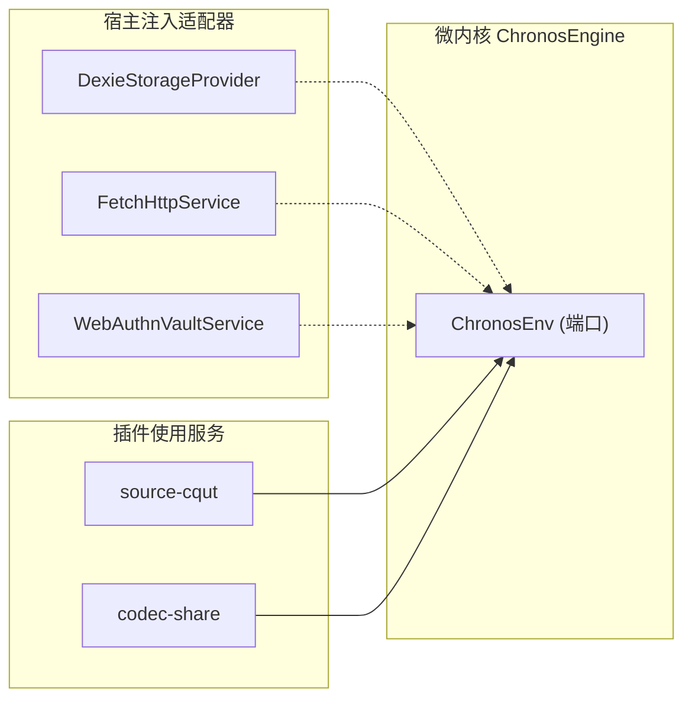

# ADR 0002: 服务容器与端口适配器架构 (Ports & Adapters)

- **状态**: Accepted
- **日期**: 2026-08-19
- **关联提交**: `cb4f3e6`, `924fca5`, `7466181`, `4d73e0a`, `1ec01ad`
- **范围**: 依赖注入与平台抽象 (`packages/core/src/types/services.ts`, `packages/core/src/runtime/scoped-context.ts`)

---

## 背景与问题

前端应用在调用持久化存储、网络请求和系统凭据等能力时，常直接调用全局对象（如 `fetch`, `localStorage`, `indexedDB`, `navigator.credentials`）。这导致：

1. **核心逻辑无法在非浏览器环境执行**：无法在纯 Node 测试环境或将来的原生平台独立运行；
2. **测试难以编写 Mock**：只能在全局作用域对 `window` 或 `globalThis` 进行侵入式篡改；
3. **插件与宿主能力混淆**：插件无法声明自己所依赖的平台能力，宿主也无法对平台能力进行访问控制与拦截。

---

## 架构决策

在 `@chronos/core` 中引入六边形架构（Hexagonal Architecture / Ports & Adapters），以 `ChronosEnv` 承载标准端口契约，由 `ScopedContext.service()` 解析：

### 1. 标准端口契约定义

- **`IStorageService`**：定义课表、课程及插件命名空间 KV 的异步存储契约（不暴露任何特定数据库细节）；
- **`IHttpService`**：定义统一的网络请求与服务端代理契约；
- **`IVaultService`**：定义硬件安全与敏感凭据加密存储契约。

### 2. 运行时解析与生命周期管理

- `ChronosEngine` 初始化时接收宿主提供的 `ChronosEnv`；
- 插件在 `apply(ctx)` 阶段通过 `ctx.service(IHttpService)` 等 typed identifier 获取所需服务；
- `createServiceIdentifier` 保留用于自定义服务标识；标准端口由 `ScopedContext.tryService()` 从 `env` 映射解析。

---

## 影响与收益

- **宿主解耦**：微内核与插件代码不再直接依赖 Web 专有 API；
- **测试友好**：单测可通过纯内存实现（如 `InMemoryStorageProvider`）完成毫秒级验证；
- **能力可控**：宿主可在服务层统一注入鉴权头、跨域代理与离线缓存策略。
