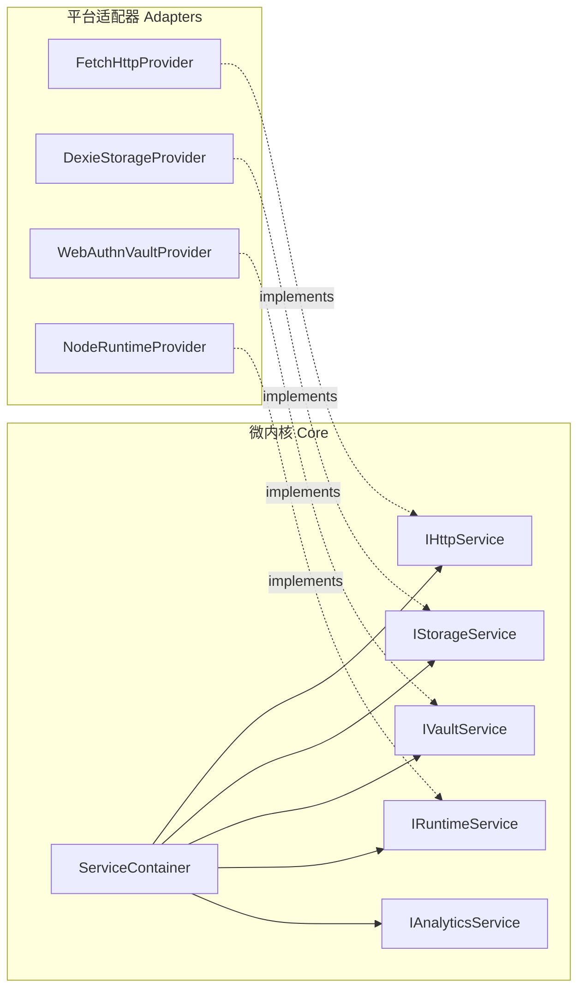

# ADR 0002: 服务容器与六边形端口适配器架构 (Ports & Adapters)

- **状态**: Accepted
- **日期**: 2026-08-19
- **关联提交**: `7adc168`, `edfe4d9`, `c5b6fec`, `2337936`, `3f69668`, `0f5ccf0`, `889a50a`, `b99ac8c`, `d14074f`
- **范围**: 核心服务契约 (`packages/core/src/types/services.ts`, `packages/core/src/runtime/service-container.ts`)

---

## 背景与问题

Web 宿主中存在大量直接调用全局环境的胶水代码（胶水代码指自身不承载业务逻辑、只负责连接两个模块的代码），例如直接访问 `localStorage`、`indexedDB`、`window.fetch`、`navigator.credentials` 等。这导致：

1. 插件在沙箱环境或 Native 环境下无法直接利用平台原生能力；
2. 单元测试必须重度 mock 全局 DOM / BOM 对象，测试脆弱且运行缓慢；
3. 缺少统一的能力注入机制与服务生命周期管理。

---

## 架构决策

在 `@chronos/core` 引入轻量的依赖注入容器 `ServiceContainer`（依赖注入指：模块不自己创建依赖对象，而是从容器领取宿主注册好的实例），并定义标准六边形**端口（Ports）**契约。端口是内核声明的能力接口，由各平台分别提供实现：

### 1. 核心服务契约（Ports）

- **`IHttpService`**：统一网络请求与教务会话管理，支持 CORS 绕行与会话隔离；
- **`IStorageService`**：标准课表、偏好设置持久化，以及基于 `pluginId` 自动命名空间的私有 KV 存储（`getPluginData` / `setPluginData`）；
- **`IVaultService`**：硬件安全加密凭据存储（Web 端 WebAuthn PRF、iOS Keychain、Android Keystore）；
- **`IRuntimeService`**：跨平台基础运行时（定时器、SHA-256、UTF-8 编解码）；
- **`IAnalyticsService`**：可选的产品事件埋点契约。

### 2. 注入与访问规则

- 宿主在应用启动（Boot）时实例化适配器并注册至 `ServiceContainer`；
- 运行时与插件通过 `ctx.service(ServiceIdentifier)` 或 `engine.services.get(...)` 按需领取能力，不允许直接使用底层具体实现类；
- `ChronosEnv` 只在宿主启动阶段负责集中装配，运行阶段一律从容器解析服务。

---

## 影响与收益

- **可测试**：测试时向 `ServiceContainer` 注入内存版适配器（如内存存储、Mock HTTP），不需要浏览器，测试在毫秒级完成；
- **可移植**：更换存储引擎（如 SQLite、Dexie）或迁移到跨端 Native 宿主时，微内核与所有业务插件零修改。
