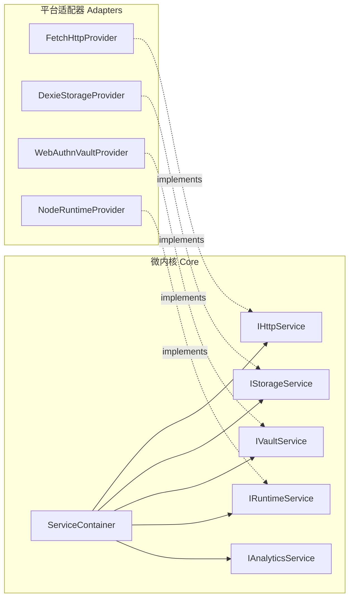

# ADR 0002: 服务容器与六边形端口适配器架构 (Ports & Adapters)

- **状态**: Accepted
- **日期**: 2026-08-19
- **关联提交**: `2337936`, `0f5ccf0`, `d14074f`, `28e4bcb`
- **范围**: 核心服务契约 (`packages/core/src/types/services.ts`, `packages/core/src/runtime/service-container.ts`)

---

## 背景与问题

Web 宿主中充斥着直接调用全局环境的胶水代码（如直接访问 `localStorage`、`indexedDB`、`window.fetch`、`navigator.credentials` 等）。这导致：

1. 插件在沙箱环境或 Native 环境下无法直接利用平台原生能力；
2. 单元测试必须重度 mock 全局 DOM / BOM 对象，测试脆弱且运行缓慢；
3. 缺少统一的能力注入机制与服务生命周期管理。

---

## 架构决策

在 `@chronos/core` 引入轻量 IoC 控制反转容器 `ServiceContainer`，并定义标准六边形**端口（Ports）**契约：

### 1. 核心服务契约（Ports）

- **`IHttpService`**：统一网络请求与教务会话管理，支持 CORS 绕行与会话隔离；
- **`IStorageService`**：标准课表、偏好设置持久化，以及基于 `pluginId` 自动命名空间的私有 KV 存储（`getPluginData` / `setPluginData`）；
- **`IVaultService`**：硬件安全加密凭据存储（Web 端 WebAuthn PRF、iOS Keychain、Android Keystore）；
- **`IRuntimeService`**：跨平台基础运行时（定时器、SHA-256、UTF-8 编解码）；
- **`IAnalyticsService`**：可选的产品事件埋点契约。

### 2. 注入与访问规则

- 宿主在应用启动（Boot）时实例化适配器并注册至 `ServiceContainer`；
- 运行时与插件通过 `ctx.service(ServiceIdentifier)` 或 `engine.services.get(...)` 按需索取能力，杜绝直接跨层调用底层具体类；
- `ChronosEnv` 仅作为宿主启动阶段的聚合装配器，运行时一律统一自容器解析服务。

---

## 影响与收益

- **Seam（测试缝隙）**：测试时可通过 `ServiceContainer` 注入轻量内存适配器（如内存存储、Mock HTTP），实现毫秒级纯内存测试；
- **Portability（可移植性）**：更换存储引擎（如 SQLite、Dexie）或迁移至跨端 Native 宿主时，微内核与所有业务插件保持零修改。
