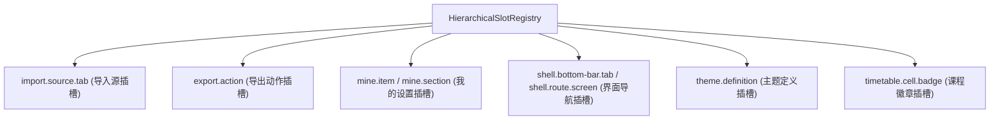

# ADR 0003: 分层插槽树与声明式扩展机制 (Hierarchical Slot Registry)

- **状态**: Accepted
- **日期**: 2026-08-19
- **关联提交**: `8eb20c8`, `512b918`, `4367be5`, `8a5c2d7`, `f86e330`
- **范围**: 扩展点机制 (`packages/core/src/types/slots.ts`, `packages/core/src/runtime/hierarchical-slot-registry.ts`)

---

## 背景与问题

传统插件体系往往依赖复杂的命令模式或硬编码回调钩子。在 Chronos 中：

1. **宿主 UI 无法动态感知插件功能点**：无法以统一方式发现第三方插件贡献的导入源、底栏 Tab、课表卡片徽章等扩展点；
2. **硬编码分支难以维护**：宿主页面容易充斥 `switch (pluginId)` 这类针对特定插件的特殊分支逻辑；
3. **缺少结构化的层级组织与类型安全**：扩展点分散无序，缺少强类型的贡献契约。

---

## 架构决策

引入分层路径插槽树 `HierarchicalSlotRegistry`，通过点分路径（Dot-notation）定义强类型标准插槽与贡献契约：

### 1. 标准插槽契约（ChronosSlotMap）

| 插槽键                       | 贡献契约类型                   | 作用                                                |
| :--------------------------- | :----------------------------- | :-------------------------------------------------- |
| `import.source.tab`          | `ImportTabSlotContribution`    | 声明式注册课表导入来源（含 `inputSchema` 动态表单） |
| `export.action`              | `ExportActionSlotContribution` | 注册课表导出动作（分享短链、文件等）                |
| `mine.item` / `mine.section` | `MineItemSlotContribution`     | 注册「我的/设置」页配置入口与跳转路由               |
| `shell.bottom-bar.tab`       | `BottomTabSlotContribution`    | 注册宿主底栏导航项（支持徽标与动态未读）            |
| `shell.route.screen`         | `PluginScreenSlotContribution` | 注册插件全屏独立视图页面                            |
| `theme.definition`           | `ThemeSlotContribution`        | 注册视觉配色主题与动态色彩适配器                    |
| `timetable.cell.badge`       | `CourseBadgeSlotContribution`  | 动态向课表单元格卡片注入状态徽章                    |

### 2. 声明式配置驱动（SchemaForm）

插件通过 `defineSchema` 声明表单配置项（支持 `string`, `password`, `boolean`, `file`, `select` 等类型），UI 外壳通过 `@chronos/ui-kit` 的 `SchemaForm` 自动完成表单渲染、双向绑定与校验，无需编写具体 Svelte 组件代码。

---

## 影响与收益

- **松散耦合**：宿主 UI 只负责渲染插槽出口（`SlotOutlet`），无需依赖任何具体插件的实现类型；
- **动态发现与扩展**：插件在 `apply(ctx)` 中注册插槽后，宿主界面即可自动发现并挂载对应功能，完全无需修改宿主代码。
