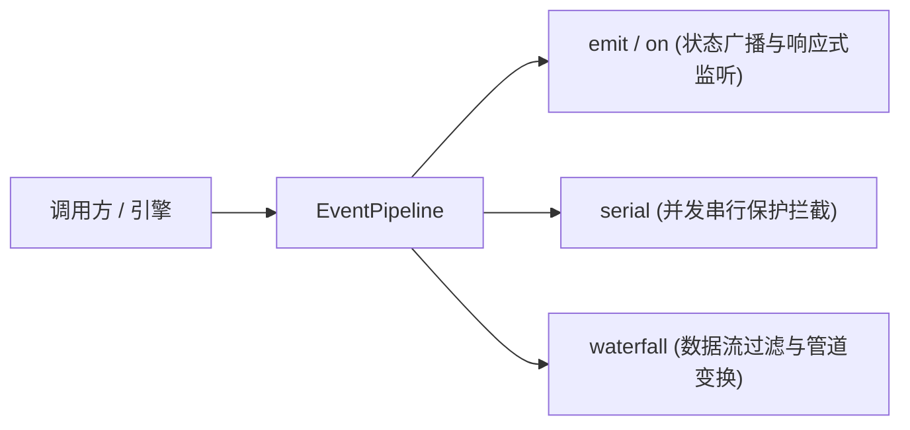
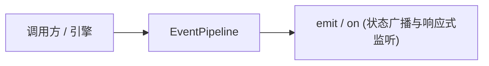

# ADR 0005: 统一事件与拦截管道 (EventPipeline)

- **状态**: Accepted
- **日期**: 2026-08-20
- **关联提交**: `27e60aa`, `e164593`
- **范围**: 事件通信与数据流水线 (`packages/core/src/runtime/event-pipeline.ts`)

---

## 背景与问题

此前项目中同时存在 `EventBus`（简单的事件订阅广播）与 `DataPipeline`（数据变换流水线）两套机制：

1. **机制重叠产生混淆**：开发者难以明确何时使用事件广播 `emit`，何时使用数据转换 `pipeline.transform`；
2. **缺乏并发与流转控制**：缺少并发串行保护（防止同一动作并发重复触发）和按序加工数据的拦截机制；
3. **概念冗余增加认知负担**：多套通信机制增加了核心引擎的理解与维护成本。

---

## 架构决策

废除独立的 `EventBus` 与 `Pipeline`，合并为统一的调度核心 **`EventPipeline`**：

### 1. 核心能力模型

- **广播通知（Pub/Sub）**：支持标准强类型事件广播（`timetables:updated`, `preferences:updated`, `pluginData:changed` 等）；
- **串行守卫（Serial Guards）**：支持注册互斥前置守卫，防止异步操作并发冲突；
- **瀑布变换（Waterfall Transformers）**：允许插件在导出或保存前注册转换拦截器（例如课表导出前的数据脱敏或格式转换）。

### 2. 接口精简化

`ChronosEngine` 将 `events` 与 `pipeline` 指向同一个 `EventPipeline` 实例，对外只暴露统一的调度接口。

---

## 影响与收益

- **概念统一**：消除功能重叠的浅层模块，收敛为单一事件与数据调度中心；
- **执行顺序明确可预期**：插件拦截与事件触发具备严格明确的执行顺序保证。

---

## 修订记录

- 2026-08-21 · 接口冻结说明：`registerPipelineHook` / `registerWaterfallHook` / `registerSerialHook` / `inject` 当前无生产插件消费方，API 保持定义并处于冻结状态；测试覆盖保留在 `packages/core/tests/ioc-topology.test.ts`。
- 2026-09-08 · **现行状态**：`serial` / `waterfall` 及 engine action 守卫包装层已移除；`EventPipeline` 仅保留强类型 `emit` / `on` 广播（实现见 `event-pipeline-broadcast.ts`）。下文「串行守卫 / 瀑布变换」描述为历史决策，不再适用。

---

## 现行架构（2026-09 起）

`ChronosEngine.events` 暴露单一 `EventPipeline` 实例；插件与宿主通过 `on` 订阅、`emit` 发布，无拦截链或变换管道。
