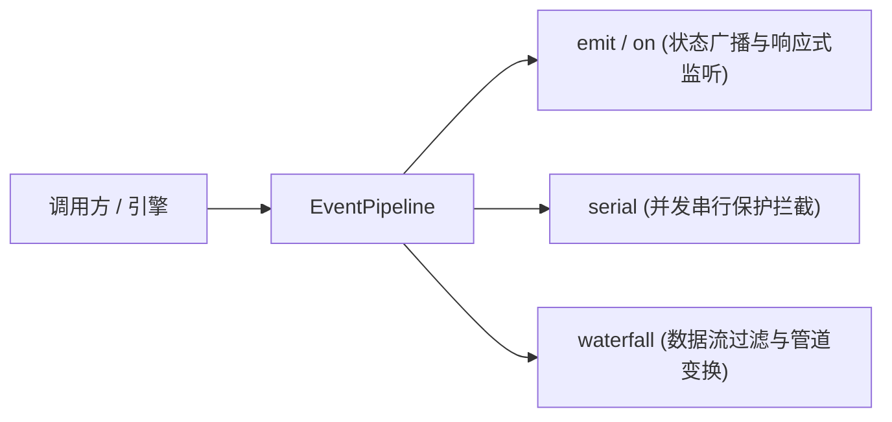

# ADR 0005: 响应式事件与拦截钩子收敛至统一 EventPipeline

- **状态**: Accepted
- **日期**: 2026-08-20
- **关联提交**: `27e60aa`, `addfe45`, `e164593`
- **范围**: 事件通信与数据流水线 (`packages/core/src/runtime/event-pipeline.ts`)

---

## 背景与问题

此前项目中同时存在 `EventBus`（简单的事件订阅广播）与 `DataPipeline`（数据变换链条）两套独立机制：

1. 双轨机制功能重叠，开发者容易混淆何时使用 `emit`，何时使用 `pipeline.transform`；
2. 缺少并发安全控制（如串行异步调用保护与瀑布流中间件拦截）；
3. 增加了引擎核心概念复杂度。

---

## 架构决策

彻底废除 `EventBus` 与 `Pipeline`，收敛为统一的深模块 `EventPipeline`：

### 1. 核心能力模型

- **广播通知（Pub/Sub）**：支持标准强类型事件广播（`timetables:updated`, `preferences:updated`, `pluginData:changed` 等）；
- **串行守卫（Serial Guards）**：支持注册互斥前置守卫，防止并发冲突；
- **瀑布变换（Waterfall Transformers）**：允许插件在导出或保存前注册转换拦截器（例如课表导出前的脱敏或格式重构）。

### 2. 接口极简化

`ChronosEngine` 将 `events` 与 `pipeline` 指向同一个 `EventPipeline` 实例，提供极低学习成本的单接口支撑。

---

## 影响与收益

- **Concept Collapse（概念折叠）**：删除 2 个分散的浅模块，收敛为 1 个高杠杆的深度调度核心；
- **Deterministic Flow（确定性流程）**：插件拦截与事件触发具备严格的执行顺序保证。
