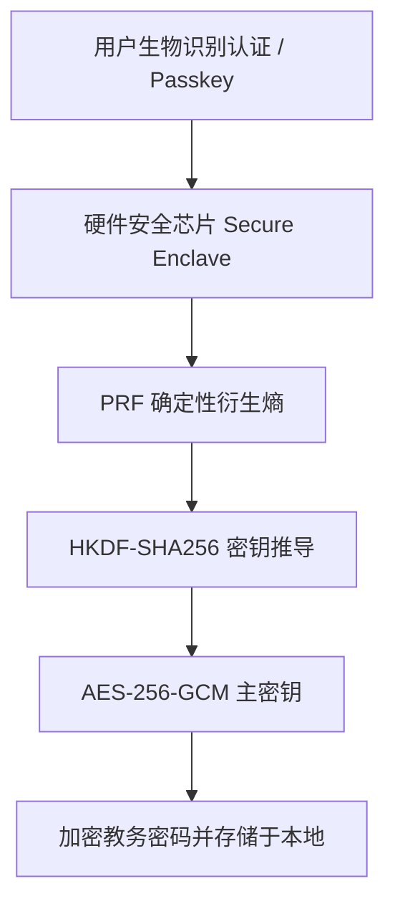

# ADR 0006: 基于 WebAuthn PRF 与硬件安全的凭据保险箱 (IVaultService)

- **状态**: Accepted（Web 实现层已由 [ADR 0017](./0017-webauthn-credential-retirement.md) Superseded；`IVaultService` 端口保留）
- **日期**: 2026-08-20
- **关联提交**: `8729d1f`, `b11d372`, `34a7e74`
- **范围**: 安全与凭据管理 (`packages/core/src/types/services.ts`, `apps/web/src/lib/providers/webauthn-vault.ts`, `apps/web/src/lib/client/credential-migration.ts`)

---

## 背景与问题

教务系统账号密码是用户的敏感凭据。在纯客户端 PWA 中：

1. 若明文或简单 Base64 保存在 LocalStorage / IndexedDB，极易受到 XSS 漏洞与恶意脚本窃取；
2. 传统对称密钥衍生算法（PBKDF2/Argon2）若硬编码在前端，等同于无保护；
3. 缺少硬件级生物识别（Touch ID / Face ID / Windows Hello）与硬件密钥隔离。

---

## 架构决策

定义核心接口 `IVaultService`，并在 Web 宿主端基于 **WebAuthn PRF (Pseudo-Random Function) 扩展** 实现零知识硬件加密存储：

### 1. 核心特性

- **无密码硬件衍生**：通过 WebAuthn 硬件认证器生成不可提取的 PRF 随机熵，作为 AES-256-GCM 的派生密钥；
- **平台透明适配**：
  - Web 端：优先使用 WebAuthn PRF，不支持时优雅回退至非敏感的账号缓存（`account_only`）；
  - iOS/Android 原生端：对接 Keychain / Android Keystore 硬件安全模块；
- **遗留键安全迁移**：实现 `runCredentialMigration`，安全将历史遗留的 `cqut_username`, `cqut-online-password` 键平滑迁移至硬件保险箱中并清理历史明文。

---

## 影响与收益

- **Hardware Isolation（硬件级安全）**：即便本地存储被非法 dump，缺乏硬件安全芯片与生物认证亦无法解密凭据；
- **Zero Host Leak（无泄露）**：宿主仅提供保险箱计算能力，不保存用户密码明文。

---

## 修订记录

- 2026-08-22 · [ADR 0017](./0017-webauthn-credential-retirement.md)：本文 Web 实现层（WebAuthn PRF 保险箱）被标记为 Superseded；`IVaultService` 端口保留。
