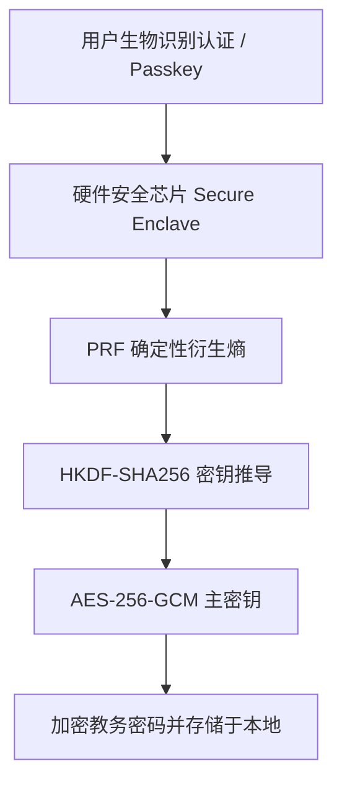

# ADR 0006: 基于 WebAuthn PRF 与硬件安全的凭据保险箱 (IVaultService)

- **状态**: Accepted（Web 端实现层已由 [ADR 0017](./0017-webauthn-credential-retirement.md) 废弃；`IVaultService` 端口保留）
- **日期**: 2026-08-20
- **关联提交**: `8729d1f`, `b11d372`, `34a7e74`
- **范围**: 安全与凭据管理 (`packages/core/src/types/services.ts`, `apps/web/src/lib/providers/webauthn-vault.ts`, `apps/web/src/lib/client/credential-migration.ts`)

---

## 背景与问题

教务系统账号密码属于敏感凭据。在纯前端 PWA 架构中：

1. **明文存储存在安全隐患**：若直接以明文或简单 Base64 保存在 LocalStorage 或 IndexedDB 中，极易受到 XSS 漏洞与恶意脚本窃取；
2. **前端对称加密防护有限**：传统对称密钥衍生算法（PBKDF2/Argon2）若硬编码在前端脚本中，无法实现真正的防篡改与防破解；
3. **缺少硬件级隔离保护**：缺少结合设备硬件安全芯片（如 Touch ID / Face ID / Windows Hello）与生物认证的密钥隔离方案。

---

## 架构决策

定义核心接口 `IVaultService`，并在 Web 宿主端基于 **WebAuthn PRF (Pseudo-Random Function) 扩展** 实现硬件级加密存储：密钥由安全芯片硬件动态派生，绝不以明文形式落盘存储。

### 1. 核心特性

- **无密码硬件衍生**：通过 WebAuthn 硬件认证器生成不可提取的 PRF 随机熵，作为 AES-256-GCM 的派生密钥；
- **跨平台透明适配**：
  - Web 端：优先使用 WebAuthn PRF，不支持时自动回退到仅缓存非敏感账号信息（`account_only`）；
  - iOS/Android 原生端：对接系统 Keychain / Android Keystore 硬件安全模块；
- **历史凭据安全迁移**：提供 `runCredentialMigration`，将历史遗留的 `cqut_username`, `cqut-online-password` 平滑迁移至硬件保险箱并彻底清除明文。

---

## 影响与收益

- **硬件级隔离**：即使本地存储数据被导出，缺少安全芯片与生物认证的参与也无法解密凭据内容；
- **宿主零明文接触**：宿主仅提供保险箱调用能力，自身不长期驻留用户密码明文。

---

## 修订记录

- 2026-08-22 · [ADR 0017](./0017-webauthn-credential-retirement.md)：本文 Web 端实现层（WebAuthn PRF 保险箱）被废弃并移除，核心 `IVaultService` 接口定义继续保留供未来原生宿主使用。
