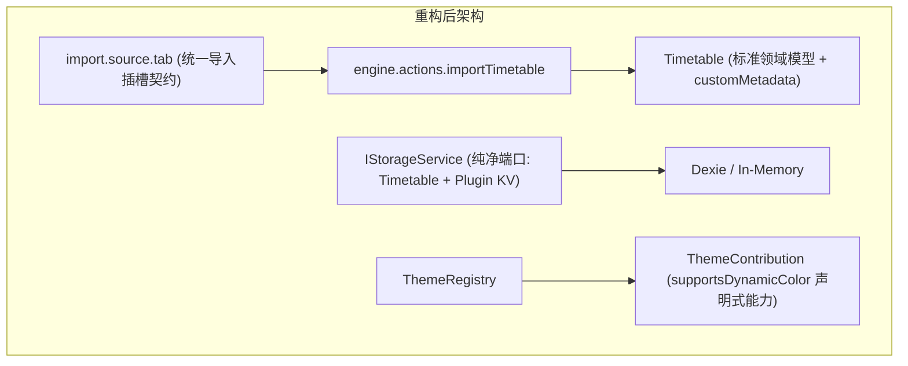

# ADR 0008: 宿主与插件深度解耦、存储端口精简与统一插槽导入

- **状态**: Accepted
- **日期**: 2026-08-21
- **关联提交**: `17b9e93`, `e54f9aa`, `1e4cd15`, `f1cf06c`, `16161e3`, `c7b7de0`, `79dc313`, `b49b9c7`, `efc5883`, `12487a2`, `415feb9`, `138a847`, `d7c93dc`, `ebb3ed5`, `be2de1b`, `adfd362`, `b374b2b`, `5615ec2`, `8e072ea`, `f1a39a2`, `3b609a2`, `28e4bcb`, `67f18a4`, `4252a7d`, `960c98d`, `367d4a8`
- **范围**: 课表导入管线、存储端口与宿主界面解耦 (`apps/web`, `packages/core`, `packages/ui-kit`, `packages/plugins/*`)

---

## 背景与问题

在项目向插件化演进的过程中，仍残留部分双轨实现与针对特定插件的侵入式宿主胶水代码：

1. **导入来源存在三套并行标识**：`TimetableImportSource`（Web 层枚举）、`TransferImportSource`（预览持久化用）与插件插槽 ID（`cqut-online`, `edu-html`, `share-link`）三者并存，导入流程中需要在多套标识间反复转换；
2. **存储端口混入了插件专属接口**：`IStorageService` 暴露了仅供壁纸插件使用的 `getWallpaper?()` 与 `setWallpaper?()`；
3. **特定高校 UI 硬编码在宿主中**：宿主课表详情编辑和确认页直接硬编码了 `OnlineCampusPeriodSection`（CQUT 校区单选组件），导致通用节次时间无法自由修改；
4. **冗余数据模型与悬空代码**：Web 宿主重复声明了一份教务数据模型，且遗留了未被引用的 `ChronosTimetableShareLinkCodec` 与孤立的 `lib/parsers/` 目录。

---

## 架构决策

### 1. 基于插槽的统一导入管线 (Slot-based Ingest Seam)

- 废除 `TimetableImportSource` 与 `TransferImportSource` 两个独立枚举，统一使用 `importMetadata.source: string` 与插槽 ID 标识导入来源；
- 移除宿主对具体导入源的硬编码转换，导入源统一由 `import.source.tab` 插槽元数据声明。

### 2. 存储端口与主题能力精净化

- 从 `IStorageService` 与 `ChronosEnv` 移除 `getWallpaper` / `setWallpaper` 专属接口；壁纸等插件私有数据统一通过 `getPluginData` / `setPluginData` 的命名空间 KV 存储；
- 移除主题设置中针对 `theme.id === 'wallpaper'` 的硬编码判断，改为读取 `ThemeContribution.supportsDynamicColor` 声明式属性决定是否启用动态取色。

### 3. 解耦高校特化 UI 并清理无用代码

- 移除宿主中的 `OnlineCampusPeriodSection` 组件，默认节次时间模板脱离特定高校绑定，课表节次在编辑界面保持通用自由修改；
- 删除无引用的 `ChronosTimetableShareLinkCodec`，清理孤立的 `lib/parsers/` 目录并将 `countDistinctCourseNames` 整合至 `@chronos/core`；
- 废除冗余的 `SystemTimeProvider` 包装，统一采用核心引擎提供的纯日期时间工具。

---

## 影响与收益

- **接口定义更纯净**：清除所有双轨枚举和松散的字符串联合类型，包的公开导出显著精简；
- **宿主与具体数据源完全解耦**：接入新高校或新视觉插件无需修改宿主核心代码。

---

## 演进复盘与反思 (Lessons Learned)

结合自 `6c23e91` 以来的提交变更轨迹，架构演进过程中有以下经验总结：

1. **通用动态表单 vs 定制交互体验**：曾尝试把所有导入源统一交给 `SchemaForm` 动态渲染，但在教务复杂认证场景（密码脱敏、剪贴板读取、记住密码等）下表单受限。最终确立分级策略：标准插件使用 `SchemaForm`，高定制的核心导入保留 Svelte 原生组件结构；
2. **作息数据由源插件自闭环管理**：校区作息表的推算与存储完全收敛至高校源插件内部（挂载至 `customMetadata['source-cqut']`），宿主不保留专属选择器，仅以通用表格形式供用户自由微调节次时间；
3. **统一分享媒介格式**：分享短链（Brotli + Varint 紧凑二进制）作为统一对外分享格式，废弃冗余的 JSON 导出，避免内部模型外泄和多重格式的维护负担。
