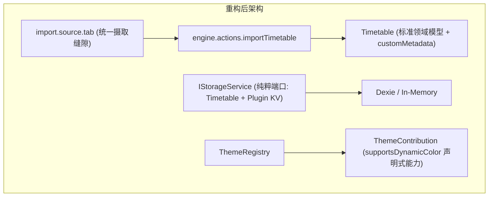

# ADR 0008: 宿主与插件解耦深化、端口纯粹化及全槽位摄取演进

- **状态**: Accepted
- **日期**: 2026-08-21
- **关联提交**: `17b9e93`, `e54f9aa`, `1e4cd15`, `f1cf06c`, `16161e3`, `c7b7de0`, `79dc313`, `b49b9c7`, `efc5883`, `12487a2`, `415feb9`, `138a847`, `d7c93dc`, `ebb3ed5`, `be2de1b`, `adfd362`, `b374b2b`, `5615ec2`, `8e072ea`, `f1a39a2`, `3b609a2`, `28e4bcb`, `67f18a4`, `4252a7d`, `960c98d`, `367d4a8`
- **范围**: 课表导入管线、存储端口与宿主界面解耦 (`apps/web`, `packages/core`, `packages/ui-kit`, `packages/plugins/*`)

---

## 背景与问题

在项目向插件化演进的过程中，还遗留了一些「双轨实现」（同一个功能同时存在两套做法）与「侵入式胶水代码」（宿主里为个别插件专门写的连接代码）：

1. **导入来源有三套并行的标识**：`TimetableImportSource`（Web 层枚举）、`TransferImportSource`（预览持久化用）与插件槽位 ID（`cqut-online`, `edu-html`, `share-link`）并存，导入控制器需要在三者之间反复转换；
2. **存储端口混入了插件专属方法**：`IStorageService` 暴露了只服务壁纸插件的 `getWallpaper?()` 与 `setWallpaper?()`；
3. **特定高校的 UI 写死在宿主里**：宿主课表详情编辑和确认页直接硬编码了 `OnlineCampusPeriodSection`（CQUT 校区单选组件），导致通用节次时间无法自由编辑；
4. **重复的数据模型与无引用代码**：Web 宿主重复声明了一份教务数据模型，且遗留了未被引用的 `ChronosTimetableShareLinkCodec` 与孤立的 `lib/parsers/` 目录。

---

## 架构决策

### 1. 全槽位驱动导入摄取（Deep Ingest Seam）

- 删除 `TimetableImportSource` 与 `TransferImportSource` 两个枚举，统一使用 `importMetadata.source: string` 与槽位 ID 标识导入来源；
- 移除宿主对特定导入源的硬编码转换，导入源完全由 `import.source.tab` 插槽元数据声明。

### 2. 存储端口与主题能力纯粹化

- 从 `IStorageService` 与 `ChronosEnv` 移除 `getWallpaper/setWallpaper` 方法；壁纸等插件私有数据一律通过 `getPluginData/setPluginData` 的命名空间 KV 存储；
- 移除主题设置中的 `theme.id === 'wallpaper'` 特判，改为读取 `ThemeContribution.supportsDynamicColor` 声明式属性来决定是否启用动态取色。

### 3. 解耦特定高校 UI 并清理死代码

- 移除宿主中的 `OnlineCampusPeriodSection` 组件，默认节次时间模板脱离特定高校绑定，课表节次在编辑界面保持通用自由修改；
- 删除无引用的 `ChronosTimetableShareLinkCodec`，清理孤立的 `lib/parsers/` 目录并将 `countDistinctCourseNames` 整合至 `@chronos/core`；
- 废除冗余的 `SystemTimeProvider` 包装，统一采用核心引擎 pure date 工具。

---

## 影响与收益

- **接口面更小**：删除了所有双轨枚举和历史遗留的松散字符串联合类型，包的公开导出明显减少；
- **宿主与具体来源解耦**：接入新高校或新视觉插件不需要修改宿主核心代码。

---

## 演进复盘与反思 (Lessons Learned)

结合自 `6c23e91` 以来的提交变更轨迹，架构演进过程中有以下反复与经验：

1. **通用动态表单 vs 原生交互体验**：曾尝试把所有导入源统一交给 `SchemaForm` 动态渲染，但教务认证场景（密码脱敏、剪贴板读取、记住密码多选等）交互复杂，体验受限且存在双向绑定同步缺陷。最终确定的策略是分级处理：标准插件使用 `SchemaForm`，高定制的核心导入保留 M3 原生表单结构；
2. **作息数据由源插件自己管理**：校区作息表的推算与存储完全放在高校源插件内部（挂载至 `customMetadata['source-cqut']`），宿主不保留 `OnlineCampusPeriodSection` 这类专属选择器，只以通用表格形式让用户自由编辑节次时间；
3. **分享媒介只用一种**：分享短链（Brotli + Varint 紧凑二进制）是唯一的对外分享格式，移除 JSON 导出，避免内部模型外泄和多种格式的重复维护。
