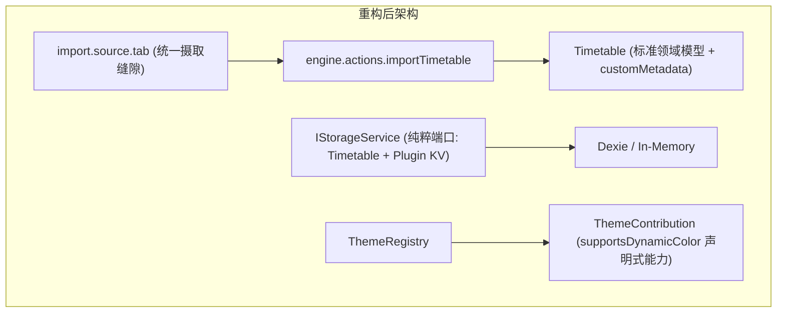

# ADR 0008: 宿主与插件解耦深化、端口纯粹化及全槽位摄取演进

- **状态**: Accepted
- **日期**: 2026-08-21
- **关联提交**: `79dc313`, `efc5883`, `12487a2`, `415feb9`, `5615ec2`, `67f18a4`, `4252a7d`, `367d4a8`
- **范围**: 课表导入管线、存储端口与宿主界面解耦 (`apps/web`, `packages/core`, `packages/ui-kit`, `packages/plugins/*`)

---

## 背景与问题

在项目向插件化演进的过程中，遗留了若干未完全消除的「双轨实现」与「侵入式胶水代码」：

1. **导入来源三套枚举双轨**：`TimetableImportSource`（Web）、`TransferImportSource`（预览持久化）与插件槽位 ID（`cqut-online`, `edu-html`, `share-link`）并存，导入控制器需要反复转译；
2. **存储端口特化污染**：`IStorageService` 暴露了特定插件专属方法 `getWallpaper?()` 与 `setWallpaper?()`；
3. **特定高校 UI 胶水侵入宿主**：宿主课表详情编辑和确认页直接硬编码了 `OnlineCampusPeriodSection`（CQUT 校区单选），导致通用节次时间无法自主编辑；
4. **影子模型与死代码残留**：Web 宿主重复声明了教务数据模型，且遗留了未被引用的 `ChronosTimetableShareLinkCodec` 与孤立的 `lib/parsers/`。

---

## 架构决策

### 1. 全槽位驱动导入摄取（Deep Ingest Seam）

- 彻底废除 `TimetableImportSource` 与 `TransferImportSource` 枚举，统一使用 `importMetadata.source: string` 与槽位 ID 驱动；
- 移除宿主对特定源的硬编码转译，导入源完全由 `import.source.tab` 插槽元数据声明。

### 2. 存储端口与主题能力纯粹化

- 从 `IStorageService` 与 `ChronosEnv` 彻底剥离 `getWallpaper/setWallpaper` 方法，插件私有数据一律通过 `getPluginData/setPluginData` 命名空间 KV 存储；
- 移除主题设置中的 `theme.id === 'wallpaper'` 特判，改为基于 `ThemeContribution.supportsDynamicColor` 声明式属性驱动。

### 3. 解耦特定高校 UI 并清理死代码

- 移除宿主中的 `OnlineCampusPeriodSection` 组件，默认节次时间模板脱离特定高校绑定，课表节次在编辑界面保持通用自由修改；
- 删除无引用的 `ChronosTimetableShareLinkCodec`，清理孤立的 `lib/parsers/` 目录并将 `countDistinctCourseNames` 整合至 `@chronos/core`；
- 废除冗余的 `SystemTimeProvider` 包装，统一采用核心引擎 pure date 工具。

---

## 影响与收益

- **High Signal & Clean Surface（高信噪比与干净表面）**：消除了所有双轨枚举与历史松散字符串联合，包导出接口显著收敛；
- **Zero Host Coupling（宿主零特定源耦合）**：接入新高校或新视觉插件无需触碰宿主核心代码。

---

## 演进复盘与反思 (Lessons Learned)

结合自 `6c23e91` 以来的提交变更轨迹，架构演进过程中曾出现以下拉锯与经验沉淀：

1. **通用动态表单 vs 原生交互体验**：曾尝试将所有导入源统一强制由 `SchemaForm` 动态渲染，但在教务认证（密码脱敏、剪贴板读取、记住密码多选等）复杂场景下体验受限且存在双向绑定同步缺陷，最终确定「标准插件使用 `SchemaForm`，高定制核心导入保留 M3 原生表单结构」的分级策略；
2. **作息映射自闭环原则**：作息表推算应完全在高校源插件内部闭环（挂载至 `customMetadata['source-cqut']`），宿主不应保留 `OnlineCampusPeriodSection` 等特化选择器，而是将节次时间以通用表格形式开放给用户自由编辑；
3. **收敛分享媒介单一出口**：分享短链（Brotli + Varint 紧凑二进制）作为统一核心媒介，果断移除 JSON 导出以避免内部模型泄露与多头兼容维护。
