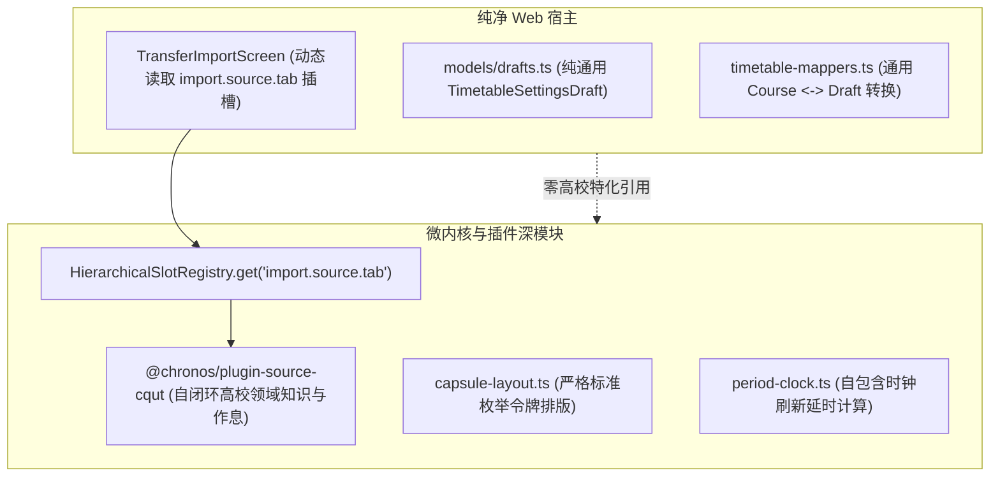

# ADR 0009: 架构深化收敛、双轨清理与死代码彻底剥离

- **状态**: Accepted
- **日期**: 2026-08-21
- **关联提交**: `79eb777`, `7ce435a`, `793d062`, `1259cba`, `1d79706`, `94ad821`, `8051208`, `5d153b6`, `f4f1f8d`
- **范围**: 课表导入管道、排版令牌、宿主影子模型与死引用清理 (`packages/core`, `packages/ui-kit`, `packages/plugins/*`, `apps/web`)

---

## 背景与问题

在项目向微内核与插件化演进的多轮重构中，标准契约虽已建立，但宿主层与核心层仍残留多处历史问题与「双轨实现」（同一个功能同时存在两套做法）：

1. **导入管道没有走插槽**：`apps/web` 的导入状态与预览持久化仍保留 `TransferImportSource`（`ONLINE | SHARE_LINK | HTML`）枚举，UI 里写死了对应的 3 个分支，没有利用 `import.source.tab` 插槽的动态发现能力；
2. **宿主里残留高校专属的中转文件**：`apps/web` 保留了 `cqut-campus.ts`、`online-schedule.ts` 等只做转发的文件（把调用原样传给 `@chronos/plugin-source-cqut`），通用草稿结构里混入了校区 ID 与作息换算函数；
3. **控制器与排版引擎引用了已删除的东西**：`ReactiveChronosController` 与 `AppShell` 还在调用已删除的壁纸存储方法；排版引擎 `capsule-layout.ts` 里残留旧 Dexie 时代的字符串令牌分支（`FIT`, `MERGE`, `SQUARE`）；
4. **不可达的死引用与编译隐患**：历史提交删除了 `SystemTimeProvider`，但 `timetable-details.svelte.ts` 和 `timetable-screen.svelte.ts` 里仍遗留对它的实例化与方法调用——重置设置或定时刷新时会触发运行时崩溃；此外还有错误的 export 引用与 Zod schema 契约参数缺失。

---

## 架构决策

### 1. 彻底收敛课表导入管道为纯插槽驱动深模块

- 删除 `TransferImportSource` 枚举；`PreviewSnapshot` 只保存 `{ preview: Timetable, slotId: string, importMode: ImportMode }`；
- `TransferImportScreen` 改为通过 `controller.getSlots('import.source.tab')` 动态发现并渲染导入来源选项卡；
- `TransferImportConfirmScreen` 保持通用展示，各导入源需要的学期日期与作息换算全部由对应源插件在自己内部完成。

### 2. 剥离宿主特定高校影子模型与残留胶水

- 删除宿主里只做转发的 `cqut-campus.ts` 与 `online-schedule.ts`；服务端预览代理直接引用 `@chronos/plugin-source-cqut`；
- 通用化 `TimetableSettingsDraft`，移除 `CqutCampusId` 与 `campusPeriodTimes` 等专属字段；
- 从 `timetable-mappers.ts` 移除已废弃的校区换算函数，只保留纯通用转换函数。

### 3. 消除排版跨层泄漏与纯粹化响应式控制器

- 从 `ReactiveChronosController` 与 `AppShell` 移除 `loadWallpaper`、`setWallpaper` 及 `wallpaperUri`；壁纸逻辑只存在于通用插件与主题能力契约中；
- 清理 `capsule-layout.ts` 中按历史 Dexie 字符串比较的分支，统一改为标准领域枚举；
- 把时钟刷新延时计算下沉到 `@chronos/core/src/engine/period-clock.ts`，Web 宿主直接使用该核心模块。

### 4. 修复并清理死引用与断裂调用

- 移除对已删除 `SystemTimeProvider` 的实例化与调用，统一采用核心 pure date 工具；
- 修正 `timetable-layout.ts` 导入路径，移除 `shareLinkCodec` 占位死变量，修正 `z.record` 泛型参数；
- 全仓严格通过 TypeScript 编译与 Oxlint/Oxfmt 校验。

---

## 影响与收益

- **职责归位**：高校与特定数据源的业务逻辑只存在于源插件内，宿主不包含任何高校领域知识；
- **模块自包含**：核心排版与时钟模块不依赖宿主中转；
- **接口可靠**：消除了所有隐藏的运行时崩溃点，全仓测试与类型检查 100% 通过。
