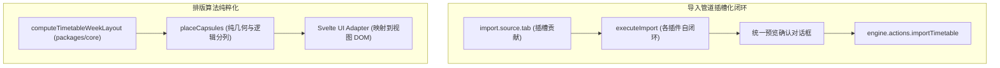

# ADR 0009: 架构深化收敛、消除双轨实现与清理无用代码

- **状态**: Accepted
- **日期**: 2026-08-21
- **关联提交**: `8ad8f88`, `ffba381`, `488a034`, `74ea6d5`, `ec843f5`, `46d1bb0`, `e49fa3e`
- **范围**: 导入管线、排版模块、类型安全与全仓死代码清理 (`packages/core`, `packages/ui-kit`, `packages/plugins/*`, `apps/web`)

---

## 背景与问题

ADR 0008 完成存储端口与导入解耦后，代码库中仍存在部分深层双轨与历史遗留问题：

1. **导入管道依然存在两套并存逻辑**：宿主 `TransferImportPipelineService` 中仍残留 `switch (source)` 硬编码分支，与 `HierarchicalSlotRegistry` 的声明式插槽机制形成双轨；
2. **排版模块跨层概念泄漏**：课表布局算法中混入了 `dayColumnIndex`（Svelte 视图层私有变量）和特定高校的节次映射；
3. **宿主中存在冗余模型与悬空胶水**：Web 宿主多处保留了与微内核重复的数据转换层（如冗余的 `academicYear` 包装与空壳工具函数）；
4. **遗留未引用的死代码与类型缺失**：部分被重构取代的旧函数未清理，严格类型检查存在遗留盲区。

---

## 架构决策

### 1. 导入管道全面插槽化

- 彻底移除 `TransferImportPipelineService` 中的硬编码 `switch (source)` 分支；
- 导入执行逻辑完全委托给各插件注册的 `ImportTabSlotContribution.executeImport()` 回调函数；
- 宿主仅提供统一的导入前后置生命周期管理（错误处理、载入状态、预览确认弹窗）。

### 2. 排版算法纯粹化与分层隔离

- 从 `@chronos/core` 的 `computeTimetableWeekLayout` 中剥离所有与 Svelte DOM 渲染相关的私有坐标逻辑；
- 核心排版算法专注于纯逻辑网格计算与冲突分列（`placeCapsules`），视图层通过 `@chronos/ui-kit` 进行纯视觉坐标适配。

### 3. 清理冗余模型与胶水代码

- 删除宿主中与微内核重叠的领域实体别名与转换函数；
- 统一使用 `@chronos/core` 导出的 `Timetable`, `Course`, `AcademicConfig` 标准模型。

### 4. 全仓严格 TypeScript 编译闭环

- 修复所有跨包导入引发的循环依赖与悬空类型引用；
- 开启全仓严格类型检查门禁，消除历史遗留的 `any` 绕过与不安全类型断言。

---

## 影响与收益

- **扩展一致性**：新增导入源只需注册对应插槽，宿主导入流程完全无需感知具体实现；
- **核心算法纯粹**：排课与布局计算成为无状态纯函数，具备完备的单元测试覆盖；
- **代码库清爽可靠**：消除了隐藏的运行时空指针与类型不匹配隐患，测试与类型检查实现 100% 自动化保障。
