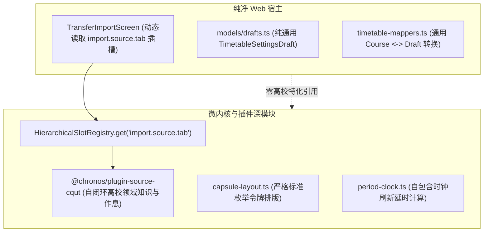

# ADR 0009: 架构深化收敛、双轨清理与死代码彻底剥离

- **状态**: Accepted
- **日期**: 2026-08-21
- **关联提交**: `79eb777`, `7ce435a`, `793d062`, `1259cba`, `1d79706`, `94ad821`, `8051208`, `5d153b6`, `f4f1f8d`
- **范围**: 课表导入管道、排版令牌、宿主影子模型与死引用清理 (`packages/core`, `packages/ui-kit`, `packages/plugins/*`, `apps/web`)

---

## 背景与问题

在项目向微内核与插件化演进的多轮重构中，代码库虽已建立标准契约，但在宿主层与核心层仍残留了多处历史断裂与浅层双轨实现：

1. **导入管道未彻底插槽化**：`apps/web` 导入状态与预览持久化仍保留 `TransferImportSource`（`ONLINE | SHARE_LINK | HTML`）枚举与硬编码 3 分支 UI，未利用 `import.source.tab` 插槽发现能力；
2. **高校影子模型与胶水代码残留**：`apps/web` 中保留了透传 `@chronos/plugin-source-cqut` 的 `cqut-campus.ts`、`online-schedule.ts` 等浅层影子模型，通用草稿结构耦合了校区 ID 与作息胶水函数；
3. **控制器与排版引擎跨层泄漏**：`ReactiveChronosController` 与 `AppShell` 残留了对已删除壁纸存储方法的虚假调用；排版引擎 `capsule-layout.ts` 残留旧 Dexie 令牌分支（`FIT`, `MERGE`, `SQUARE`）；
4. **不可触达死引用与编译隐患**：历史提交删除了 `SystemTimeProvider` 但在 `timetable-details.svelte.ts` 和 `timetable-screen.svelte.ts` 遗留了未捕获的实例化与方法调用，重置设置或定时刷新时存在潜在运行时崩溃风险；同时存在错误的 export 引用与 Zod schema 契约参数缺失。

---

## 架构决策

### 1. 彻底收敛课表导入管道为纯插槽驱动深模块

- 彻底废除 `TransferImportSource` 枚举，`PreviewSnapshot` 仅保存 `{ preview: Timetable, slotId: string, importMode: ImportMode }`；
- `TransferImportScreen` 动态通过 `controller.getSlots('import.source.tab')` 发现并渲染导入来源选项卡；
- `TransferImportConfirmScreen` 通用化展示，各导入源所需的学期日期与作息推算全部在源插件内部闭环产出。

### 2. 剥离宿主特定高校影子模型与残留胶水

- 删除宿主浅层透传文件 `cqut-campus.ts` 与 `online-schedule.ts`；服务端预览代理直接引用 `@chronos/plugin-source-cqut`；
- 通用化 `TimetableSettingsDraft`，移除 `CqutCampusId` 与 `campusPeriodTimes` 等特化字段；
- 从 `timetable-mappers.ts` 移除已废弃的校区胶水函数，仅保留纯通用转换函数。

### 3. 消除排版跨层泄漏与纯粹化响应式控制器

- 从 `ReactiveChronosController` 与 `AppShell` 彻底剥离 `loadWallpaper`、`setWallpaper` 及 `wallpaperUri`，壁纸逻辑完全收敛至通用插件与主题能力契约；
- 清理 `capsule-layout.ts` 中的历史 Dexie 字符串比较分支，收紧为标准领域枚举；
- 将时钟刷新延时计算下沉至 `@chronos/core/src/engine/period-clock.ts`，Web 宿主直接使用核心深模块。

### 4. 修复并清理死引用与断裂调用

- 移除对已删除 `SystemTimeProvider` 的实例化与调用，统一采用核心 pure date 工具；
- 修正 `timetable-layout.ts` 导入路径，移除 `shareLinkCodec` 占位死变量，修正 `z.record` 泛型参数；
- 全仓严格通过 TypeScript 编译与 Oxlint/Oxfmt 校验。

---

## 影响与收益

- **Locality（高内聚度）**：高校与特定源业务逻辑完全收敛于源插件内，宿主零领域污染；
- **Depth（模块深度）**：核心排版与时钟模块自包含，消除宿主浅层转接；
- **Interface Robustness（强接口鲁棒性）**：消除所有隐藏运行时崩溃点，全仓测试与类型检查 100% 通过。
