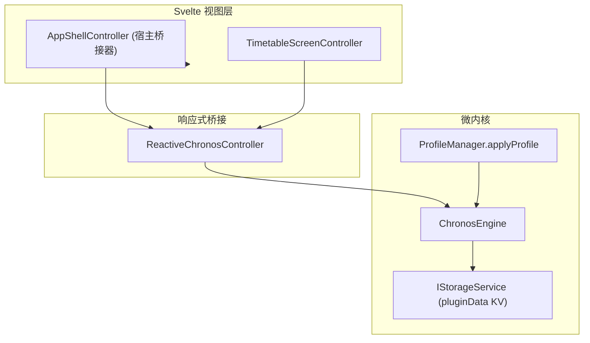

# ADR 0010: 宿主状态精简、消除双轨实现与统一契约规范

- **状态**: Accepted
- **日期**: 2026-08-21
- **关联提交**: `afb0c1a`, `f2397c4`, `a3414c2`, `6510251`, `ba95d54`
- **范围**: 宿主影子模型、持久化残余、Profile 双重注册、槽位哈希与事件契约 (`packages/core`, `apps/web`)

---

## 背景与问题

ADR 0009 完成导入管道插槽化与排版跨层清理后，宿主层仍残留多处「影子状态」（视图层自行维护的、与引擎状态重复的数据）和浅层双轨实现，导致 Svelte 视图与微内核数据源之间多出一层无效同步：

1. **`AppState` 影子模型**：`apps/web/src/lib/models/app-state.ts` 将 `ReactiveChronosController` 已有字段重复包装为 `appState`，并携带已失效的 `wallpaperUri` 等字段；
2. **Dexie `wallpapers` 废弃表**：壁纸已迁移至 `IStorageService` 命名空间 KV（`getPluginData` / `setPluginData`），Dexie 特化表与操作方法成为死代码；
3. **`period-clock.ts` 浅层重导出**：Web 宿主保留了只有 11 行的透传文件与重复测试，时钟工具本应直接自 `@chronos/core` 导入；
4. **Profile 双重注册**：`createEngine` 中手动调用 `registerCoreShellSlots`，与 `ProfileManager.applyProfile` 声明式挂载 `coreShellPlugin` 形成双轨；
5. **槽位键哈希格式不一致**：`periodSlotKey`（使用 `-` 分隔）与 `courseSlotKey`（使用 `:` 分隔）命名风格不统一；
6. **无消费方事件与反向依赖**：`ChronosEvents` 中 `'wallpaper:updated'` 从未被触发；`MarketplaceService` 反向导入了宿主 `$lib/appearance/color-scheme`。

---

## 架构决策

### 1. 废除 `AppState` 影子模型

- 彻底删除 `app-state.ts` 与 `emptyAppState()`；
- `AppShellController` 仅保留宿主桥接职责（主题、触感、课表切换等），状态读取统一经 `controller.userPreferences`、`controller.currentTimetable`、`controller.timetables` 直连引擎；
- 所有仍引用 `shell.state.appState` 的 Svelte 组件与路由页改为直连 `shell.controller`。

### 2. 清除 Dexie 壁纸表与存储特化

- 从 `ChronosDB` 移除 `wallpapers` 表定义；
- 从 `DexieStorageProvider` 删除 `getWallpaper()` / `setWallpaper()`，并从 `estimateStorageBytes` / `clearAllData` 移除相关引用；
- 壁纸数据完全经插件 `getPluginData` / `setPluginData` 命名空间进行持久化。

### 3. 删除 `period-clock` 宿主透传文件

- 删除 `apps/web/src/lib/timetable/period-clock.ts` 及其重复测试；
- `timetable-screen.svelte.ts`、`TimetableGrid.svelte` 等直接自 `@chronos/core` 导入时钟工具。

### 4. 消除 Profile 双重注册

- 从 `createEngine` 移除手动调用 `registerCoreShellSlots(engine.getPluginContext(...))`；
- `core-shell` 插槽统一由 `profileManager.applyProfile` 加载 `coreShellPlugin` 时声明式注册。

### 5. 统一槽位键命名与哈希规范

- `periodSlotKey` 与 `courseSlotKey` 统一收敛为 `${day}:${start}:${end}` 格式；
- 同步更新 `capsule-layout.ts`、`display-models.ts` 与相关单元测试。

### 6. 精简事件契约并解除反向依赖

- 从 `ChronosEvents` 删除从未触发的 `'wallpaper:updated'` 事件；
- `MarketplaceService.revertThemeIfNeeded` 改用 `engine.actions.setTheme('m3-default')` 与 `engine.actions.updatePreferences(...)`，彻底解除对 `$lib/appearance/color-scheme` 的反向依赖。

### 7. 草稿模型类型收敛

- `drafts.ts` 中 `PeriodTimeDraft`、`AcademicConfigDraft` 等浅层别名直接复用 `@chronos/core` 领域类型；
- 仅保留 `TimetableSettingsDraft` / `CourseDraft` 等 UI 编辑专用的结构。

---

## 影响与收益

- **单一数据源 (Single Source of Truth)**：Svelte 视图与测试直连 `ReactiveChronosController`，移除了中间冗余同步层；
- **存储端口纯粹**：Dexie 层仅保留课表、课程与 `pluginData` 三张核心表，无任何插件特化方法；
- **启动路径清晰明确**：引擎启动路径收敛为单一通道，所有内置插槽注册统一由 Profile 装配管理；
- **依赖拓扑清晰**：Marketplace 服务不再逆向依赖宿主 appearance 模块，主题回退完全通过引擎 actions 标准接口完成。

---

## 验证

- `vp check` — 格式化、Lint 与类型检查全量通过
- `vp test` — 全仓单元测试通过
- 结构性检查：`app-state.ts`、`period-clock.ts` 无悬挂引用；课表首屏、周次切换、详情编辑、设置保存与主题回退链路正常
