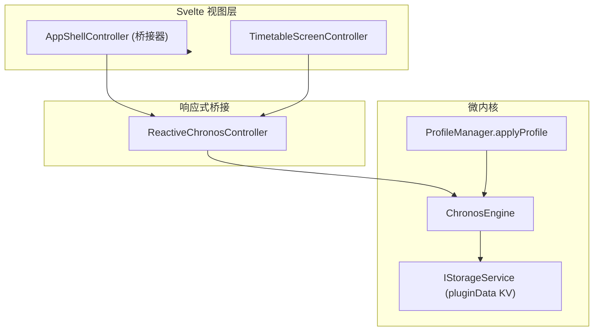

# ADR 0010: 宿主状态折叠、双轨消除与架构深化收敛

- **状态**: Accepted
- **日期**: 2026-08-21
- **范围**: 宿主影子模型、持久化残余、Profile 双重注册、槽位哈希与事件契约 (`packages/core`, `apps/web`)

---

## 背景与问题

ADR 0009 完成导入管道插槽化与排版跨层清理后，宿主层仍残留多处「影子状态」与浅层双轨实现，导致 Svelte 视图与微内核数据源之间多一层无效同步：

1. **`AppState` 影子模型**：`apps/web/src/lib/models/app-state.ts` 将 `ReactiveChronosController` 已有字段再包装为 `appState`，并携带已失效的 `wallpaperUri` 等字段；
2. **Dexie `wallpapers` 废弃表**：壁纸已迁移至 `IStorageService` 命名空间 KV（`getPluginData` / `setPluginData`），Dexie 特化方法与表定义成为死代码；
3. **`period-clock.ts` 浅层重导出**：Web 宿主 11 行透传文件与重复测试，时钟工具应直接自 `@chronos/core` 导入；
4. **Profile 双重注册**：`createEngine` 手工调用 `registerCoreShellSlots`，与 `ProfileManager.applyProfile` 声明式挂载 `coreShellPlugin` 形成双轨；
5. **槽位键哈希双轨**：`periodSlotKey`（`-` 分隔）与 `courseSlotKey`（`:` 分隔）格式不一致；
6. **死事件与逆向依赖**：`ChronosEvents` 中 `'wallpaper:updated'` 从未触发；`MarketplaceService` 逆向导入 `$lib/appearance/color-scheme`。

---

## 架构决策

### 1. 废除 `AppState` 影子模型

- 删除 `app-state.ts` 与 `emptyAppState()`；
- `AppShellController` 仅保留宿主桥接职责（主题、触感、课表切换等），状态读取统一经 `controller.userPreferences`、`controller.currentTimetable`、`controller.timetables`；
- 所有仍引用 `shell.state.appState` 的 Svelte 组件与路由页改为直连 `shell.controller`。

### 2. 清除 Dexie 壁纸表与存储特化

- 从 `ChronosDB` 移除 `wallpapers` 表；
- 从 `DexieStorageProvider` 删除 `getWallpaper()` / `setWallpaper()`，并从 `estimateStorageBytes` / `clearAllData` 移除相关引用；
- 壁纸数据完全经插件 `getPluginData` / `setPluginData` 持久化。

### 3. 删除 `period-clock` 宿主透传

- 删除 `apps/web/src/lib/timetable/period-clock.ts` 及其重复测试；
- `timetable-screen.svelte.ts`、`TimetableGrid.svelte` 等直接自 `@chronos/core` 导入时钟工具。

### 4. 消除 Profile 双重注册

- 从 `createEngine` 移除 `registerCoreShellSlots(engine.getPluginContext(...))` 手工调用；
- `core-shell` 插槽统一由 `profileManager.applyProfile` 加载 `coreShellPlugin` 时声明式注册。

### 5. 统一下沉槽位键哈希规范

- `periodSlotKey` 与 `courseSlotKey` 统一为 `${day}:${start}:${end}` 格式；
- 同步更新 `capsule-layout.ts`、`display-models.ts` 与相关单元测试。

### 6. 事件契约与 Marketplace 自闭环

- 从 `ChronosEvents` 删除从未触发的 `'wallpaper:updated'`；
- `MarketplaceService.revertThemeIfNeeded` 改用 `engine.actions.setTheme('m3-default')` 与 `engine.actions.updatePreferences(...)`，移除对 `$lib/appearance/color-scheme` 的逆向导入。

### 7. 草稿类型收敛

- `drafts.ts` 中 `PeriodTimeDraft`、`AcademicConfigDraft` 等浅层别名直接复用 `@chronos/core` 领域类型；
- 保留 `TimetableSettingsDraft` / `CourseDraft` 等 UI 编辑专用结构。

---

## 影响与收益

- **Single Source of Truth**：Svelte 视图与测试均直连 `ReactiveChronosController`，消除影子同步层；
- **Storage Port Purity**：Dexie 层仅保留课表、课程与 `pluginData` 三张表，无插件特化方法；
- **Boot Sequence Clarity**：引擎启动路径单一，Profile 装配负责全部内置插槽注册；
- **Hash Consistency**：槽位键格式统一，胶囊布局与网格展示共用同一键空间；
- **Dependency Direction**：Marketplace 服务不再依赖宿主 appearance 模块，主题回退逻辑自闭环于引擎 actions。

---

## 验证

- `vp check` — 格式化、Lint、类型检查
- `vp test` — 全仓单元测试
- 结构性检查：`app-state.ts`、`period-clock.ts` 无悬挂引用；课表首屏、周次切换、详情编辑、设置保存与插件市场主题回退流程正常
