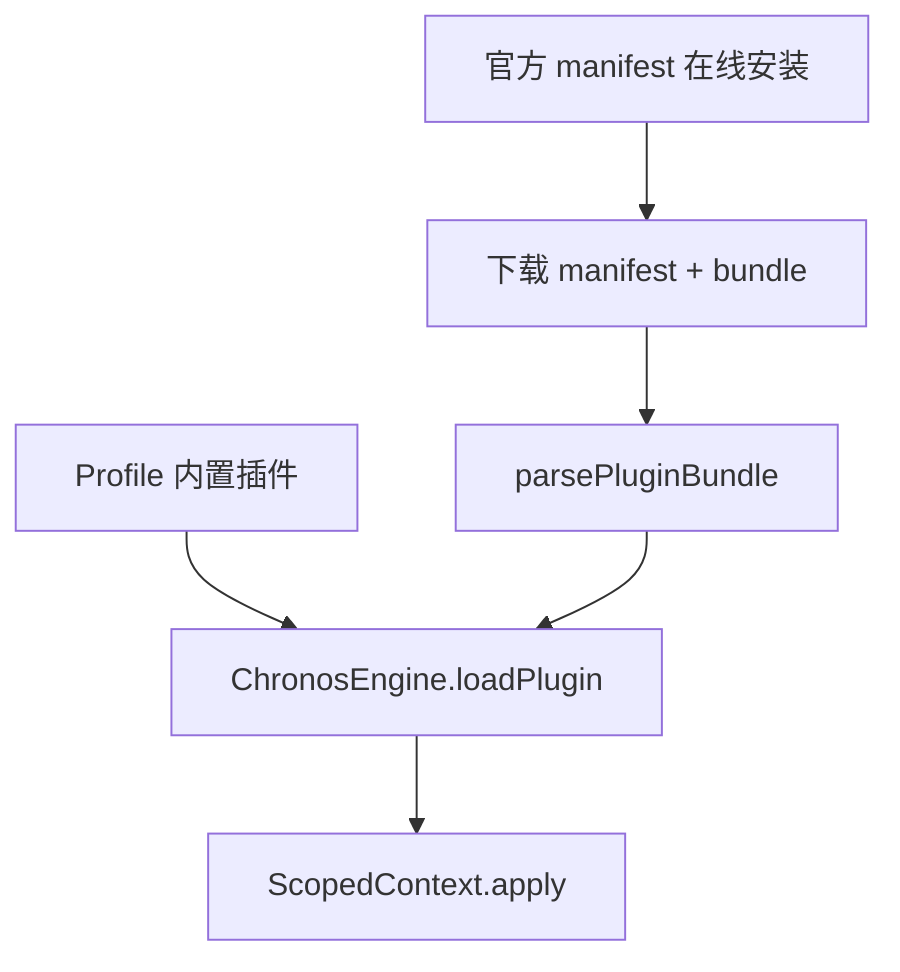

# ADR 0011: 单轨官方插件与 manifest 在线安装

- **状态**: Accepted
- **日期**: 2026-08-21
- **关联提交**: `4feb4ae`, `e857c4f`, `dcfafbf`, `fa0ec2d`, `88b0ce4`, `d9467dd`, `a322953`, `3e42a35`, `6a473e8`, `2e2d4d1`, `be6f41c`, `07e0262`, `4606533`, `a4f5365`, `a7cb155`
- **关联**: 取代 ADR 0004 中 Worker 沙箱双轨部分（双轨模型退役，Profile 内置轨保留）
- **范围**: 插件安装与激活 (`packages/core`, `apps/web/src/lib/services/official-plugins`)

---

## 背景与问题

ADR 0004 为第三方市场插件引入 Web Worker 沙箱双轨，带来：

1. Worker + JSON-RPC 与进程内 `ScopedContext` 两套生命周期，维护成本高；
2. 市场 bundle 与 workspace 源码双产物；
3. 沙箱 API 裁剪（无 pipeline hook、无 Svelte 路由），插件开发体验差；
4. 产品方向调整为无在线市场、官方 manifest 链接安装、用户自担风险。

---

## 架构决策

统一为 **单轨进程内 `ChronosEngine.loadPlugin`**，区分仅在于插件来源：

### 1. Profile 内置轨（不变）

- `ProfileManager` 按 profile 顺序加载 `core-shell`、`source-cqut`、`codec-share` 等 workspace 插件；
- 编译进发行产物，零运行时下载。

### 2. 官方插件在线安装轨

- 仓库维护 [`apps/web/static/official-plugins/catalog.json`](apps/web/static/official-plugins/catalog.json) 与 manifest 列表；
- 用户从官方目录安装，或粘贴 manifest.json URL（含 bundleUrl + sha256）；
- `OfficialPluginService` 校验 SHA-256 后 `parsePluginBundle` → `engine.loadPlugin`；
- 已安装记录持久化于 `core.official-plugins` / `installed_plugins`（自 `core.marketplace` 迁移）。

### 3. 移除项

- `WorkerPluginBridge`、`worker-runtime.js`、static marketplace bundles；
- `packages/core/src/types/sandbox.ts`；
- 「插件市场 / 社区 / 第三方」产品文案。

### 4. 安全边界

- 在线安装的官方插件与 Profile 内置插件同等进程内权限；
- UI 安装前明示用户自担风险；依赖 manifest 来源可信与 SHA-256 完整性校验。

---

## 影响与收益

- **Concept Collapse**：插件激活收敛为单一路径，slot owner 跟踪一致；
- **开发体验**：官方插件 bundle 与 workspace 源码同源，build 脚本生成 manifest + sha256；
- **产品对齐**：无市场运营成本，官方 catalog + 链接安装满足可选扩展需求。
