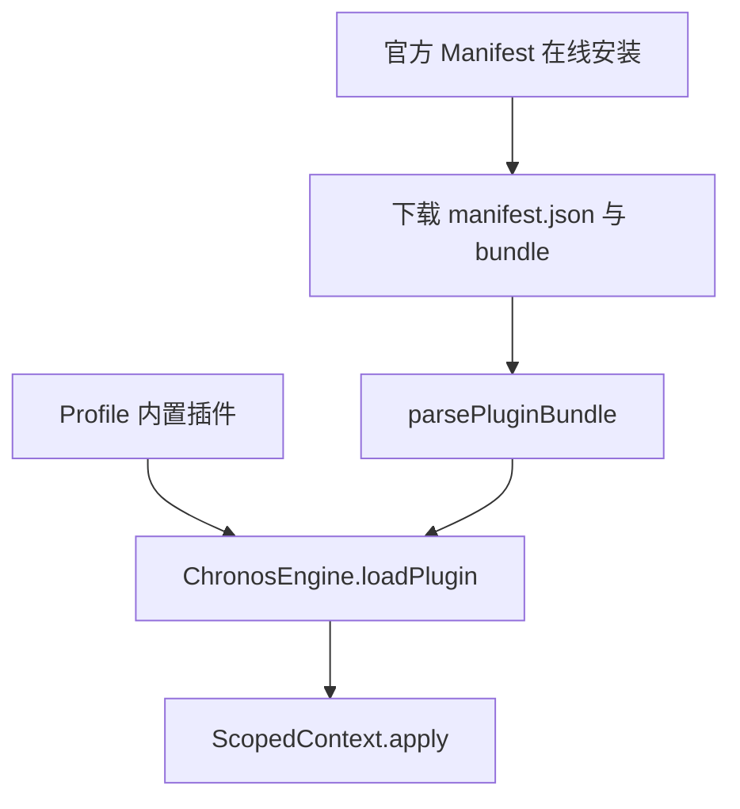

# ADR 0011: 官方插件在线分发与统一加载机制

- **状态**: Accepted
- **日期**: 2026-08-21
- **关联提交**: `4feb4ae`, `e857c4f`, `dcfafbf`, `fa0ec2d`, `88b0ce4`, `d9467dd`, `a322953`, `3e42a35`, `6a473e8`, `2e2d4d1`, `be6f41c`, `07e0262`, `4606533`, `a4f5365`, `a7cb155`
- **关联**: 取代 ADR 0004 中 Worker 沙箱双轨部分（废弃沙箱多轨模型，保留 Profile 内置插件机制）
- **范围**: 插件安装与激活 (`packages/core`, `apps/web/src/lib/services/official-plugins`)

---

## 背景与问题

ADR 0004 曾为第三方市场插件引入 Web Worker 沙箱隔离，形成「沙箱隔离 + 进程内加载」两套并存的机制，带来一系列架构痛点：

1. **维护成本高昂**：需要同时维护 Worker + JSON-RPC 通信通道与进程内 `ScopedContext` 两套截然不同的生命周期与 API 代理；
2. **构建产物割裂**：同一插件需同时维护 workspace 源码与市场静态 bundle 两份独立产物；
3. **沙箱能力受限**：Worker 内部无法挂载 DOM 视图组件、无法拦截流水线钩子，严重制约了复杂插件的开发体验；
4. **产品策略调整**：明确不做开放第三方市场运营，收敛为「官方插件目录（Catalog）+ Manifest 链接安装、用户自担风险」的分发模式。

---

## 架构决策

统一为 **单轨进程内插件加载机制 (`ChronosEngine.loadPlugin`)**，仅根据插件来源区分分发形式：

### 1. Profile 内置插件链路

- `ProfileManager` 按 Profile 配置顺序加载 `core-shell`、`source-cqut`、`codec-share` 等 workspace 源码插件；
- 直接编译进最终宿主发布包中，零额外运行时网络下载。

### 2. 官方插件在线分发链路

- 仓库统一维护 [`apps/web/static/official-plugins/catalog.json`](apps/web/static/official-plugins/catalog.json) 与官方 manifest 列表；
- 用户可从官方插件中心直接安装，或通过粘贴外部 manifest URL 进行安装；
- `OfficialPluginService` 在下载产物后进行 SHA-256 完整性校验，校验通过后调用 `parsePluginBundle` → `engine.loadPlugin` 完成激活；
- 已安装插件记录持久化存储在 `core.official-plugins` / `installed_plugins` 命名空间中。

### 3. 彻底移除沙箱冗余代码

- 移除 `WorkerPluginBridge`、`worker-runtime.js` 及市场静态 bundle 冗余资产；
- 移除 `packages/core/src/types/sandbox.ts`；
- 全局清理「第三方插件市场」相关概念文案，明确官方插件分发定位。

### 4. 安全与权限边界

- 在线安装的官方插件与内置插件拥有相同的进程内运行权限；
- 在界面安装前明确告知用户风险，安全机制基于 Manifest 来源信任与 SHA-256 产物哈希防篡改校验。

---

## 影响与收益

- **架构路径统一**：插件加载与生命周期收敛为单一通道，插槽所有者（Slot Owner）追踪与卸载行为严格一致；
- **开发体验提升**：官方插件源码与独立 bundle 共享同一套 TypeScript 源码，构建脚本自动生成 manifest 与哈希；
- **产品边界清晰**：规避了复杂的跨进程沙箱维护成本，官方目录与链接安装兼顾了灵活性与安全性。
