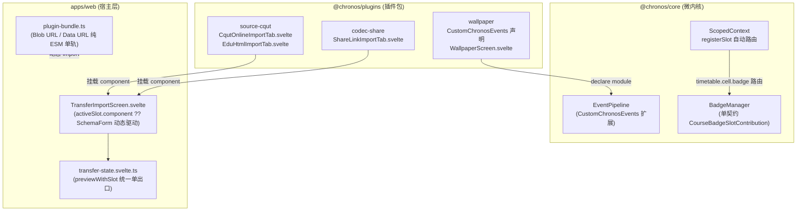

# ADR 0013: 导入管道插槽化闭环、微内核事件收敛与徽章双轨统一

- **状态**: Accepted
- **日期**: 2026-08-22
- **关联**: 细化 [ADR 0003](./0003-hierarchical-slot-registry-and-extensibility.md)、[ADR 0009](./0009-deep-architecture-convergence-and-dead-code-purge.md)、[ADR 0012](./0012-online-plugin-rich-ui-via-esm-and-controlled-preview.md)
- **范围**: 导入插槽体系、微内核事件与徽章契约、ESM 单轨加载与宿主解耦 (`packages/core`, `packages/plugins/*`, `apps/web`)

---

## 背景与问题

随着 ADR 0012 引入了在线插件富 UI（ESM 编译 Svelte 自包含挂载能力），系统架构中仍存在几处关键的历史技术债务与双轨现象：

1. **导入管道“插槽未闭环”**：
   - 宿主 `TransferImportScreen.svelte` 内部硬编码了针对 `cqut-online`（知行理工表单）、`share-link`（剪贴板卡片）、`edu-html`（HTML 文件选择）三条专用分支与手写逻辑；
   - 历史上曾尝试通过 `inputSchema` 驱动，但因通用 `SchemaForm` 无法表达 Material 3 精细表单卡片、离线提示、WebAuthn PRF 凭据列表及快捷验证、一键剪贴板导入等富交互，被迫回退为手写 UI；
   - 导致无法零改动接入第三方课表源插件，宿主导入状态层 `transfer-state.svelte.ts` 存在针对具体插件的硬编码与逆向常量 import。

2. **壁纸私有事件污染微内核核心事件总线**：
   - `wallpaper:set`、`wallpaper:changed`、`wallpaper:hydrate` 硬编码在 `@chronos/core` 的 `ChronosEvents` 接口中，破坏了内核的业务无关性与纯粹性。

3. **徽章系统双轨契约**：
   - 微内核同时保留了已废弃的 `CourseBadgeContribution`（通过 `projectBadges` 计算）与 ADR 0003 插槽契约 `CourseBadgeSlotContribution`，造成维护冗余。

4. **插件加载器遗留 CJS eval 兼容层**：
   - `plugin-bundle.ts` 仍保留 `parseCjsBundle` / `isLikelyCjs` / `new Function` 兜底与正则替换，未彻底实现纯 ESM 单轨。

5. **宿主层逆向依赖与死代码**：
   - `app-shell.svelte.ts` 在 `clearAllData` 中直接调用 `source-cqut` 的私有凭据存储 key；壁纸插件内部残留未使用的存储函数。

---

## 架构决策

### 1. 导入管道插槽化闭环（保持 UI 像素级一致）

- 在 `@chronos/plugin-source-cqut` 中创建 [`CqutOnlineImportTab.svelte`](file:///Users/uednd/code/Chronos/packages/plugins/source-cqut/src/CqutOnlineImportTab.svelte)（知行理工账号密码登录、离线提示、WebAuthn 凭据列表、验证与清除）与 [`EduHtmlImportTab.svelte`](file:///Users/uednd/code/Chronos/packages/plugins/source-cqut/src/EduHtmlImportTab.svelte)（教务系统 HTML 文件选择与解析）；
- 在 `@chronos/plugin-codec-share` 中创建 [`ShareLinkImportTab.svelte`](file:///Users/uednd/code/Chronos/packages/plugins/codec-share/src/ShareLinkImportTab.svelte)（剪贴板一键读取与口令解析）；
- 插件在 `apply()` 注册 `import.source.tab` 插槽时挂载 `component` 与 `inputSchema`（作为降级兜底）；
- `TransferImportScreen.svelte` 改造为按 `activeSlot.component` 动态挂载，无组件时回退 `SchemaForm`，**消除所有硬编码源分支，且 100% 保持 UI 布局与交互体验像素级一致**；
- `transfer-state.svelte.ts` 收敛为通用的 `previewWithSlot(tabId, inputs)` 单出口，移除对插件常量的逆向依赖。

### 2. Wallpaper 事件微内核剥离

- 从 `@chronos/core` 的 `ChronosEvents` 移除 `wallpaper:set`、`wallpaper:changed`、`wallpaper:hydrate`；
- 在 `@chronos/plugin-wallpaper` 中利用 TypeScript 模块增强（`declare module '@chronos/core'`）将私有事件扩展至 `CustomChronosEvents`。

### 3. 徽章系统双轨合一

- 彻底删除已废弃的 `CourseBadgeContribution` 及 `projectBadges`，统一微内核徽章契约为 `CourseBadgeSlotContribution`；
- `BadgeManager` 适配单契约与上下文同步计算；
- `ScopedContext.registerSlot('timetable.cell.badge')` 自动路由注册至 `host.badges`。

### 4. 在线插件 ESM 加载器单轨化

- 移除 `plugin-bundle.ts` 中的 `new Function` / `parseCjsBundle` / CJS eval 回退代码；
- 浏览器环境下使用 Blob URL ESM 动态加载，Node / Vitest 测试环境下使用 Data URL ESM 动态加载；
- `validatePluginManifest` 严格校验 `bundleFormat === 'esm'`。

### 5. 宿主层解耦与死代码清理

- `app-shell.svelte.ts` 中 `clearAllData` 简化为直接调用 `controller.clearAllData()`，消除对 `source-cqut` 私有凭据存储 key 的逆向依赖；
- 移除壁纸插件中未使用的存储函数（`saveWallpaperBytes`、`clearLocal`、`clearPersisted`）。

---

## 插件体积（ESM Svelte 化后）

各插件使用 Vite / Rolldown 打包为独立 ESM bundle 后的产物体积：

| 插件 ID          | 插件名称           | 产物格式   | Bundle 体积 (未压缩) | Gzip 压缩后体积 | 说明                                                    |
| :--------------- | :----------------- | :--------- | :------------------- | :-------------- | :------------------------------------------------------ |
| `theme-yumemita` | YUMEMITA 主题      | ESM (`es`) | **2.14 kB**          | **1.03 kB**     | 轻量主题令牌与排版                                      |
| `source-cqut`    | 重庆理工知行理工源 | ESM (`es`) | **62.89 kB**         | **20.09 kB**    | 含登录/离线/凭据/HTML解析完整富 UI                      |
| `tool-wallpaper` | 课表壁纸           | ESM (`es`) | **188.60 kB**        | **45.11 kB**    | 含 Material 3 取色引擎、图片压缩、壁纸设置完整富 UI     |
| `codec-share`    | 分享短链编解码     | ESM (`es`) | **1.43 MB**          | **676.80 kB**   | 含 brotli-wasm 完整 WebAssembly 压缩二进制与剪贴板富 UI |

---

## 结论与后续

本决策使得 Chronos 导入体系彻底实现了**插件自包含富 UI 挂载**与**微内核完全解耦**。任何第三方或高校插件均可通过相同模式声明自身的导入卡片富 UI 或 Schema 降级，宿主无需改动任何代码。
