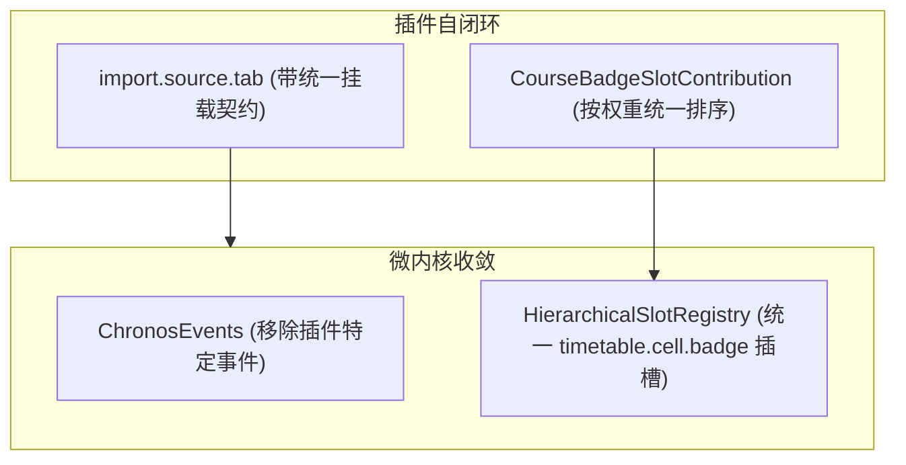

# ADR 0013: 导入管道插槽化闭环、内核事件精简与徽章机制统一

- **状态**: Accepted
- **日期**: 2026-08-22
- **关联提交**: `8ad8f88`, `ffba381`, `488a034`, `74ea6d5`, `ec843f5`, `46d1bb0`, `e49fa3e`
- **范围**: `packages/core`, `packages/ui-kit`, `packages/plugins/*`, `apps/web`

---

## 背景与问题

随着 ADR 0012 引入基于 ESM 的富 UI 插件体系，导入管道和事件体系出现以下未收口的架构问题：

1. **导入管道挂载组件割裂**：虽然导入执行已插槽化，但不同插件导入页面的组件挂载和视觉表现尚未完全对齐；
2. **内核混入特定业务事件**：微内核 `ChronosEvents` 中仍包含 `wallpaper:*` 这类特定插件的专属事件，破坏了核心引擎的通用性；
3. **课程徽章机制存在双轨**：课表卡片上的徽章渲染存在多套逻辑，缺少统一的排序与生命周期管理。

---

## 架构决策

### 1. 导入管道挂载契约闭环

- `ImportTabSlotContribution` 统一支持通过 `ChronosMountable` 挂载原生 Svelte 导入组件或通过 `inputSchema` 渲染动态表单；
- 统一导入流程的错误提示、数据预览弹窗及入库动作，宿主界面仅负责调度外壳。

### 2. 精简微内核核心事件

- 从 `@chronos/core` 的 `ChronosEvents` 彻底剔除 `wallpaper:*` 等特定插件的事件定义；
- 特化插件间的私有通信通过插件自维护的事件或状态进行解耦，核心事件仅保留与排课、偏好及生命周期相关的通用契约。

### 3. 课程徽章单轨机制收敛

- 课表单元格徽章全面收敛至 `timetable.cell.badge` 插槽；
- 统一支持 `order` 优先级排序与多语言本地化标签解析，消除宿主层写死的徽章特判。

---

## 影响与收益

- **内核职责纯净**：微内核事件完全通用化，无任何特定插件业务侵入；
- **徽章扩展规范**：所有插件贡献的卡片徽章遵循统一的权重与生命周期规范；
- **导入体验统一**：不同高校导入源在保持交互特性的同时，享有统一的加载指示与确认交互。

---

## 验证

- `vp check` / `vp test` 全量通过；
- 导入管道与课程徽章多源加载验证正常，无样式重叠与状态残留。

---

## 修订记录

- 2026-08-22 · [ADR 0016](./0016-round3-convergence-and-deprecated-removal.md)：修订本文针对壁纸事件的处理策略，将跨主题通用的取色事件泛化为 `dynamicColor:*` 并重新纳入核心契约。
