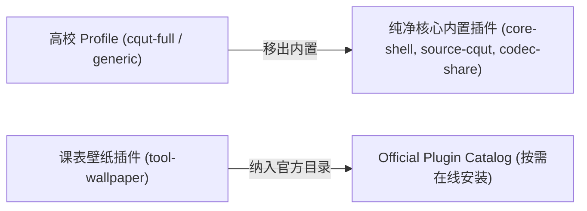

# ADR 0014: 课表壁纸移出内置预设并转为官方在线插件分发

- **状态**: Accepted
- **日期**: 2026-08-22
- **关联提交**: `b453eb5`, `7303f8a`, `8f46e50`, `60aa839`, `b122718`, `bfa2a63`, `e3a1fef`
- **范围**: `packages/plugins/wallpaper`, `apps/web`, `scripts/build-official-plugins.ts`

---

## 背景与问题

课表壁纸此前作为 Profile 默认内置插件（`builtinPlugins`）直接打包在发布包中，带来以下问题：

1. **宿主产物体积增大**：壁纸功能包含较多图片处理与交互组件代码，使仅需要基础排课功能的高校产物变得臃肿；
2. **分发模式不一致**：壁纸与主题类扩展应当作为可选的高级功能，通过官方插件中心按需分发，而非强制内置；
3. **构建与样式隔离不彻底**：独立插件的 Tailwind 样式在按需加载时容易与宿主全局样式冲突或缺失。

---

## 架构决策

### 1. 从 Profile 预设中剥离壁纸插件

- 修改所有 Profile 预设定义，将 `@chronos/plugin-wallpaper` 从 `builtinPlugins` 列表中移除；
- 将壁纸插件重新定位为官方扩展插件 `tool-wallpaper`，仅在官方插件目录（Catalog）中提供在线安装。

### 2. 完善插件富 UI 容器与样式加载

- 优化 `PluginScreenContainer`，在动态挂载组件的同时确保对应插件的独立 CSS 资源正确注入到页面；
- 构建脚本针对插件样式产物进行独立命名与 SHA-256 校验，杜绝全局样式覆盖。

### 3. 数据隔离与持久化

- 壁纸插件的数据（自定义图片、透明度、缩放参数）完全存储于其私有命名空间（`tool-wallpaper`）下，宿主底层存储不保留任何专有数据结构。

---

## 影响与收益

- **首屏体积显著瘦身**：通用发布包体积大幅降低，提升 PWA 加载速度；
- **分发模型统一**：所有可选功能（壁纸、梦见多主题等）均通过官方插件中心统一分发与管理；
- **组件样式完全隔离**：插件自带完整样式，按需动态装卸，避免污染全局宿主。

---

## 验证

- `vp run build:official-plugins` 成功生成独立的 `tool-wallpaper` bundle 与 manifest；
- 在纯净环境中从插件中心在线安装壁纸插件，功能完整可用，卸载后无残留状态与事件监听。
