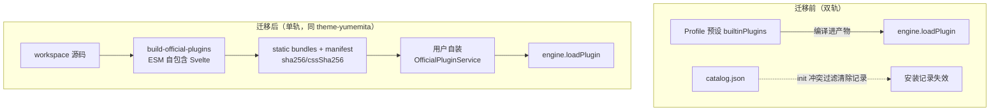

# ADR 0014: 课表壁纸退役 Profile 预设、转纯在线官方插件分发

- **状态**: Accepted（待办由 [ADR 0015](./0015-deepening-round2-build-credential-glue-convergence.md) 闭环）
- **日期**: 2026-08-22
- **关联**: 收敛 [ADR 0007](./0007-plugin-profile-and-preset-assembly.md) 装配边界；依赖 [ADR 0011](./0011-single-track-official-plugin-install.md)、[ADR 0012](./0012-online-plugin-rich-ui-via-esm-and-controlled-preview.md)（`865bb1861` 起）、[ADR 0013](./0013-import-pipeline-slot-closure-and-deep-convergence.md)
- **范围**: Profile 装配与官方插件分发 (`apps/web/src/lib/boot`, `packages/plugins/wallpaper`, `packages/ui-kit`, `scripts/build-official-plugins.ts`, `apps/web/static/official-plugins`)

---

## 背景与问题

课表壁纸插件是历史上胶水最重的插件，经多轮收敛才达成「宿主零特判」：

1. **存储端口特化**（ADR 0008）：`IStorageService.getWallpaper/setWallpaper` 剥离为插件命名空间 KV；
2. **影子模型与 Dexie 残余**（ADR 0010）：删除 `AppState.wallpaperUri` 与 `wallpapers` 表；
3. **富 UI 回归插件**（ADR 0012 / `865bb1861`）：此前在线 bundle 无法携带 Svelte 组件，壁纸 UI 被迫宿主硬编码于 `/wallpaper` 路由与 `WallpaperScreen.svelte`；ESM 自包含编译落地后组件回归插件，宿主路由删除；
4. **私有事件剥离**（ADR 0013）：`wallpaper:set/changed/hydrate` 经模块增强声明，微内核事件总线恢复纯粹。

但装配位置从未调整：三个 Profile 预设均强制预装 `tool-wallpaper`，同时它又列在官方 catalog 中，形成同一插件的双轨生命周期：

| #   | 问题                            | 后果                                                                                                                 |
| :-- | :------------------------------ | :------------------------------------------------------------------------------------------------------------------- |
| 1   | 违背 ADR 0007「零冗余体积」初衷 | 壁纸属可选美化工具而非高校必需能力；188.6 kB（gzip 45.11 kB）被编译进所有发行产物                                    |
| 2   | 双轨安装冲突                    | `OfficialPluginService.init` 的内置重叠过滤会清掉用户从市场的安装记录；市场页将其显示为不可安装的内置项              |
| 3   | 宿主 boot 层残留胶水            | `apps/web/src/lib/boot/wallpaper-plugin.ts` 仅为一行「传宿主组件进工厂」的适配文件，是 ADR 0012 前胶水时代的最后残余 |

YUMEMITA 主题（ADR 0012）已验证「workspace 源码同源、仅经 catalog 在线分发」的模式，壁纸应跟进同轨。

---

## 架构决策

`tool-wallpaper` 退役出全部 Profile 预设，转为**纯在线官方插件**：catalog 分发 → manifest SHA-256 校验 → Blob ESM `import()` → 单轨 `engine.loadPlugin`。bundle entry 自包含，不再依赖宿主传组件。

### 1. Profile 剔除与宿主胶水移除（工作区已完成）

- [`profile-registry.ts`](../../apps/web/src/lib/boot/profile-registry.ts)：`availablePlugins` 移除 `wallpaperPlugin`，`chronos-cqut` / `chronos-cqut-offline` 预设删 `{ id: 'tool-wallpaper' }`（`default` 本就未含）；
- 删除 `apps/web/src/lib/boot/wallpaper-plugin.ts`（唯一职责是把宿主 `WallpaperScreen` 传入工厂）；
- [`bundle/entry.ts`](../../packages/plugins/wallpaper/bundle/entry.ts)：改为 `svelte` 的 `mount/unmount` mountable 适配器自包含默认导出，不再要求宿主注入组件。

### 2. 富 UI 加载通道补全（工作区已完成）

- [`PluginScreenContainer.svelte`](../../packages/ui-kit/src/plugin-screen/PluginScreenContainer.svelte)：新增 **mountable 组件分支**——检测 `component.mount` 为函数时挂载到容器 div 并在清理回调中 unmount；Svelte 编译期组件对象分支保留给 Profile 内置插件；`schema` 分支兜底不变。
- 该分支是在线 bundle 富 UI 的通用通道，后续任何含 Svelte 界面的官方插件直接复用，无需宿主改动。

### 3. 构建脚本 CSS 归属缺陷修复（待办）

`scripts/build-official-plugins.ts` 全部插件共享 `distDir` 且 `emptyOutDir:false`，CSS 归属靠「抓目录里任意 `.css`」（L101-113），前一插件的样式残留会被记到后一插件头上——当前两份 manifest 的 `cssSha256` 完全相同（`85d2e211…`）即为该缺陷实证。修复：

- 每个插件使用隔离子目录 `dist/official-plugins/<id>/` 构建（或每次构建前清空 distDir），构建后仅取本插件产出的 CSS，再拷贝至 static 目录并计算哈希；
- 重新执行 `vp run build:official-plugins`，核对两份 manifest 哈希互异且与产物一致。

### 4. 宿主残留决策清单（有意保留项）

| 文件                                                                          | 内容                                                                                     | 决策                                                                                                                               |
| :---------------------------------------------------------------------------- | :--------------------------------------------------------------------------------------- | :--------------------------------------------------------------------------------------------------------------------------------- |
| `apps/web/src/lib/appearance/appearance.svelte.ts:13-20`                      | 动态 `import('@chronos/plugin-wallpaper/wallpaper-theme')` 取色适配器                    | **保留**。以 `themes.getTheme('wallpaper')` 注册与否门控，与安装来源无关；未安装时返回 null 走默认配色。远期可随取色链路事件化下沉 |
| `apps/web/src/lib/app/app-shell.svelte.ts`                                    | `WALLPAPER_PLUGIN_ID` 特判、`wallpaper:changed/hydrate/set` 事件桥、`hasWallpaper*` 状态 | **保留**（ADR 0012 §4 决议）：课表背景层渲染与 appearance 取色仍依赖此桥接；插件卸载后 `isPluginLoaded` 门控自动失活               |
| `apps/web/package.json:22`、根/子 `vite.config.ts` 别名、`layout.css @source` | 包解析与 Tailwind 类扫描                                                                 | **保留**：appearance 动态导入解析、单测解析与在线 bundle 工具类复用宿主样式的前提                                                  |
| `apps/web/src/lib/client/analytics.ts:39-40`                                  | 死埋点类型 `wallpaper_set/clear`                                                         | **顺手清理**：无任何触发点                                                                                                         |
| `packages/plugins/wallpaper/src/index.ts:9`                                   | 「web app uses `$lib/boot/wallpaper-plugin`」注释                                        | 更新为在线 bundle 分发说明；`wallpaperPlugin` 默认实例保留供包内单测                                                               |

### 5. 兼容性与升级路径

- **数据零迁移**：壁纸图片存于引擎插件 KV `('tool-wallpaper', 'wallpaper_image')`，与安装记录无关；市场重装后 `syncFromStorage(true)` 自动恢复壁纸与配色。
- **存量用户**：旧版本中市场安装记录会被 `init` 内置冲突过滤立即清除，故升级后所有用户统一走「插件中心 → 官方插件 → 安装课表壁纸」，符合可选扩展 opt-in 定位。
- **主题偏好回退**：偏好停留在 `visualThemeId/paletteMode = 'wallpaper'` 但插件未安装时，主题未注册 → `resolveWallpaperModule()` 返回 null → 回退默认配色，不崩溃（列为验证用例）。
- **新旧客户端自洽**：客户端仅 fetch 同源静态 catalog/bundle，旧客户端配旧产物、新客户端配新产物，互不串扰。`minEngineVersion` 目前无运行时校验（ADR 0012 后续项），不在本次范围。

---

## 影响与收益

- **Profile 纯粹化**：预设仅保留高校必需能力（core-shell / source-cqut / codec-share），发行产物瘦身约 188 kB，回归 ADR 0007「零冗余」初衷；
- **单轨生命周期**：壁纸与 YUMEMITA 同轨，安装/启停/卸载状态唯一由 `OfficialPluginService` 管理，「已安装即不可安装」的市场矛盾消除；
- **富 UI 通道泛化**：PluginScreenContainer mountable 分支使任意官方插件可自包含交付 Svelte 富界面，宿主 boot 层不再出现「替插件传组件」的胶水文件；
- **工程闭环**：构建脚本 CSS 归属缺陷顺带修复，manifest 双哈希恢复可信。

---

## 验证

- `vp check` / `vp test` 全绿；
- `vp run build:official-plugins`：两份 manifest `sha256` 互异、`cssSha256` 互异（缺陷修复后）；
- `vp -C apps/web build` 通过，确认产物中不再包含壁纸主包（除 appearance 异步 chunk）；
- 手动场景：
  1. 全新启动 → 插件中心安装「课表壁纸」→ 设置图片 → 重启后壁纸与配色自动恢复；
  2. 卸载壁纸（偏好停留 wallpaper 主题）→ 无崩溃，回退默认配色；
  3. 停用/启用开关行为一致；`cqut-offline` 构建首屏不含壁纸入口；
  4. `/plugins/tool-wallpaper` 富 UI 页正常渲染（mountable 通道），SchemaForm 预览降级可用。

---

## 后续

- `minEngineVersion` 运行时校验与 catalog `version:2`（承接 ADR 0012 后续项，本次不动）；
- `app-shell` 壁纸事件桥的远期事件化下沉（与取色链路一并评估）；
- ADR 0007 装配图中的 `theme-yumemita, wallpaper` 示例已过时，本文生效时同步勘误。
