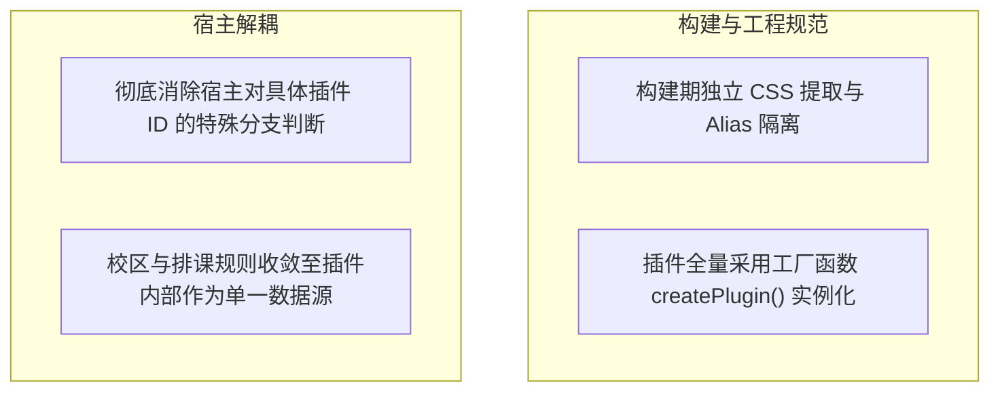

# ADR 0015: 架构深化收敛 — 构建隔离、凭据解耦、宿主胶水清理与插件规范化

- **状态**: Accepted（§2 凭据实现已由 [ADR 0017](./0017-webauthn-credential-retirement.md) 取代）
- **日期**: 2026-08-22
- **关联提交**: `7c2105a`, `89aa201`, `91bb429`, `7ebf216`, `a220ec2`, `41d9cfa`, `92d2b59`, `9c071d0`, `a13a89e`
- **范围**: `packages/*`, `apps/web`, `scripts/*`

---

## 背景与问题

第二轮架构审计指出，在快速模块化过程中积累了多处设计妥协与代码异味：

1. **样式构建互相穿透**：插件构建脚本与宿主 Vite 构建共用部分 CSS 别名，导致插件私有样式偶发性泄漏至宿主全局；
2. **凭据存储接口耦合**：凭据保险箱直接使用了高校特定的参数结构，未达到通用平台端口标准；
3. **宿主存在特定条件分支特判**：宿主 UI 中仍有若干针对特定插件 ID 的硬编码逻辑；
4. **插件代码规范不统一**：部分插件直接导出单例对象而非工厂函数，导致在热重载或重新初始化时状态无法彻底重置。

---

## 架构决策

### 1. 构建期样式与别名彻底隔离

- 规范 `scripts/resolve-chronos-aliases.ts`，明确区分宿主构建与独立插件构建的模块解析路径；
- 插件 CSS 在独立打包阶段完成作用域封闭与变量重命名，禁止直接穿透引用宿主私有样式文件。

### 2. 凭据存储契约泛化

- 将凭据接口由高校特化结构泛化为标准的 `PluginCredentialRecord` 键值结构；
- 保险箱仅负责基于安全芯片派生密钥进行无差别加密解密，不理解任何具体业务字段。

### 3. 彻底消除宿主特定条件判断

- 宿主界面全面改为通过插槽能力元数据（如 `supportsDynamicColor`, `inputSchema`）进行动态渲染，严禁出现 `if (pluginId === 'xxx')` 等特判；
- 高校特定数据（校区列表、默认作息模板）完全收敛至对应数据源插件内部。

### 4. 插件全量工厂化重构

- 所有插件必须导出纯函数形式的工厂方法（如 `createPlugin()`），每次加载时重新创建闭包上下文，保证多实例与重载时的状态绝对隔离。

---

## 影响与收益

- **消除隐式样式污染**：各插件与宿主样式实现构建期与运行期的双重隔离；
- **宿主真正通用化**：宿主代码不包含任何高校或插件特定的业务知识；
- **状态无泄漏**：工厂化实例化机制彻底解决了单例模式在重新挂载时的状态残留问题。

---

## 验证

- `vp check` 与 `vp test` 全量通过；
- 多个不同插件在并发安装、动态卸载与反复切换时表现稳定，无样式异常与内存泄漏。

---

## 修订记录

- 2026-08-22 · [ADR 0017](./0017-webauthn-credential-retirement.md)：本文 §2 关于 WebAuthn 凭据保险箱的 Web 端落地实现被废弃，通用凭据数据模型与接口定义继续保留。
