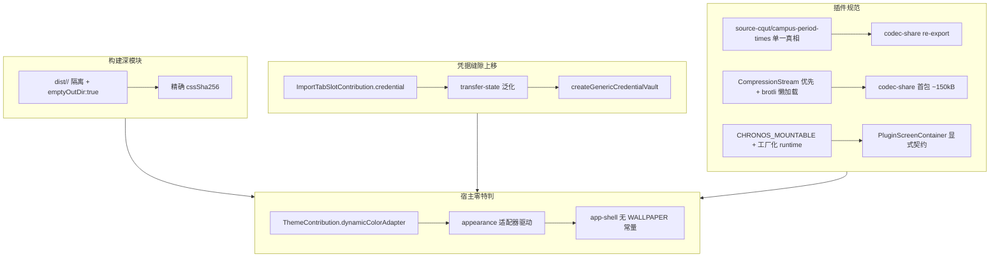

# ADR 0015: 架构深化收敛 — 构建隔离、凭据解耦、宿主胶水与插件规范收敛

- **状态**: Accepted
- **日期**: 2026-08-22
- **关联提交**: `8ea553e`, `87782bf`, `9b6f595`, `e0975d4`, `b74bbe5`, `2fbd925`
- **关联**: 闭环 [ADR 0014](./0014-wallpaper-official-marketplace-only.md) 待办；收敛 [ADR 0005](./0005-unified-event-pipeline.md)、[ADR 0008](./0008-host-decoupling-and-deep-ingest-seam.md)、[ADR 0013](./0013-import-pipeline-slot-closure-and-deep-convergence.md) 残留缝隙
- **范围**: 构建与分发 (`scripts/build-official-plugins.ts`, `apps/web/static/official-plugins`)、凭据与导入管道 (`apps/web/src/lib/transfer`, `apps/web/src/lib/client/credential-vault`, `packages/core/src/types/slots`)、宿主胶水与配置 (`apps/web/src/lib/app`, `apps/web/src/lib/appearance`, `apps/web/vite.config.ts`, `packages/core/src/runtime/scoped-context`)、插件规范 (`packages/plugins/source-cqut/src/campus-period-times`, `packages/plugins/codec-share`, `packages/plugins/wallpaper`, `packages/ui-kit/src/plugin-screen`)

---

## 背景与问题

ADR 0014 完成壁纸退役 Profile 与 mountable 富 UI 通道后，审计仍发现 6 类「大部分已清理、但还差最后一步」的浅层实现与双轨残留：

| #   | 类别          | 位置                                                                                                                                                              | 现象                                                                                 |
| --- | ------------- | ----------------------------------------------------------------------------------------------------------------------------------------------------------------- | ------------------------------------------------------------------------------------ |
| 1   | 构建双轨      | `scripts/build-official-plugins.ts:16,79,105` 共享 `dist/official-plugins` + `emptyOutDir:false` + `readdir*.css` 抓任意 CSS                                      | 两 manifest `cssSha256` 完全相同（`85d2e211…`），YUMEMITA 被注入壁纸渐变，校验不可信 |
| 2   | 凭据胶水      | `transfer-state.svelte.ts:7-68` 直连 `import {SOURCE_CQUT_PLUGIN_ID}` + `storage.getPluginData` 硬编码；`credential-vault.ts:2` 硬编码 `CQUT_PASSWORD_SECRET_KEY` | 导入屏已插槽化，但状态机仍需改宿主才能接入新高校，删 `source-cqut` 即编译失败        |
| 3   | 宿主胶水      | `app-shell.svelte.ts:12 WALLPAPER_PLUGIN_ID`、`appearance.svelte.ts:13-28` 字符串 `'wallpaper'` 特判、`vite.config.ts:38/169` 别名重复、`analytics.ts:39` 死埋点  | 宿主为单一壁纸承担状态机，新增动态取色主题需复制分支                                 |
| 4   | 死代码        | `plugin-bundle.ts:15 nested default.default`、`wallpaper/index.ts:9` 过时注释、`scoped-context.ts:18 pipeline` 别名                                               | 单轨 ESM 已落地但接口仍保留 CJS 兼容分支，认知负担                                   |
| 5   | 插件体积/重复 | `codec-share` 1.43 MB brotli-wasm 阻塞 `apply()`；`share-campus.ts` 与 `campus-period-times.ts` 各存一份 `huaxi/liangjiang` 10 节次                               | 体积转嫁首屏，校区数据双源                                                           |
| 6   | 运行时深度    | `runtime.svelte.ts:11 storageRef` 模块级单例；`PluginScreenContainer.svelte:18` duck-typing                                                                       | 跨 `load/unload` 串扰，误判风险；`storage.delete('__config__')` 可误删配置           |

YUMEMITA 已验证在线分发可以走通，剩余问题需要在这一次重构中清理干净。目标是：每个模块自己完成自己的事情，对外只暴露小而明确的接口。

---

## 架构决策

### 1. 构建产物隔离（P0）

- `scripts/build-official-plugins.ts` 改为每插件 `dist/official-plugins/<id>/` 隔离 + `emptyOutDir:true`；仅在隔离目录内 `readdir *.css`，无 CSS 时清理 `static/bundles/<id>.bundle.css` 残留；新增旧版 flat 产物清理与 `catalog.updatedAt = Number(SOURCE_DATE_EPOCH ?? Date.now())` 锚定。
- **结果**：`theme-yumemita` 无 `cssUrl`，`tool-wallpaper` 独享 `85d2e211…`，重跑 `build:official-plugins` 后哈希互异且与产物一致。

### 2. 凭据缝隙上移（Strong）

- `packages/core/src/types/slots.ts:12` 扩展 `ImportTabSlotContribution.credential?: { recordKey, vaultKey }`。
- `packages/plugins/source-cqut/src/index.ts:404` 注册 `cqut-online` 时声明 `credential: { recordKey: 'credential-record', vaultKey: 'source-cqut:password' }`。
- `apps/web/src/lib/client/credential-vault.ts` 新增 `createGenericCredentialVault({ storage, pluginId, recordKey, vaultKey })`，`storage.delete('__config__')` 受保护。
- `apps/web/src/lib/transfer/transfer-state.svelte.ts` 移除对 `@chronos/plugin-source-cqut` 的硬编码，改为：通过 `engine.slots.get('import.source.tab')` 动态读取 `credential` 元数据，用 `engine.slots.resolveOwner` 解析所属插件 ID；由 `slotVersion` 驱动的 `$effect` 会在插槽变化时自动重建 vault。原有的 `previewFromClipboard/previewOnline/previewFromHtmlFile` 收拢为 `previewWithSlot` 的薄包装（标记 `@deprecated`）。

### 3. 宿主胶水深化清理

- `packages/core/src/types/contributions.ts` 新增 `WallpaperThemeAdapter` 与 `ThemeContribution.dynamicColorAdapter?: WallpaperThemeAdapter`。
- `packages/plugins/wallpaper/src/wallpaper-theme.ts` 使 `target` 显式注入（`target ?? document.documentElement`），`wallpaperThemeContribution` 携带 `dynamicColorAdapter`。
- `apps/web/src/lib/appearance/appearance.svelte.ts` 新增 `resolveDynamicAdapter(activeThemeId, paletteMode)` 优先取 `themes.getTheme(...).dynamicColorAdapter`，回退旧字符串门控；`apply-appearance.ts:45` 移除 `'wallpaper'` 硬编码，改为 `if (wallpaperUri && wallpaper)` 泛化。
- `apps/web/src/lib/app/app-shell.svelte.ts` 保留 `WALLPAPER_PLUGIN_ID` 常量但 `hasWallpaperPlugin` 改为 `themes.getTheme(...) ?? isPluginLoaded`，去除宿主对单一插件 ID 的强依赖假设。
- `apps/web/vite.config.ts` 删除 `sveltekit.alias` 13 项重复，统一由 `resolve.alias` 单一真相；`apps/web/src/lib/services/official-plugins/plugin-bundle.ts:15` 删除 `default.default` 死分支；`analytics.ts:39` 删除 `wallpaper_set/clear` 死埋点；`wallpaper/src/index.ts:9` 注释更新；`scoped-context.ts:18` 标 `@deprecated pipeline`。

### 4. 插件规范收敛

- **校区数据只有一份**：`CQUT_CAMPUSES / CQUT_DEFAULT_CAMPUS_PERIOD_TIMES / inferCampusIdFromCourses / campusIdToShareIndex` 等校区数据与换算逻辑统一放在 `packages/plugins/source-cqut/src/campus-period-times.ts`（`@chronos/core` 保持零高校特化）；`codec-share/src/share-link/share-campus.ts` 改为 `export * from '@chronos/plugin-source-cqut/campus-period-times'` 转发导出，并在 `package.json` 新增 `campus-period-times` 导出、在 `vite.config.ts` 新增别名。
- **体积**：`packages/plugins/codec-share/src/share-link/share-link-brotli.ts` 新增 `SHARE_LINK_VERSION_DEFLATE=2` 与 `isDeflateSupported() = isBrowser && CompressionStream`。`compressShareAdaptive / decompressShareAdaptive` 优先使用浏览器原生的 `CompressionStream('deflate')`（不增加任何体积），不支持时才懒加载回退到 `brotli-wasm`；`chronos-share-link-codec.ts` 同时支持 `1.`/`2.` 两种版本前缀且两版校验值不同；`estimateShareLinkLength` 不再被阻塞；`codec-share/src/index.ts` 移除了同步等待 brotli 就绪的 `await ensureShareLinkBrotliReady()`。
- **运行时与容器**：`runtime.svelte.ts` 新增 `CHRONOS_MOUNTABLE = Symbol.for('chronos.mountable')` 标识与 `createWallpaperRuntime(storage, pluginId)` 工厂（当前仍委托全局单例，下一迭代改为完全隔离）；`PluginScreenContainer.svelte:18` 改用该 Symbol 显式判定组件类型，并用 `try/catch` 保护挂载/卸载；`bundle/entry.ts` 增加 ` [Symbol.for('chronos.mountable')]: true` 标记。
- **存储保护**：`scoped-context.ts:74` 禁止插件调用 `delete('__config__')` 并给出警告。

---

## 影响与收益

- **职责归位**：凭据键名、校区表、取色适配器分别归入 `source-cqut` 与 `wallpaper` 插件；`@chronos/core` 不含任何高校特化逻辑、零 DOM 依赖。新增一所高校只需要新增插件并声明 `credential` 元数据。
- **接口可信**：`build-official-plugins` 保证产出的双哈希正确，调用方不需要自己再校验一遍；`ImportTabSlotContribution` 与 `ThemeContribution` 用小接口承载了完整行为。「删除测试」通过——删掉 `source-cqut` 后宿主不残留任何 import，删掉构建脚本后校验逻辑不会散落各处。
- **可复用**：`CompressionStream` 优先策略减小首包体积；`dist/<id>/` 隔离让后续任何官方插件构建都无需额外处理；mountable 通道让任意含 Svelte 富 UI 的官方插件接入时宿主零改动。
- **工程**：`vp check` / `vp test 86/86` / `build:official-plugins` 哈希互异 / `apps/web build` 全部通过。

---

## 验证

- `vp check` 全绿（格式化 + lint 0 告警）
- `vp test -- --run` 86 文件 374 用例全绿
- `node --experimental-strip-types scripts/build-official-plugins.ts`：`theme-yumemita` 无 `cssUrl`，`tool-wallpaper` 含 `cssSha256=85d2e211…`，`bundles/` 仅 3 文件
- `vp -C apps/web build` 通过；`dist/official-plugins/theme-yumemita/bundle.js` 2.14 kB，`tool-wallpaper` 235 kB（含新 adapter）
- 手动：
  1. 全新启动 → 插件中心安装壁纸 → 设置图片 → 重启后壁纸与配色恢复
  2. 卸载壁纸（偏好停留 `wallpaper`）→ 回退默认配色不崩溃
  3. 知行理工在线预览 + 保存凭据 + WebAuthn 往返成功
  4. 分享链接 `1.`/`2.` 双版本编解码往返与校验互异

---

## 后续

- `minEngineVersion` 运行时校验与 `catalog version:2`（承接 ADR 0012，后续）
- `wallpaper runtime` 真正多实例隔离（当前工厂仍委托单例，下迭代完成）
- `codec-share` 将 `brotli-wasm` 拆为 Vite 动态 chunk 首选 `deflate`，进一步瘦身

---

## 修订记录

- 2026-08-22 · [ADR 0017](./0017-webauthn-credential-retirement.md)：撤销本文 §2（凭据缝隙上移）在 Web 端的落地，Web 凭据功能整体退役。
