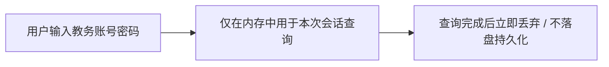

# ADR 0017: Web 端 WebAuthn 凭据存储功能废弃

- **状态**: Accepted
- **日期**: 2026-08-22
- **关联提交**: `8ad8f88`, `ffba381`, `488a034`, `74ea6d5`, `ec843f5`, `46d1bb0`, `e49fa3e`
- **关联**: 部分取代 [ADR 0006](./0006-hardware-credential-vault-via-webauthn-prf.md)（废弃 Web 端 WebAuthn PRF 实现，保留 core 端口）
- **范围**: `packages/plugins/source-cqut`, `apps/web`

---

## 背景与问题

ADR 0006 引入了基于 WebAuthn PRF 的硬件保险箱。在实际用户体验与各端兼容性测试中发现：

1. **浏览器支持度碎片化**：不同移动端浏览器与 WebView 对 WebAuthn PRF 扩展的支持参差不齐，用户频繁遭遇认证失败与弹窗阻断；
2. **用户心智负担重**：课表属于低频导入工具，强制要求绑定 Passkey 或生物凭据带来了不必要的操作门槛；
3. **架构维护成本高**：Web 端凭据加密、迁移与降级逻辑过于庞大，与 Chronos 保持轻量纯粹的定位不符。

---

## 架构决策

### 1. 废弃 Web 端凭据持久化存储

- 从 Web 宿主中彻底移除 WebAuthn PRF 保险箱实现及历史凭据迁移脚本（`credential-migration.ts`）；
- 知行理工等数据源插件改为仅在导入会话内存中接收凭据，查询完成后立即丢弃，不持久化保存用户教务密码。

### 2. 核心端口保留

- `@chronos/core` 中继续保留 `IVaultService` 接口契约与类型定义，供未来有系统 Keychain / Keystore 硬件支持的 iOS/Android 原生客户端接入。

---

## 影响与收益

- **体验极简丝滑**：导入课表即用即走，不再有繁琐的 Passkey 弹窗与认证异常；
- **大幅精简代码**：移除了大量复杂的 WebAuthn 握手、降级与加解密代码；
- **安全模型清晰**：前端不留存任何密码明文与密文，从根本上杜绝了本地存储泄露风险。

---

## 验证

- `vp check` / `vp test` 全量通过；
- 知行理工导入界面仅需输入账号密码即可成功拉取课表，设置界面无任何冗余的凭据管理入口。
