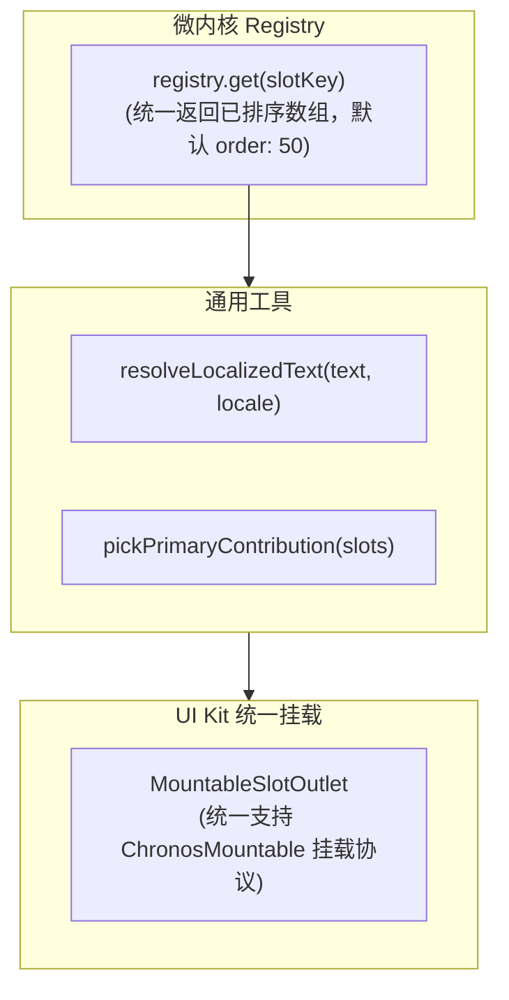

# ADR 0021: 插槽消费机制收敛 — 统一排序契约、文本解析与组件挂载规范

- **状态**: Accepted
- **日期**: 2026-08-23
- **关联提交**: `dd87c35`, `dcf87e6`, `6ad1d6c`, `27076d1`, `4ac2df3`, `5ac598b`
- **关联**: 落实 [ADR 0003](./0003-hierarchical-slot-registry-and-extensibility.md) 的消费侧规范；兑现冲突策略「允许多项共存，按 order 升序排序」的标准承诺
- **范围**: `packages/core/src/types/slots`, `packages/core/src/runtime/hierarchical-slot-registry`, `packages/ui-kit`, `apps/web`

---

## 背景与问题

ADR 0003 建立了 `HierarchicalSlotRegistry` 注册机制，但消费端（Svelte 视图层）在读取和渲染插槽贡献时存在多处口径不一致与样板代码重复：

1. **排序契约未在核心层统一**：各宿主界面在读取插槽列表后各自编写 `.sort((a, b) => ...)`，排序逻辑分散；
2. **多语言文本解析重复**：各视图层自行判断 `typeof label === 'string' ? label : label[locale]`，缺少统一的国际化文本解析工具；
3. **组件挂载方式存在多套写法**：存在 `SlotOutlet`（纯 Schema）、`PluginScreenContainer`（全屏容器）以及若干手写的 Svelte 挂载代码，缺少通用的挂载出口。

---

## 架构决策

### 1. 排序契约唯一下沉至 Registry

- `HierarchicalSlotRegistry.get()` 与 `getAll()` 内部统一执行排序：`order` 较小者排在前面，缺省时默认为 `50`；
- 所有 UI 消费端直接消费已排好序的数组，严禁在视图层进行二次排序。

### 2. 国际化文本与主贡献项解析工具单源化

- 提取通用工具函数 `resolveLocalizedText(label, locale)`，统一处理纯字符串与多语言字典映射；
- 提取 `pickPrimaryContribution(slots)`，规范多贡献项冲突时的首选推导逻辑。

### 3. 组件挂载协议收敛为 `MountableSlotOutlet`

- 在 `@chronos/ui-kit` 中提供统一的 `MountableSlotOutlet` 组件，封装 `ChronosMountable` 挂载协议、Props 变更监听与卸载清理；
- 废弃并删除无消费方的旧版 `SlotOutlet` 浅层组件。

---

## 影响与收益

- **接入成本极低**：新增任何类型的插槽时，消费端无需编写重复的排序与多语言适配样板代码；
- **行为完全一致**：插槽排序与国际化文本回退逻辑全仓唯一，单测覆盖 Registry 即可保障全界面表现一致；
- **生命周期安全**：统一的挂载出口保证了 DOM 节点与事件监听在组件切换时得到可靠清理。

---

## 验证

- `vp check` / `vp test` 全量通过；
- 底栏 Tab、导入源列表、课程徽章及「我的」配置项排序与多语言切换表现正确。
