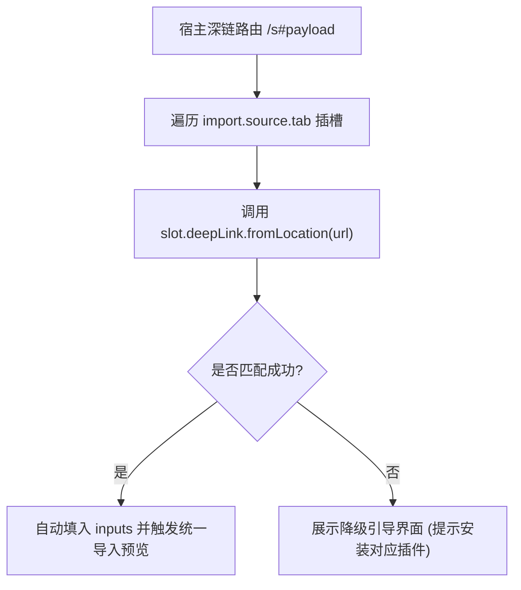

# ADR 0022: 深链解析协议泛化与导出格式逻辑下沉至插件

- **状态**: Accepted
- **日期**: 2026-08-23
- **关联提交**: `4d54649`, `6ad1d6c`, `4ac2df3`
- **关联**: 深化 [ADR 0013](./0013-import-pipeline-slot-closure-and-deep-convergence.md) 的导入插槽规范；对齐 [ADR 0015](./0015-deepening-round2-build-credential-glue-convergence.md)「消除宿主特定条件分支」主线
- **范围**: `packages/core/src/types/slots`, `packages/plugins/codec-share`, `apps/web/src/lib/transfer`, `apps/web/src/routes/s`, `apps/web/src/lib/config/features.ts`

---

## 背景与问题

课表分享深链（`/s#payload`）此前在宿主路由中直接硬编码了 `codec-share` 的格式解析与业务规则：

1. **宿主强耦合特定插件格式**：`/s` 路由直接调用了 `parseShareLinkPayload`，当 `codec-share` 插件未安装或被禁用时，深链页面直接崩溃；
2. **分享长度与告警文案跨层泄漏**：分享链接字符长度阈值（如 2000 字符）与针对 QQ/微信截断的警告文案写在宿主配置中，而非由编码插件自身声明；
3. **缺少通用的深链握手契约**：未来若新增其他协议链接（如二维码载荷落地页或特定高校直接解析链接），宿主无法通用分发。

---

## 架构决策



### 1. 声明式深链握手契约 (`deepLink.fromLocation`)

- 在 `ImportTabSlotContribution` 中增加可选元数据 `deepLink`：
  ```typescript
  deepLink?: {
    fromLocation: (location: Location | URL) => Record<string, unknown> | null;
  }
  ```
- 宿主 `/s` 路由仅作为通用调度网关：遍历所有已注册的导入插槽，调用 `fromLocation` 尝试匹配。首个返回非空输入对象的插槽即为目标解析源，自动调起统一导入预览。

### 2. 导出长度阈值与告警文案归还插件

- 将 2000 字符的链接长度限制与截断警告文案完全移入 `codec-share` 插件内部；
- 宿主不再保留任何针对特定分享格式的字符数判断与提示文案。

### 3. 彻底删除宿主 MIME 嗅探与字符串字面量特判

- 清理宿主中所有的 `'share-link'` 字符串字面量特判；
- 若目标插件未安装，宿主安全展示降级指引页，引导用户前往插件中心安装。

---

## 影响与收益

- **高内聚性 (Locality)**：分享格式的所有知识（Payload 提取、表单输入参数结构、长度限制、风险提示）全部内聚在 `codec-share` 插件中；
- **高复用性 (Leverage)**：接入第二种深链协议（如 NFC、二维码短链等）时，宿主路由代码零修改；
- **容错与安全性**：即使未加载任何编解码插件，深链页面仍能优雅降级，杜绝脚本执行报错。

---

## 验证

- `vp check` / `vp test` 全量通过；
- 移除 `codec-share` 插件后，访问 `/s` 路由正常展示优雅降级提示页；安装后能立即自动唤起课表导入确认弹窗。
