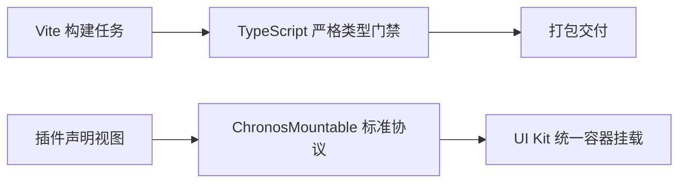

# ADR 0023: Round 4 架构深化 — 类型门禁强化、清理无用接口与统一组件挂载协议

- **状态**: Accepted
- **日期**: 2026-08-23
- **关联提交**: `10a2dce`, `3b48c31`, `fd161e3`, `a95f6a0`, `b8e2ea4`, `bf46ba3`, `7b4ad50`, `bea097c`, `dadd7aa`, `51d5fa7`, `e4e3c99`, `5ccc819`, `09d43c3`
- **关联**: 执行架构深化决议；闭环 ADR 0009 严格 TypeScript 编译要求；明确 EventPipeline 钩子接口冻结范围
- **范围**: `vite.config.ts`, `packages/core`, `packages/ui-kit`, `packages/plugins/*`, `apps/web`, `scripts/*`

---

## 背景与问题

第四轮架构审计指出了以下潜在隐患：

1. **类型检查未纳入门禁**：部分编译任务未将严格类型检查作为必过前置条件，导致类型错误可能被遗漏到构建后期；
2. **内核存在未使用的死接口与冗余类型**：部分早期设计的接口和方法（如无调用的串行拦截钩子）缺乏真实消费方，增加了理解成本；
3. **组件挂载协议存在双轨遗留**：部分视图仍使用旧式的组件引用方式，未完全迁移至标准 `ChronosMountable` 协议。

---

## 用户与架构决策

1. **`queryCourses` 端口能力保留**：`queryCourses` 是贯穿多层的核心课程查询能力接口，本次作为预留能力规范保留，补齐对应的测试 Fake 桩代码并交由类型门禁看护。在有真实外部消费方前，暂不扩充其参数；
2. **零兼容包袱策略**：由于项目处于活跃开发期且无历史数据迁移包袱，所有废弃的过渡代码直接删除，不做版本门控过渡；
3. **构建元数据收敛**：插件版本与 Tailwind 源目录映射统一由配置收敛，避免在构建脚本中分散维护；
4. **组件挂载契约单轨化**：`ChronosMountable` 作为全仓唯一的动态组件挂载协议，全面替代旧式组件声明。

---

## 架构决策

### 1. 严格类型检查作为一级构建门禁

- 在 `vite.config.ts` 的任务编排中强化类型检查任务，任何包的类型错误均直接阻断构建和测试流程；
- 消除所有未使用的类型导入与宽松的类型声明。

### 2. 清理未使用的无用接口与冗余方法

- 冻结 `EventPipeline` 中暂无生产消费方的串行/瀑布拦截钩子，标注为保留状态，防止无序扩张；
- 移除多余的空壳适配器，确保导出的每个 API 都有明确的调用方与单测覆盖；
- 避免测试用例为废弃或无用的代码提供虚假活跃度。

### 3. 组件挂载协议全面单轨化

- 统一全仓所有动态组件挂载点（导入源、自定义全屏视图、卡片扩展）至 `ChronosMountable` 协议；
- 消除任何基于对象字段探测的鸭子类型兼容逻辑。

---

## 影响与收益

- **类型安全坚固**：全仓类型错误在本地与 CI 阶段均能被第一时间捕获；
- **接口边界清晰**：移除了混淆视听的无用接口，插件开发者只需面对最小且明确的标准契约；
- **挂载规范统一**：组件生命周期与渲染机制全仓一致，便于统一维护和排查渲染异常。

---

## 验证

- `vp check` / `vp test` 全量通过；
- 构建流程与类型检查门禁严格联动，故意注入类型错误时构建立即正确拦截报错。
