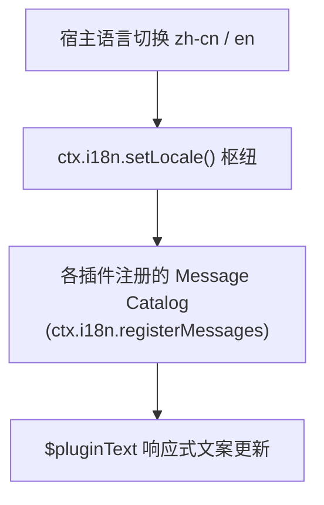

# ADR 0024: 插件多语言架构与 Message Catalog 机制

- **状态**: Accepted（§4 宿主国际化调用由 [ADR 0027](./0027-round6-architecture-subtraction.md) 修订）
- **日期**: 2026-08-23
- **关联提交**: `450d2c5`, `943b5f5`, `481a3b6`, `d5622ef`, `318db1a`, `8886125`, `689c87f`, `7d3ed9d`, `2d967a5`, `50dc61d`
- **关联**: 落实插件国际化演进；扩展 ADR 0021 `LocalizedText` 模型；**§4 宿主桥接由 [ADR 0027](./0027-round6-architecture-subtraction.md) 修订**（移除 `i18nHandler` 与 `engine.t()`，宿主 Shell 统一采用 `hostT`）
- **范围**: `packages/core`, `packages/ui-kit`, `apps/web`, `packages/plugins/*`

---

## 背景与问题

随着插件数量增加，国际化（i18n）面临以下痛点：

1. **宿主与插件文案强行混杂**：所有文案最初均写在宿主 Paraglide 字典中，导致新增一个插件必须修改宿主多语言文件；
2. **多语言字典直接硬编码在 UI 中**：部分插件在 Svelte 模板中直接手写中英文三元表达式，无法集中翻译与统一管理；
3. **语言切换无法联动**：宿主切换语言环境（如 `zh-cn` ↔ `en`）时，插件内部的动态文案无法自动响应更新。

---

## 架构决策

### 1. 插件独立 Message Catalog 注册

- 插件通过 `ctx.i18n.registerMessages({ 'zh-cn': { ... }, 'en': { ... } })` 注册私有国际化词条字典；
- 词条采用命名空间隔离（如 `plugin.today.title`），避免不同插件键名冲突。

### 2. 插件内响应式翻译方法 (`pluginText`)

- 插件上下文提供 `ctx.i18n.t(key, params)` 与响应式辅助函数 `pluginText(key)`；
- 语言环境切换时，所有使用 `pluginText` 的 Svelte 5 视图组件通过 Runes 自动触发响应式重绘。

### 3. 宿主与插件语言环境双向同步

- 宿主 Paraglide 语言切换时自动调用微内核 `engine.setLocale(newLocale)`；
- 内核广播语言变更通知，触发所有已激活插件的国际化上下文同步更新。

---

## 影响与收益

- **插件完全自治**：插件多语言词条完全由插件源码自包含，无需修改宿主任何代码；
- **语言切换无缝联动**：语言切换即时生效，全界面文案实时刷新无需重载页面；
- **翻译词条集中规范**：消除组件内散落的三元表达式硬编码，国际化体验规范专业。

---

## 修订记录

- 2026-08-24 · [ADR 0027](./0027-round6-architecture-subtraction.md)：修订本文 §4；移除冗余的 `engine.t()` 转发，宿主 Shell 自身翻译统一采用轻量 `hostT`，插件内部继续保持 Message Catalog 机制。
