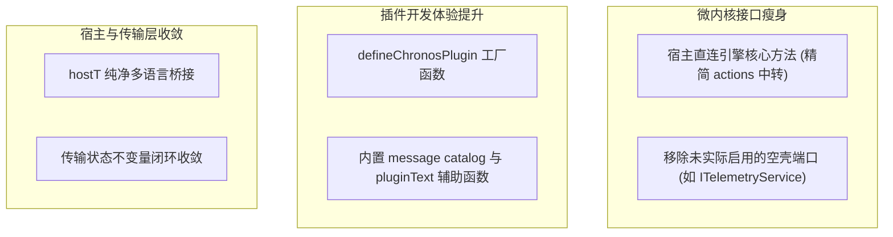

# ADR 0027: Round 6 架构精简 — 颜色契约、内核接口瘦身、宿主国际化与插件工厂化

- **状态**: Accepted
- **日期**: 2026-08-24
- **关联提交**: `c834023`, `3ce1d8c`, `3076a87`, `9375f15`, `ddcc841`, `e3909c1`, `7e728c0`, `3eeefa0`, `72e624d`
- **关联**: 执行第六轮架构深化计划；**部分修订** [ADR 0024](./0024-plugin-message-catalog-i18n.md) §4 宿主国际化桥接；**延续** [ADR 0023](./0023-round4-gate-typing-dead-face-component-single-track.md) 接口冻结基准；**闭环** [ADR 0023](./0023-round4-gate-typing-dead-face-component-single-track.md) 构建元数据收敛规范
- **范围**: `packages/core`, `packages/ui-kit`, `packages/plugins/*`, `apps/web`, `scripts/*`

---

## 背景与问题

第六轮架构审计聚焦于「过度抽象带来的复杂度」，识别出多处冗余层与设计妥协：

1. **Workbench 颜色命名与标准失配**：CSS 变量名与 Material 3 标准存在点号与短横线混用，导致部分全局样式变量映射不清晰；
2. **微内核暴露了不必要的透传接口**：宿主直接通过 `engine.actions.*` 间接调用方法，多了一层无实际价值的转发；同时存在如 `ITelemetryService` 等未实际落地的空壳端口；
3. **宿主国际化刷新机制不优雅**：宿主 Shell 依赖 `hostTextRead` 强制触发重新计算，与 Paraglide 原生机制存在割裂；
4. **插件定义样板代码过多**：编写一个简单插件需要手动实现对象字面量、i18n 注入、上下文绑定等数十行重复代码。

---

## 架构决策

### 1. 规范 Workbench 颜色命名规范

- Workbench 语义颜色键全面规范为 kebab-case（连字符）命名，与 Material 3 CSS 变量标准对齐；
- 官方主题插件的 `colors.json` 同步迁移，消除变量名映射断层。

### 2. 精简微内核对外公开接口

- 宿主侧调用由原先的 `engine.actions.*` 间接中转改为直接调用微内核实例的标准方法；
- 插件上下文 `ctx.actions` 保持稳定不变；
- 彻底移除未启用的空壳端口与类型定义，避免为未来臆想的需求保留沉重负担。

### 3. 宿主轻量化国际化桥接 (`hostT`)

- 移除宿主对 `engine.t()` 的逆向调用依赖；
- 宿主 Shell 自身国际化采用轻量级 `hostT` 工具函数，与 Paraglide 原生响应式更新无缝集成，无需再依赖 hack 触发界面重绘。

### 4. 插件工厂化与样板代码消除 (`defineChronosPlugin`)

- 提供标准插件定义工厂函数 `defineChronosPlugin`；
- 自动处理插件元数据注入、多语言词条注册与上下文绑定，单个官方插件可减少 ≥60 行样板代码。

### 5. 课表导入传输状态自闭环

- 将导入过程中的进度、错误与解析临时状态集中收敛在 `transfer-state` 模块内部，防止状态分散在多个 UI 组件中。

---

## 影响与收益

- **认知负担大幅减轻**：移除了不必要的间接抽象层，调用链路一目了然；
- **插件开发极其轻便**：新插件作者仅需通过 `defineChronosPlugin` 即可在几行代码内完成标准插件声明；
- **国际化响应极速**：宿主与插件在切换语言时各自通过原生响应式机制刷新，完全杜绝了界面不同步问题。

---

## 验证

- `vp check` / `vp test` 全量通过；
- 颜色切换、多语言切换、插件动态加载与课表导入全流程运行平稳。
