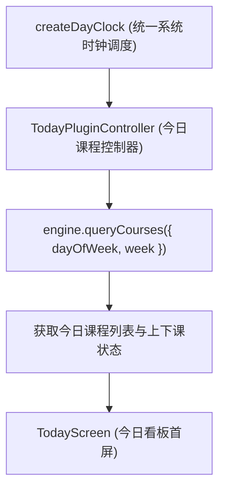

# ADR 0028: 今日插件、默认启动页与统一时钟调度

- **状态**: Accepted（§3–§4 底栏路由约定已由 [ADR 0029](./0029-shell-internal-tab-navigation.md) 取代）
- **日期**: 2026-08-28
- **关联提交**: `c8fc9e7`, `f8b71f4`, `29ad4c1`, `1dd631a`
- **关联**: 延续 [ADR 0003](./0003-hierarchical-slot-registry-and-extensibility.md) 底栏插槽规范；首度落地 [ADR 0023](./0023-round4-gate-typing-dead-face-component-single-track.md) 中预留的 `queryCourses` 端口能力
- **范围**: `packages/core`, `packages/plugins/today`, `apps/web`

---

## 背景与问题

Chronos 原先默认启动页始终为课表主网格（`TimetableScreen`）。在日常校园使用场景中：

1. **缺乏聚焦今日事项的首屏体验**：学生在通勤或课前通常只需查看「下一节课在哪里、还有多久上课」，打开完整课表网格信息过载；
2. **多处独立时钟导致计时不同步**：不同组件各自通过 `setInterval` 维护当前时间，导致分钟变更时倒计时刷新不同步；
3. **`queryCourses` 预留接口缺少真实检验**：ADR 0023 保留的核心课程查询能力尚未在实际业务场景中端到端验证。

---

## 架构决策

### 1. 新增「今日看板」官方插件 (`@chronos/plugin-today`)

- 提供独立的「今日」看板视图（`TodayScreen`），聚焦呈现当前进行中与下一节待上课程、剩余节次倒计时及空闲时段概览；
- 作为 `queryCourses` 端口的首个真实消费者，验证多维课程过滤能力。

### 2. 统一时钟调度体系 (`createDayClock`)

- 引入集中化的 `createDayClock` 时钟调度器，统一按秒/分触发时间跳变事件；
- 所有倒计时与状态计算共享同一个时钟脉冲，彻底消除各组件时间不一致问题。

### 3. 支持可配置的默认启动页 (`defaultLaunch`)

- 用户偏好中增加默认启动 Tab 配置；若安装了今日插件，可将冷启动默认展示页面设置为「今日看板」，提升高频查看效率。

---

## 非目标

- 不在今日插件中内嵌完整的课表编辑功能（保持轻量看板定位）；
- 不引入重型跨天日程管理。

---

## 影响与收益

- **核心场景体验大幅提升**：课前快速查看课程地点与时间变得更加直观高效；
- **时钟调度统一**：全应用共用单一时间源，降低后台轮询性能开销；
- **核心契约闭环**：验证了 `queryCourses` 核心领域查询能力的设计有效性。

---

## 修订记录

- 2026-08-30 · [ADR 0029](./0029-shell-internal-tab-navigation.md)：修订本文 §3–§4 底栏路由部分，将底栏 Tab 切换重构为纯内部状态导航，不再依赖 URL 路径路由。
