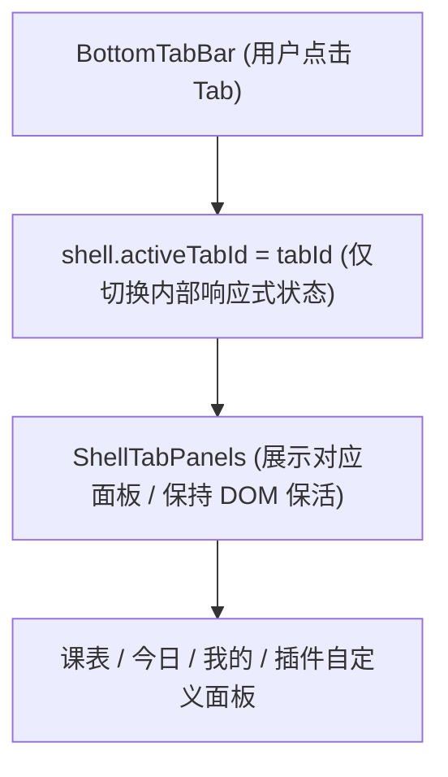

# ADR 0029: 壳内 Tab 内部状态导航与底栏路由解耦

- **状态**: Accepted
- **日期**: 2026-08-30
- **关联提交**: `ffbd2c7`, `f028e0d`
- **关联**: 取代 [ADR 0028](./0028-today-plugin-default-launch-and-day-clock.md) §3–§4 的路由约定；延续 [ADR 0003](./0003-hierarchical-slot-registry-and-extensibility.md) 底栏插槽与 [ADR 0021](./0021-slot-consumption-seam.md) 插槽消费规范
- **范围**: `packages/core`, `packages/plugins/today`, `apps/web`

---

## 背景与问题

此前应用底栏的各个一级 Tab（如「今日」、「课表」、「我的」）是通过 SvelteKit 页面路由（如 `/today`, `/timetable`, `/mine`）进行切换的。这引发了以下架构缺陷：

1. **底栏 Tab 切换性能损耗与闪烁**：每次点击底栏都会触发完整的页面卸载与路由加载，破坏了移动端原生应用般的流畅 Tab 切换体验；
2. **破坏插槽的声明式边界**：插件注册底栏 Tab 时需要提供特定的路由 `href`，迫使宿主必须预先建立对应的路由骨架；
3. **历史堆栈混乱**：底栏各 Tab 之间的频繁切换会污染浏览器的前进/后退历史栈。

---

## 架构决策

### 1. 底栏 Tab 切换收敛为壳内内部状态

- 底栏导航彻底脱离 SvelteKit URL 路由映射，统一由 `AppShellController.activeTabId` 响应式状态进行驱动；
- 插件注册 `shell.bottom-bar.tab` 插槽时无需声明 `href` 路由，仅需提供唯一的 `id` 与组件渲染出口；
- 移除所有与底栏路由相关的硬编码路由常量映射。

### 2. 壳内面板保活容器 (`ShellTabPanels`)

- 在主外壳中引入 `ShellTabPanels` 容器；
- 已访问过的核心 Tab 保持 DOM 保活与状态缓存，再次切换时实现零延迟即时展示。

### 3. 清晰区分一级外壳与二级独立页面

- **一级外壳 Tab**：包括「课表」、「今日」、「我的」等，均运行在常驻外壳内部，通过内部状态瞬间切换；
- **二级独立页面**：如「添加课程」、「壁纸设置」、「关于」等深度配置页，继续保留标准的 SvelteKit 路由导航与完整的返回历史栈控制。

---

## 非目标

- 不改变二级深度页面的 URL 路由与外部深链直达能力；
- 不在 Tab 切换中触发全量数据重载。

---

## 影响与收益

- **原生级流畅交互**：底栏切换达到 60fps 瞬时响应，彻底消除了页面切换闪白；
- **扩展性增强**：第三方插件注册自定义底栏 Tab 时无需关心宿主路由结构，真正做到声明即生效；
- **浏览器历史栈清爽**：底栏切换不产生多余的历史记录，用户点击系统返回键能直观退出或返回上一级功能页。

---

## 验证

- `vp check` / `vp test` 全量通过；
- 今日 ↔ 课表 ↔ 我的 Tab 之间极速切换无闪烁，课表滑动周次与滚动位置在切换后完美保留。
