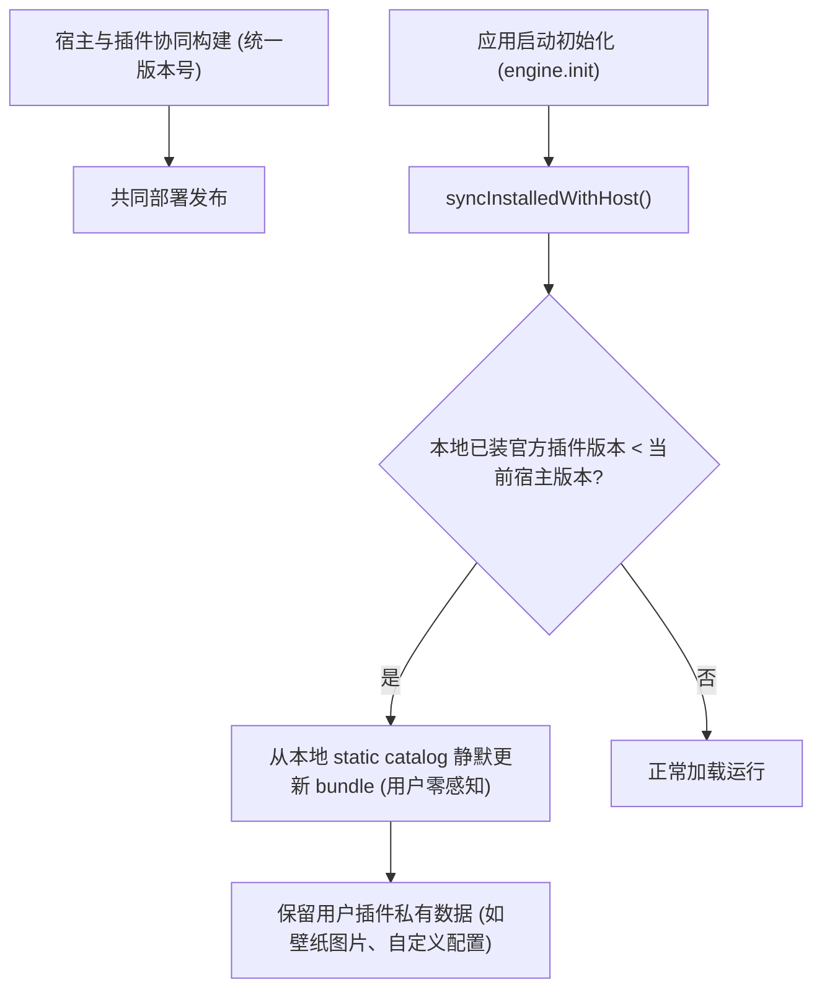

# ADR 0030: 官方插件随宿主发版与启动时静默同步

- **状态**: Accepted
- **日期**: 2026-08-31
- **关联提交**: `db2128f`, `642e38b`
- **关联**: **部分修订** [ADR 0016](./0016-round3-convergence-and-deprecated-removal.md)（废除 `minEngineVersion` 运行时校验）；延续 [ADR 0011](./0011-single-track-official-plugin-install.md) 官方插件分发与 [ADR 0014](./0014-wallpaper-official-marketplace-only.md) 目录机制
- **范围**: `packages/core`, `apps/web`, `scripts/build-official-plugins.ts`, `apps/web/static/official-plugins`

---

## 背景与问题

官方插件此前尝试过类似复杂扩展市场的「独立版本号 + 引擎最低版本兼容约束 (`minEngineVersion`)」策略。在实际交付中：

1. **版本管理复杂度失控**：Chronos 为快速迭代的应用，官方插件与宿主位于同一 Monorepo 内协同开发，强行维护插件的独立版本号徒增维护成本；
2. **用户手动更新摩擦大**：宿主升级后，若插件需要用户进入插件中心手动点击更新，会导致大量用户因版本不同步遇到异常；
3. **版本协商机制过度设计**：对于第一方协同发版的官方插件，运行时的 SemVer 版本协商属于不必要的复杂抽象。

---

## 架构决策

### 1. 官方插件与宿主协同统一发版

- 官方插件的版本号在构建期严格与 `apps/web` 宿主版本号保持单一源头对齐；
- 废除 `minEngineVersion` 运行时版本协商机制与相关校验代码。

### 2. 应用启动时静默同步 (`syncInstalledWithHost`)

- 应用启动初始化阶段，`OfficialPluginService` 自动检查本地已安装的官方插件；
- 若已安装插件的打包版本低于当前宿主版本，系统自动从本地静态目录完成静默重装与代码替换，无需用户手动操作且不产生干扰提示。

### 3. 代码更新与用户私有数据严格隔离

- 静默同步仅替换插件的代码 Bundle、样式 CSS 与 Manifest 元数据；
- 插件在命名空间下持久化的用户数据（如已设置的课表壁纸图像、私有参数等）严格保留，绝不丢失。

---

## 非目标

- 不对外部第三方 Manifest URL 安装的插件执行静默同步；
- 不在官方插件列表中重新引入复杂的手动更新交互按钮。

---

## 影响与收益

- **维护成本归零**：官方插件完全随宿主一同发版，消除版本碎片化问题；
- **用户体验无感升级**：宿主 PWA 更新后，所有已装官方插件自动享受最新功能与 Bug 修复，告别手动更新流程；
- **数据绝对安全**：清晰的代码与数据隔离确保升级过程零数据丢失。

---

## 验证

- `vp check` / `vp test` 全量通过；
- 模拟低版本壁纸插件环境，应用启动后成功静默升级至最新代码，原壁纸背景图片完好保留。
