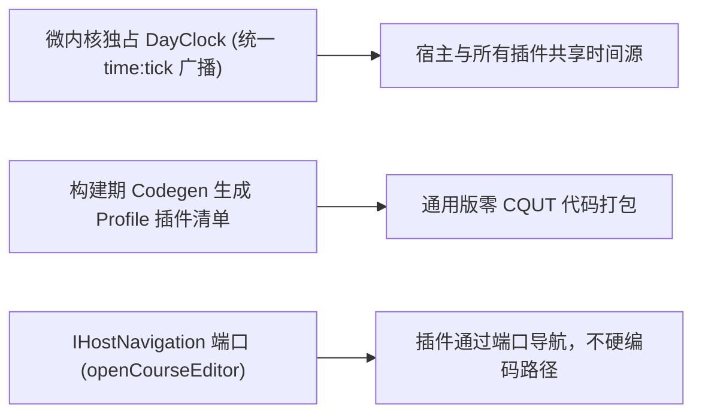

# ADR 0031: Round 7 架构收敛 — 统一时钟调度、Profile 客户端按需打包与导航解耦

- **状态**: Accepted
- **日期**: 2026-09-01
- **关联提交**: `c25424e`, `e400d11`, `31e607e`
- **关联**: 对齐 [ADR 0024](./0024-plugin-message-catalog-i18n.md) 插件国际化与 [ADR 0021](./0021-slot-consumption-seam.md) 插槽消费规范
- **范围**: `packages/core`, `apps/web`, `packages/plugins/*`, `packages/ui-kit`

---

## 背景与问题

第七轮架构审计指出：

1. **时钟机制存在残留分支**：部分页面仍自建计时器，未完全对齐微内核的 `DayClock`；
2. **构建时对特定高校存在静态依赖**：通用版构建产物在 `profile-registry` 中静态引用了 `source-cqut`，未能实现真正按需打包；
3. **插件存在硬编码宿主路由行为**：今日看板等插件内部直接硬编码调用了宿主的具体页面路径。

---

## 架构决策

### 1. 微内核独占统一时钟调度

- `ChronosEngine.init()` 启动唯一的 `DayClock` 实例，`dispose()` 时安全停钟；
- 宿主课表屏与今日插件彻底删除自建的计时器，统一通过响应式控制器订阅标准时钟信号；
- 唯一计时器按下一分钟边界自调度，统一 `onTick(now)`；午夜只广播一次，空课表也持续刷新时间；
- 冻结时停钟，恢复系统时间立即广播并重新对齐分钟；页面恢复可见由宿主调用 `engine.refreshSystemTime()`，冻结时该请求无效，core 不监听 DOM；
- 预览网格只消费调用方传入的当前节次，静态预览缺省无当前节次高亮；保留课程起止分钟的现有包含端点规则；
- Today 以相关快照输入变化决定查询；分钟与提醒配置只重算内存状态，调色板只刷新配色。课程与配色请求分别通过递增编号防止旧结果覆盖新结果。
- `createDayClock` 删除旧双回调和课时输入；清理旧的边界 delay 工具，不保留兼容别名。

### 2. Profile 客户端代码生成与按需打包

- 引入构建期代码生成工具，根据当前构建指定的 `CHRONOS_PROFILE` 自动生成仅包含目标高校所需插件的导入清单（`available-plugins.generated.ts`）；
- 通用 Profile 打包时彻底剔除对 `@chronos/plugin-source-cqut` 的静态引用，实现真正的物理按需打包。

### 3. 引入可选宿主导航端口 (`IHostNavigation`)

- 在微内核中定义标准导航服务契约 `IHostNavigation`（提供 `openCourseEditor(courseId)` 等标准方法）；
- 宿主注入对应平台的路由适配逻辑，插件内部通过标准端口触发导航，严禁硬编码宿主私有 URL。

---

## 影响与收益

- **时间调度唯一**：全系统使用统一时钟节拍，性能开销更低，无时间显示偏差；
- **产物体积更纯净**：通用版本彻底排除特定高校插件的打包体积；
- **跨平台导航解耦**：插件不再与 Web URL 绑定，为后续原生客户端移植扫清障碍。

---

## 验证

- `vp check` / `vp test` 全量通过；
- 构建通用版本时确认产物中无任何 CQUT 相关代码；今日插件点击课程卡片成功平滑拉起编辑弹窗。
