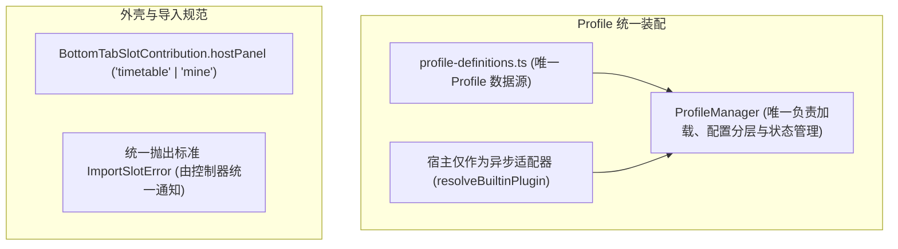

# ADR 0032: Round 8 架构收敛 — 消除双轨装配、单源 Profile 与统一异常规范

- **状态**: Accepted
- **日期**: 2026-09-01
- **关联提交**: `c426f19`, `f835e02`, `f0171c7`
- **关联**: 延续 [ADR 0029](./0029-shell-internal-tab-navigation.md) 壳内 Tab 导航与 [ADR 0021](./0021-slot-consumption-seam.md) 插槽消费规范
- **范围**: `packages/core`, `apps/web`, `packages/plugins/*`, `packages/ui-kit`

---

## 背景与问题

第八轮架构审计梳理出以下深层双轨与不一致性：

1. **Profile 装配存在双重入口**：宿主中保留了手写的 `loadProfilePlugins`，与微内核 `ProfileManager.applyProfile` 并行存在；
2. **Profile 定义存在两处数据源**：高校配置列表在 `profile-registry` 与 `profile-definitions` 中均有声明，容易产生不同步；
3. **导入异常处理标准不统一**：部分导入插件使用通用 Error 或直接调用浏览器 `alert`，破坏了统一的错误处理与通知规范；
4. **外壳 Tab 识别依赖硬编码字符串**：宿主通过比对 `'timetable'` 与 `'mine'` 字符串字面量来判断面板类型。

---

## 架构决策

### 1. 收敛 `ProfileManager` 为唯一装配入口

- 将插件加载与激活的控制权完全收敛到 `ProfileManager` 中（由 `loadPlugins` 和 `applyProfile` 统一管理分层 `disabledSlots` 配置、插件 handle 以及 `activeProfile` 状态）；
- 宿主仅需提供异步适配器 `resolveBuiltinPlugin`；彻底移除宿主中重复的 `loadProfilePlugins` 以及容易引起歧义的 `availablePlugins` 全量集合；
- 恢复出厂设置操作统一由 `applyProfile` 执行。

### 2. Profile 配置字典确立单一数据源

- 全量 `ChronosProfile` 声明仅集中于 `profile-definitions.ts` 单一文件中；
- 消除所有派生常量的重复手写，统一由代码生成工具自动派生。

### 3. 外壳槽位引入声明式 `hostPanel` 标记

- 在 `BottomTabSlotContribution` 中引入 `hostPanel?: 'timetable' | 'mine'` 字段；
- 宿主仅依据该枚举标记判断渲染课表或「我的」面板，彻底废除对 Tab ID 字符串的硬编码判定；无该标记的 Tab 统一交给通用插件全屏容器渲染。

### 4. 统一导入异常标准 (`ImportSlotError`)

- 所有导入插件在解析或网络失败时一律抛出标准 `ImportSlotError`；
- 统一由宿主控制器捕获并展示优雅的 Toast 通知，严禁在插件内部直接调用浏览器原生 `alert`。

---

## 影响与收益

- **系统启动与恢复逻辑单一**：彻底消除了装配过程中的双轨分流，行为严格可预测；
- **配置与类型单源化**：避免了在多个文件中同步 Profile 列表的人为失误风险；
- **用户交互更加专业友好**：导入异常具备统一友好的交互反馈，杜绝了突兀的原生弹窗阻断。

---

## 验证

- `vp check` / `vp test` 全量通过；
- 课表导入失败场景下，系统正确弹出标准通知而非原生弹窗；底栏 Tab 扩展表现稳定可靠。
