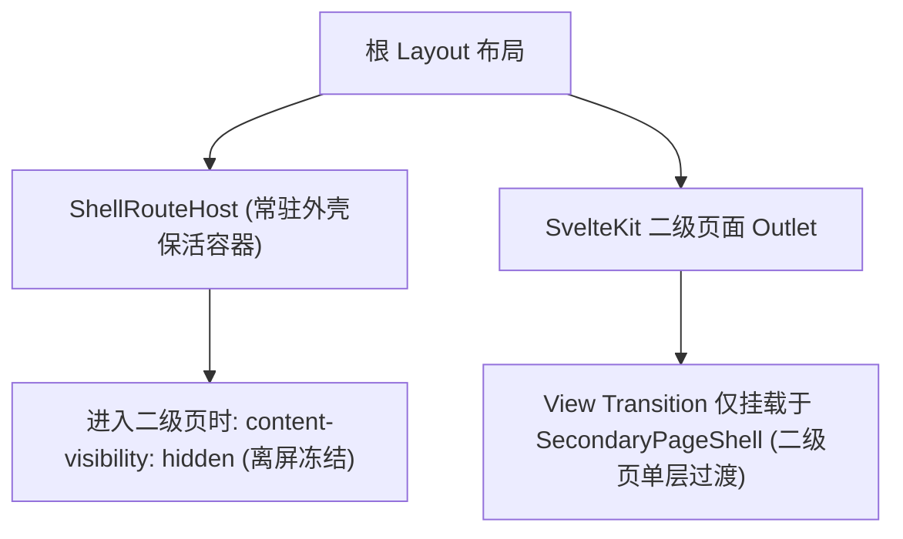

# ADR 0033: 外壳常驻保活与二级页面视图过渡隔离

- **状态**: Accepted
- **日期**: 2026-09-03
- **关联提交**: `b07458a`
- **关联**: 延续 [ADR 0029](./0029-shell-internal-tab-navigation.md) 壳内 Tab 机制；保持二级页面 URL 与导航历史栈行为不变
- **范围**: `apps/web`, `packages/ui-kit`

---

## 背景与问题

ADR 0029 将底栏 Tab 重构为壳内切换后，进入二级页面（如壁纸设置、课程编辑等）依然存在以下性能瓶颈：

1. **进入二级页时卸载课表网格**：进入二级页时面板 DOM 会被销毁，返回时需一次性重新构建 Swiper 与课表网格，导致界面掉帧；
2. **View Transition 过渡范围过大**：`view-transition-name` 曾挂载在整页根节点上，在进行页面切换动画时，隐藏层中正在重建的课表网格会同时参与过渡重绘，造成肉眼可见的卡顿；
3. **壁纸设置等页面存在重复渲染**：进入壁纸设置时会再次挂载一棵预览课表树，与后台正在重建的课表产生双重渲染开销。

---

## 架构决策

### 1. 主外壳与二级页面保持兄弟层级

- 根 Layout 中常驻外壳组件 `ShellRouteHost`（包含底栏与各 Tab 面板）；
- SvelteKit 的页面插槽仅用于承载二级独立页面；严禁将主外壳与二级页面置于同一个带有 `view-transition-name` 的父容器中。

### 2. 离屏高效冻结 (`secondary-transition-gate`)

- 当用户处于二级页面时，主外壳通过 CSS `content-visibility: hidden` 与 `inert` 属性进入完全冻结状态，浏览器跳过该区域的布局与渲染计算；
- 返回主外壳时瞬间解冻，无需重新挂载任何组件，瞬时呈现原有课表状态。

### 3. View Transition 过渡仅作用于二级层

- `view-transition-name: page-root` 仅挂载在二级页面的根容器上；
- 主外壳区域使用静态快照进行缩放退后动画（Recede Transition），杜绝在保活的实时 DOM 上同时执行复杂的 CSS 过渡，确保动画全程保持 60fps。

### 4. 预览组件延迟按需绘制

- 在页面过渡动画未完全结束前，壁纸设置等页面的课表预览网格保持延迟就绪状态，确保在动画期间屏幕上始终只有一棵活跃的课表渲染树。

---

## 非目标

- 不退回每次切换 Tab 都重新挂载的旧模型；
- 不将二级深度页面做成全量常驻保活。

---

## 影响与收益

- **极其丝滑的推入与返回体验**：从课表进入二级设置页跟手流畅，返回时零白屏、周次与滚动位置完美保持；
- **渲染算力开销大幅降低**：动画期间避开了双重网格绘制，彻底消除了移动端低端设备上的卡顿掉帧。

---

## 验证

- `vp check` / `vp test` 全量通过；
- 课表 ↔ 壁纸设置推入返回动画跟手流畅；二级页期间主外壳正确处于 `content-visibility: hidden` 状态。
