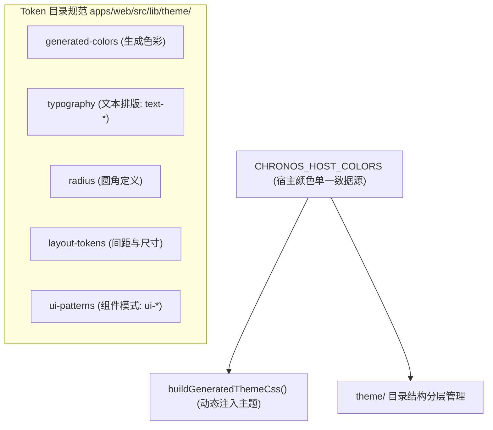

# ADR 0034: 设计 Token 分层与命名规范

- **状态**: Accepted
- **日期**: 2026-08-29
- **关联提交**: `baf0d67`
- **关联**: 延续 [ADR 0019](./0019-workbench-color-and-icon-theme-platform.md) Workbench 色彩注册表规范
- **范围**: `packages/ui-kit/src/theme`, `apps/web/src/lib/theme`, `packages/core/src/theme/workbench-colors.ts`

---

## 背景与问题

样式 Token 此前散落在 `generated-theme.css`、`layout.css` 中的 `@layer tokens`、`m3.css` 以及运行时 `workbenchColors` 四个不同位置，导致：

1. **颜色声明重复**：宿主颜色覆盖与 Material 3 基础产物存在重复的十六进制色值；
2. **命名暗示合规性偏差**：许多自定义组件直接使用了 `m3-*` 类名，容易误导为严格遵循 Material Design 3 规范，实际已由 Chronos 定制。

---

## 架构决策

### 1. 宿主色彩收敛至单一数据源

- 将宿主基础颜色统一定义在 `CHRONOS_HOST_COLORS` 中，并在 `buildGeneratedThemeCss()` 中集中生成，彻底删除 `layout.css` 中的硬编码色值。

### 2. 规范主题 Token 目录结构

- 将 `apps/web/src/lib/m3/` 目录重命名并规整为 `apps/web/src/lib/theme/`，按职责清晰拆分为色彩、排版、圆角、布局与组件模式五个子模块。

### 3. 统一原子样式命名规范

- 排版样式统一采用 `text-*` 前缀；
- 通用组件视觉模式统一采用 `ui-*` 前缀（如 `ui-shell-top-bar`），逐步替代旧式的 `m3-*` 别名。

### 4. 扩展 Workbench 宿主语义颜色键

- 在微内核 Workbench 注册表中扩充常用的宿主语义键（如 `color.canvas`、`color.ink` 等），供各主题插件统一映射。

---

## 影响与收益

- **设计体系清晰分层**：Token 定义层级分明，修改全局主题色值仅需在一处维护；
- **命名语义规范专业**：消除具有误导性的外部设计系统命名前缀，形成 Chronos 专属的 UI 规范基元。

---

## 修订记录

- 2026-08-29：初版 Accepted。
- 2026-09-05：原编号 `0029-design-token-layering` 与壳内 Tab 导航 ADR 编号冲突，正式更正编号为 `0034`（决策生效日期保持不变）。
