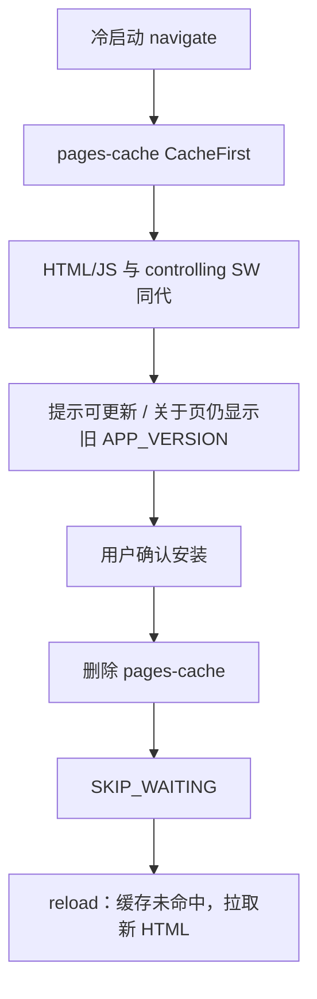

# ADR 0035: PWA 手动更新与导航文档同代

- **状态**: Accepted
- **日期**: 2026-09-07
- **关联提交**: `066aef2`, `25a32da`
- **关联**: 与 [ADR 0030](./0030-official-plugin-version-co-shipping-and-host-sync.md) 区分——官方插件随宿主静默同步；宿主 PWA 自身更新必须用户确认
- **范围**: `apps/web/vite.config.ts`, `apps/web/src/lib/client/pwa-sw.ts`, `apps/web/src/lib/content/releases`

---

## 背景与问题

Chronos 是课表 PWA，更新采用 `registerType: 'prompt'`：新 Service Worker 进入 `waiting` 后提示用户，确认后才 `SKIP_WAITING`。关于页的 `APP_VERSION` 编译进 **当前已加载的 JS**，不是 controlling SW 的版本。

导航文档若不与 controlling SW 同代，会出现：

1. **版本号抢跑**：`NetworkFirst` 在冷启动时拉取新 HTML，新 HTML 引用新 hash JS；关于页已显示新版本，SW 仍在 `waiting`，系统继续提示可更新；
2. **白屏被误诊**：`CacheFirst` 的旧 HTML 若在新 SW 激活后仍留在 `pages-cache`，会指向新 precache 已删除的旧 chunk。0.4.5 因此把导航改回 `NetworkFirst`，但用「提前换壳」去防「激活后旧壳」，方向反了。

Vercel SSR 无预渲染 `/`，`navigateFallback` 必须为 `null`，HTML 不能进 Workbox precache，只能靠 runtime `pages-cache`。

---

## 架构决策

### 1. 宿主更新必须用户确认

- 保持 `registerType: 'prompt'`，禁止 `skipWaiting: true` 自动接管；
- `version.json` 继续 `NetworkOnly`，更新页可展示远端最新版本；当前版本号仍来自旧壳中的 `APP_VERSION`。

### 2. 导航文档与 controlling SW 同代

- `request.mode === 'navigate'` 使用 `CacheFirst`（`pages-cache`，`maxAgeSeconds: 2_592_000`）；
- 禁止对导航使用 `NetworkFirst` / `StaleWhileRevalidate`，也禁止仅靠关于页文案掩盖版本错位。

### 3. 白屏在安装路径消除，而不是提前换壳

- `applyUpdateAndReload` 仅在存在 `registration.waiting` 时删除 `pages-cache`，然后 `SKIP_WAITING` 并 reload；
- 缓存未命中后走网络，新 HTML 与新 precache 对齐；
- `clientsClaim: true` 仅在用户确认并激活后接管页面。

---

## 非目标

- 不把 HTML 预缓存进 Workbox precache（受 `navigateFallback: null` 与 Vercel SSR 约束）；
- 不自动 `skipWaiting`；
- 不改变 `/official-plugins/` 的 `NetworkFirst`（稳定 URL、内容随发版变化）与 `version.json` 的 `NetworkOnly`。

---

## 影响与收益

- **手动更新语义成立**：未确认安装前，界面版本与 controlling SW 一致；
- **白屏责任归位**：旧壳与新 precache 的冲突只在安装路径处理，不再用导航抢跑换取安全。

---

## 验证

- `vp run check` 通过；`src/lib/client/pwa-sw.test.ts` 覆盖「无 waiting 不删 pages-cache / 有 waiting 先删再 skipWaiting」；
- 生产 PWA：发新版后关于页版本号仍旧且提示可更新；安装后才变为新号，无白屏。

---

## 修订记录

- 2026-08-18：`066aef2` 将注册改为 `prompt`；`25a32da` 将导航改为 `CacheFirst`，安装时删除 `pages-cache`。
- 2026-09-04：`c9fa271` 为降低旧 HTML 白屏将导航改为 `NetworkFirst`，导致版本号与 SW 脱节。
- 2026-09-07：恢复导航 `CacheFirst`，明确白屏由安装路径删除 `pages-cache` 解决。
