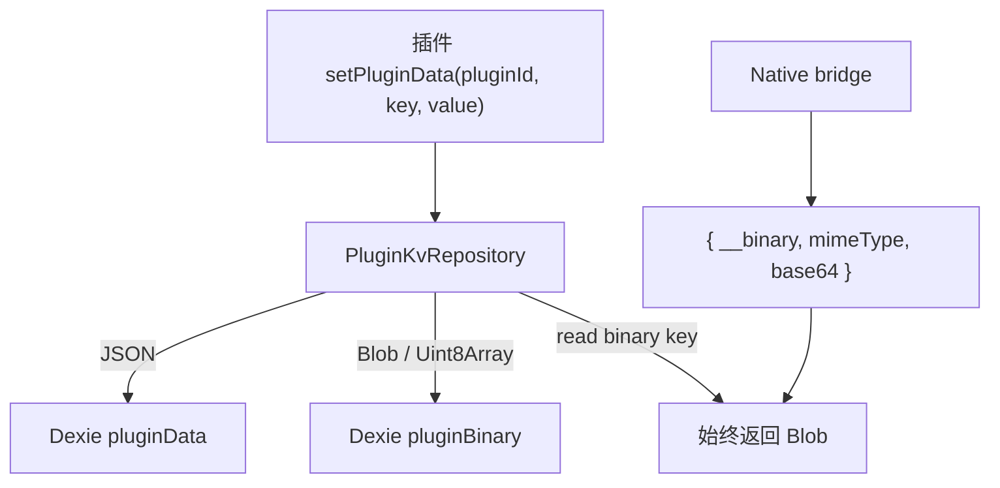

# ADR 0036: Plugin KV 二进制存储与 Dexie pluginBinary 表

> 2026-09-20 修订：自定义壁纸、动态取色和主题图片的当前职责与契约见 [ADR 0040](./0040-host-wallpaper-and-theme-assets.md)。本文相关插件实现描述为历史记录。

- **状态**: Accepted
- **日期**: 2026-09-13
- **关联提交**: `e564e1d`
- **关联**: **部分修订** [ADR 0002](./0002-service-container-and-ports-adapters.md)（`IStorageService` 插件 KV 值类型）；**部分修订** [ADR 0010](./0010-host-state-collapse-and-architecture-deepening.md)（Dexie 表数量与存储分层）；延续 [ADR 0008](./0008-host-decoupling-and-deep-ingest-seam.md) 命名空间 KV 原则；延续 [ADR 0023](./0023-round4-gate-typing-dead-face-component-single-track.md) 零兼容包袱
- **范围**: `packages/core`, `apps/web/src/lib/storage`, `apps/web/src/lib/providers`, `packages/plugins/wallpaper`

---

## 背景与问题

插件私有数据自 ADR 0008 / 0010 起统一经 `IStorageService.getPluginData` / `setPluginData` 按 `pluginId` 命名空间持久化。早期实现仅支持 JSON 可序列化值；壁纸插件将图片以 `{ mimeType, base64 }` JSON 落盘，带来：

1. **体积与性能**：Base64 膨胀约 33%，大图读写与内存占用偏高；
2. **质量链路**：编解码往返非必要，与「裁剪后按源像素导出」目标冲突；
3. **契约模糊**：端口未声明二进制语义，宿主与 native 桥无法一致处理 `Blob`。

同时壁纸裁剪功能要求课表背景按视口精确贴合（`fill`），而 Schema 预览等场景仍需 `cover`；共享 `TimetableWallpaperLayer` 不应为单插件隐式改全局默认（见 [ADR 0021](./0021-slot-consumption-seam.md)）。

---

## 架构决策

### 1. `IStorageService` 插件 KV 二进制契约

单源定义于 `packages/core/src/types/services.ts` 与 `packages/core/src/storage/plugin-data-value.ts`：

| 操作     | 契约                                                                              |
| :------- | :-------------------------------------------------------------------------------- |
| **写入** | `Blob`（携带 `type` 作为 MIME）或 `Uint8Array`（存为 `application/octet-stream`） |
| **读取** | 二进制 key **始终**返回 `Blob`（不向插件暴露 `Uint8Array`）                       |
| **互斥** | 同一 `pluginId:key` 仅存 JSON **或** 二进制之一；写入一侧时删除另一侧             |
| **JSON** | 行为不变：序列化进 `pluginData` 表，读出为解析后的 JSON                           |

插件仅通过端口访问，**禁止**直连 Dexie 或 IndexedDB。

### 2. Web 宿主：Dexie schema v1 与通用门面

未发布阶段统一在 `version(1)` 声明所有当前表，不保留历史升级链。

- 新增 **`pluginBinary`** 表（`ArrayBuffer` + `mimeType`），与 `pluginData` 并列，**非**壁纸或任何插件专表；
- `PluginKvRepository` 统一路由 JSON / 二进制；`DexieStorageProvider` 内部字段命名为 `pluginKv`；
- `StorageChangeEvent.type` 仍为 `'pluginData'`（与 [ADR 0005](./0005-unified-event-pipeline.md) 事件名一致），覆盖二进制变更。

### 3. Native 桥接线格式（过渡）

在 native 宿主尚未直接存字节前，二进制经 `{ __binary: true, mimeType, base64 }` 穿越 `createNativeHostEnv`；反序列化后为 `Blob`。未来 native 实现可直接存字节并移除此 wire 信封。

### 4. 零兼容与首个消费方

- 遵循 ADR 0023：**不迁移**旧版壁纸 `{ mimeType, base64 }` JSON；用户需重新设置壁纸；
- 首个生产消费方：`tool-wallpaper` 的 `wallpaper_image` key。

### 5. 壁纸层 `fit` 显式参数

`TimetableWallpaperLayer` 增加 `fit: 'cover' | 'fill'`（默认 `cover`）：

- **`cover`** + `inset-[-24px]`：未裁剪预览、抗模糊溢边（如 `WallpaperPreviewField`）；
- **`fill`** + `inset-0`：已按视口裁剪的壁纸（课表主屏、`TimetableLivePreview` 由壁纸插件传入 `fill`）。

---

## 影响与收益

- **端口契约明确**：二进制读写语义单源，插件与宿主测试可对齐；
- **存储仍无插件专表**：`pluginBinary` 为通用 KV 后端，符合 ADR 0008 / 0010 精神；
- **共享 UI 保持通用**：显示模式由调用方声明，避免 ui-kit 绑死裁剪流程。

---

## 验证

- `vp check` / 相关单测：`plugin-kv-repository`、`plugin-data-value`、`wallpaper`、`timetable-wallpaper-layer`；
- 壁纸：选图 → 裁剪 → 确认后主屏与预览无二次放大；Schema 预览仍为 `cover`。

---

## 修订记录

- **2026-09-13**：初版采纳。
