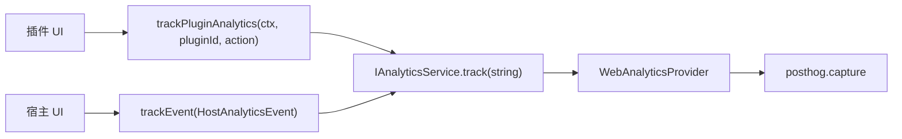

# ADR 0037: 插件产品埋点命名与宿主事件清单分离

- **状态**: Accepted
- **日期**: 2026-09-13
- **关联**: 延续 [ADR 0002](./0002-service-container-and-ports-adapters.md)（`IAnalyticsService` 可选端口）；对齐 [ADR 0031](./0031-round7-clock-profile-codegen-navigation-i18n.md)（插件经标准端口解耦宿主）
- **范围**: `packages/core`, `apps/web`, `packages/plugins/*`

---

## 背景与问题

PostHog 埋点最初集中在 `apps/web` 的封闭 `AnalyticsEvent` union。官方插件（如壁纸）接入后，若将 `wallpaper_*` 等事件登记进宿主 union，会导致：

1. **耦合倒置**：插件每新增埋点需修改宿主清单，违背插件独立演进；
2. **分层破坏风险**：插件可能被迫 import `$lib/client/analytics`；
3. **命名碰撞**：多插件扁平事件名易冲突。

`IAnalyticsService` 在 core 已定义为 `track(event: string, ...)` 开放契约，但缺少插件侧命名规范与辅助函数。

---

## 架构决策

### 1. 宿主事件清单（封闭）

- `apps/web/src/lib/client/analytics.ts` 维护 `HostAnalyticsEvent` union；
- 宿主屏通过 `trackEvent(name: HostAnalyticsEvent, ...)` 上报；
- **不**登记插件事件名。

### 2. 插件事件命名空间（开放）

- 格式：`plugin.{pluginId}.{action}`（例：`plugin.tool-wallpaper.pick`）；
- `pluginId` 为 manifest / `defineChronosPlugin` 的 canonical id；
- `action` 由插件本地 `as const` catalog 定义（snake_case）。

### 3. Core 辅助函数

`packages/core/src/analytics/plugin-analytics.ts`：

- `pluginAnalyticsEventName(pluginId, action)` — 格式化事件名；
- `trackPluginAnalytics(ctx, pluginId, action, properties?)` — 经 `ctx.tryService(IAnalyticsService)` 上报，并注入 `source: 'plugin'`、`plugin_id`（调用方不可覆盖）。

### 4. 宿主适配器透传

`WebAnalyticsProvider` 调用 `captureAnalyticsEvent(event: string, ...)`，不对插件事件做 union 校验或 cast。

---

## 影响与收益

- 插件埋点可随插件包独立演进，无需改宿主 union；
- 依赖方向保持 `plugins → core ← apps/web`；
- PostHog 事件按 `plugin.{id}.*` 自然分区，便于 breakdown。

---

## 非目标（本 ADR 不涵盖）

- official-plugins 构建期 codegen 合并事件清单；
- PostHog 项目侧 event definition 自动同步；
- 安装阶段/进度等细粒度宿主埋点扩展。

---

## 验证

- `packages/core/tests/plugin-analytics.test.ts`
- `apps/web` analytics / providers 单测
- 壁纸插件：`plugin.tool-wallpaper.*` 四处用户动作
