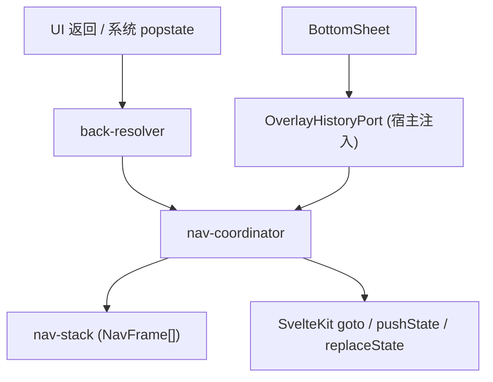

# ADR 0038: 统一导航栈与返回路径收敛

- **状态**: Accepted
- **日期**: 2026-09-16
- **关联**: 延续 [ADR 0029](./0029-shell-internal-tab-navigation.md) 壳内 Tab 机制；[ADR 0033](./0033-persistent-shell-freeze-and-secondary-view-transition.md) 二级页过渡；[ADR 0022](./0022-deep-link-handshake.md) 深链握手
- **范围**: `apps/web/src/lib/navigation`, `packages/ui-kit/src/overlay`

---

## 背景与问题

应用存在两套并行导航状态：

1. **浏览器 history**：SvelteKit 路由、`BottomSheet` 裸 `history.pushState`、系统返回手势；
2. **nav-journal**：内存 pathname 栈，供 `navigateBack()` 决策。

二者在以下场景漂移，导致「重复返回 / 循环感」：

- Overlay 在同 URL 上 `pushState`，journal 无记录；
- `goto({ replaceState: true })`（如 `/s` → 导入确认）journal 仍 append；
- UI 返回按钮走 `navigateBack()`，系统手势直接 `popstate`，决策分裂。

---

## 架构决策

### 1. 逻辑栈为唯一决策源（`nav-stack`）

用 **NavFrame** 替代 pathname 数组：

- `RouteFrame`：二级页路径、深链标记、`shellTab` 快照；
- `OverlayFrame`：BottomSheet 等同 URL 浮层。

所有前进 / 替换 / 返回决策只读此栈，不再盲信 `history.back()`。

### 2. 返回解析与执行分离

- `back-resolver.ts`：纯函数，`stack + fallback → BackPlan`；
- `nav-coordinator.ts`：执行 `close-overlay` / `goto-route` / `fallback`，并在 `beforeNavigate` 拦截异常 `popstate`。

### 3. History 写入收口

| 写入方       | 改后                                                         |
| ------------ | ------------------------------------------------------------ |
| 路由前进     | `recordNavigation`（区分 push / replace）                    |
| 路由替换     | `replaceRoute`（修复 `/s` replace 栈漂移）                   |
| Overlay 打开 | `openOverlayHistory` → SvelteKit `pushState` + `pushOverlay` |
| Overlay 关闭 | `closeOverlayHistory` / `dismissOverlayWithoutHistoryPop`    |

`packages/ui-kit` 不再直接调用 `history.pushState`，改为注入 `OverlayHistoryPort`（宿主在 `apps/web` 实现）。

### 4. 系统返回与 UI 返回统一

`+layout.svelte` 的 `beforeNavigate` 在 `popstate` 时调用 `resolvePopstateBack`：

- 目标与栈一致 → 同步栈；
- 深链 / 漂移 → `cancel()` + 执行与 UI 返回相同的 `BackPlan`。

二级页通过 `SecondaryPageShell` 注册 `pageBackFallback`，供 popstate 纠偏使用。

---

## 非目标

- 不引入 `@virtualstate/navigation` 或与 SvelteKit 并行的第三套路由；
- 不改变壳内 Tab 不进 URL 的策略（ADR 0029）；
- 不在本 ADR 内一次性替换所有 scattered `goto()`（layout hook 已兜底 replace 标记）。

---

## 影响与收益

- UI 返回与系统手势行为一致；
- Overlay 不再产生 journal 不可见的幽灵 history entry；
- 深链与 `replaceState` 场景返回路径可预测；
- ui-kit 与宿主 history 解耦，便于原生端注入不同 port。

---

## 验证

- `nav-stack.test.ts` / `back-resolver.test.ts` / `navigate-back.test.ts`；
- `packages/ui-kit/tests/history-overlay.test.ts`（port 注入路径）；
- 手动：Sheet 开 → 系统返回 → 关 Sheet；`/s` → 确认页 → 返回 → 导入页；深链二级 → 返回 → shell。
