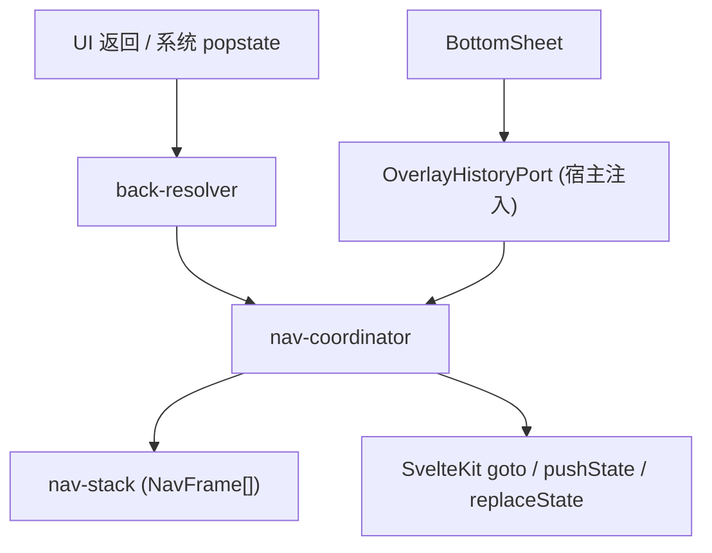

# ADR 0038: 统一导航栈与返回路径收敛

- **状态**: Accepted
- **日期**: 2026-09-16
- **关联**: 延续 [ADR 0029](./0029-shell-internal-tab-navigation.md) 壳内 Tab 机制；[ADR 0033](./0033-persistent-shell-freeze-and-secondary-view-transition.md) 二级页过渡；[ADR 0022](./0022-deep-link-handshake.md) 深链握手
- **范围**: `apps/web/src/lib/navigation`, `packages/ui-kit/src/overlay`

---

## 背景与问题

应用存在两套并行导航状态：

1. **浏览器 history**：SvelteKit 路由、`BottomSheet` 裸 `history.pushState`、系统返回手势；
2. **nav-journal**：内存 pathname 栈，供 `navigateBack()` 决策。

二者在以下场景漂移，导致「重复返回 / 循环感」：

- Overlay 在同 URL 上 `pushState`，journal 无记录；
- `goto({ replaceState: true })`（如 `/s` → 导入确认）journal 仍 append；
- UI 返回按钮走 `navigateBack()`，系统手势直接 `popstate`，决策分裂。

---

## 架构决策



### 1. 单一记录集合与当前位置

`nav-stack` 保存记录集合和 cursor，后退保留前进记录。每条记录拥有稳定 ID、会话 ID、浏览器相对位置。route 保存完整应用内 URL（含 query/hash）、入口属性与离开 shell 时的 Tab；overlay 保存实例与有效性。实际父子关系由 ui-kit 组件上下文中的生命周期句柄管理，不能把时间上相邻的独立弹层误认为父子。重复 URL 不去重，不从 `history.length` 推断本应用历史。

### 2. 决策、执行与提交

- `back-resolver` 只读取快照，返回目标和 delta，不修改集合、不访问浏览器。
- 已确认属于当前会话的 UI 返回使用 `history.go(delta)`；未知记录或深链 UI 返回使用 `goto(..., { replaceState: true })` fallback。
- `beforeNavigate` 仅暂存意图；路由成功后提交。取消／失败不得新增或弹出记录。返回尚未完成时合并重复请求。
- 系统 popstate 根据记录位置处理前进、后退、多步跳转。跨文档离站保持浏览器原行为。
- 失效弹层纠偏在原遍历完成后执行，避免取消 popstate 与 SvelteKit 历史恢复竞争；若未来必须取消，必须等待恢复完成再发出跳转。

### 3. SvelteKit 公共状态桥接

只通过 `page.state.chronosNavigation` 读取导航元数据；用公开 `pushState` / `replaceState` 写入并保留其他页面状态，禁止依赖 SvelteKit 私有 history 包装。路由初始化成功后才写入首条元数据。

完整导航完成回调与同 URL shallow `page.state` 变化共用幂等入口。路由替换 shallow 弹层后，如果后续遍历只更新 URL 和 state、没有触发完整导航，coordinator 通过公开 `goto(..., { replaceState: true })` 加载目标页面，成功后恢复该记录的原 ID，不增加历史或第二份路由记录。深链属性由 route 持有，`/s` replace 保留该属性。shell Tab 快照记录在源 route，恢复后按现有插槽规则校验插件是否仍存在。页面 fallback 的注册令牌独立，旧页面卸载不能清除新页面注册。

### 4. 实例弹层生命周期

```ts
interface OverlayHistoryPort {
	openOverlay(
		id: string,
		onDismiss: () => void
	): {
		close(): void;
		dispose(): void;
	};
}
```

每次打开产生唯一实例，按实例定向关闭。系统返回只通知取消 UI，不触发确认或再次返回。close/dispose 幂等；父实例销毁同时清理嵌套实例。已关闭的物理条目无法从浏览器中间删除，在同一集合保留失效标记；前进跳过失效弹层到下个有效记录，没有后续目标则回原有效位置，不恢复已关闭弹层。

弹层内路由跳转使用 coordinator 替换当前弹层条目，成功后关闭所属弹层。ui-kit 未注入端口时为纯 UI。BottomSheet、TimePicker、Dialog、DateField 共用 `createHistoryOverlaySync`，SchemaForm 与 Clock 显式传端口。

## 非目标

不增加第二份导航日志或第三套路由；Tab 仍为 shell 内部状态，外壳持续保活，过渡仅用于二级页。普通链接和 push 路由仍由 SvelteKit 执行；replace 与弹层转路由必须经过 coordinator。

## 接口迁移

删除 nav-journal、navigate-back 转发、旧工厂别名、重复 BackFallback、closer 注册和 skipNextHistoryBack。新实例端口为破坏性接口变更；官方插件随宿主重建，无 deprecated 双轨。

## 验证

`navigation-regression.test.ts` 使用带路由私有包装的模拟浏览器适配器，覆盖成功提交、失败、重复 URL、多步遍历、深链、Tab 与嵌套弹层。`back-resolver.test.ts` 验证解析纯度；ui-kit lifecycle 测试验证无 port 行为和实例幂等。真实浏览器补验 shallow routing 与二级页过渡。
