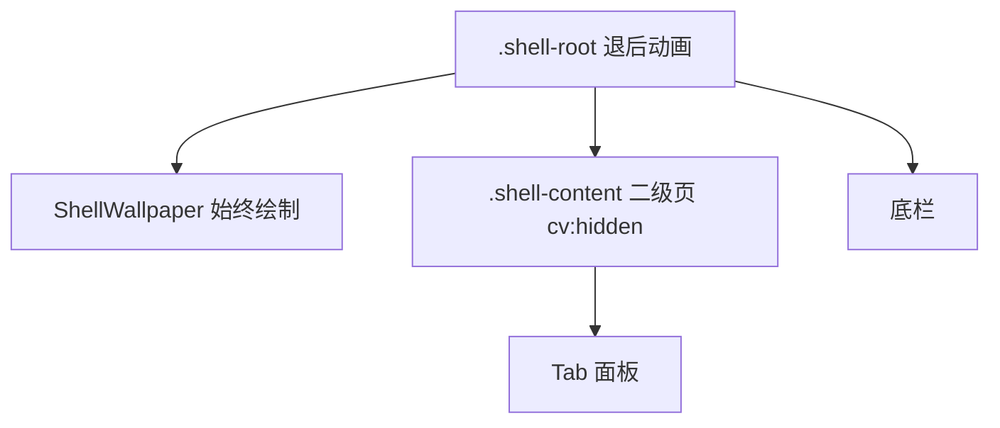

# ADR 0039: 外壳壁纸合成层与冻结范围收窄

> 2026-09-20 修订：自定义壁纸、动态取色和主题图片的当前职责与契约见 [ADR 0040](./0040-host-wallpaper-and-theme-assets.md)。本文相关插件实现描述为历史记录。

- **状态**: Accepted
- **日期**: 2026-09-19
- **关联**: **部分修订** [ADR 0033](./0033-persistent-shell-freeze-and-secondary-view-transition.md)（冻结作用范围）；延续 [ADR 0016](./0016-round3-convergence-and-deprecated-removal.md) `dynamicColor:*` 契约；延续 [ADR 0036](./0036-plugin-kv-binary-storage.md) 壁纸 Blob 存储
- **范围**: `apps/web`, `packages/ui-kit`

---

## 背景与问题

课表壁纸原先画在 `TimetableScreen` 内的 `TimetableWallpaperLayer` 上。该节点同时落在两处会被浏览器跳过绘制的子树里：

1. 二级页期间 ADR 0033 对整棵 `.shell-root` 使用 `content-visibility: hidden`；
2. 非课表 Tab 的面板使用 `hidden`（`display: none`）。

两者都会丢掉壁纸解码帧。返回课表或解冻时需要重新解码，表现为闪白。后续用 `document.body` 钉一张隐形 ``、以及 `prewarmBlur` 双层，是在对抗冻结模型，而不是修正绘制位置。

插件 KV、Object URL 与 `dynamicColor:*` 不是根因，不在本决策范围内。

---

## 架构决策

### 1. 冻结与退后分离

- `is-receded` 仍打在 `.shell-root`，壁纸跟外壳一起退后；
- `content-visibility: hidden` 只打在 `.shell-content`（课表网格与其它 Tab）；
- 底栏继续用 `hidden={skipPaint}`。

### 2. 宿主合成层

- [`ShellRouteHost`](../../../apps/web/src/lib/components/shell/ShellRouteHost.svelte) 与 Tab 面板兄弟挂载 `ShellWallpaper`；
- 源仍是宿主 `dynamicColorUri`，无 URI 不挂载；
- 课表 Tab 且存在课表时 `opacity: 1`，其它 Tab / 空课表为 `0.001`，禁止 `display: none` / `hidden` / `content-visibility: hidden`；
- 绘制用共享的 `TimetableWallpaperImage`（`` + `decode()`），清晰层与预热模糊层只过渡 opacity；
- [`TimetableScreen`](../../../apps/web/src/lib/components/timetable/TimetableScreen.svelte) 不再绘制壁纸，课表区域保持透明。

### 3. 预览仍走展示原语

- 设置页预览与 Schema 选图继续使用 `TimetableWallpaperLayer` 单层展示，不走外壳合成层，也不预热模糊；其图片铺满、裁切和边缘外扩由同一个 `TimetableWallpaperImage` 绘制。

---

## 非目标

- 不改 `tool-wallpaper` 存储、裁剪导出、`WallpaperRuntime`；
- 不落盘第二张模糊 Blob，不引入 Canvas / ImageBitmap 双缓冲。

---

## 影响与收益

- 二级页返回与 Tab 往返不再因解码缓存丢失而闪白；
- 编辑模式模糊在合成层上预热，不再依赖 body 钉图；
- ADR 0033 的网格冻结收益保留，壁纸解码寿命与冻结范围解耦。

---

## 验证

- `vp check` / `vp test` 全量通过；
- 设壁纸后切「我的」再回课表、进壁纸设置再返回、长按进入编辑：无闪白，模糊仍预热，二级页 recede 仍带壁纸。
