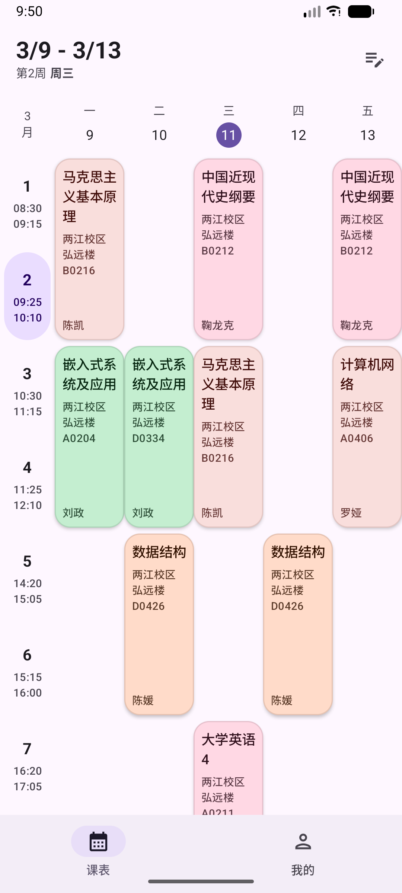
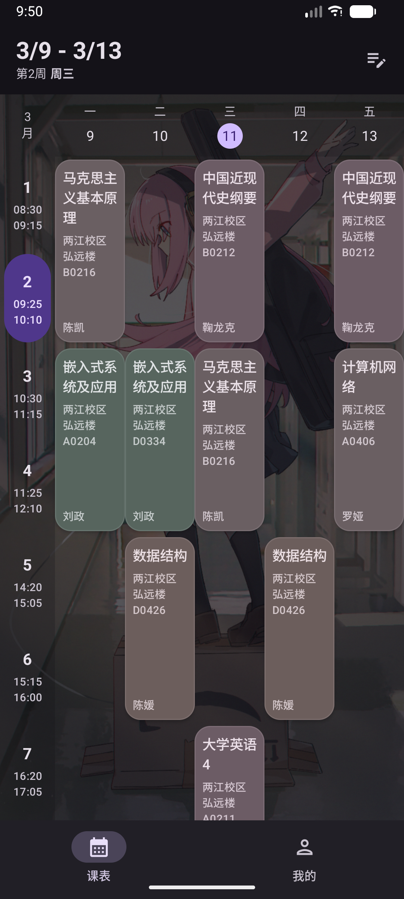

# Chronos

> Chronos 是一个简单的 Android 课程表应用，仅支持查看和分享课表

	
	

## 导入课表

### 【本校教务】知行理工帐号

- 在应用内选择导入方式为教务处，并输入帐号密码

### 【正方教务】手动导入

1. 电脑端登录办事大厅
2. 进入【本科生教务管理系统】->【信息查询】->【个人课表查询】
3. 按下键盘的 `Ctrl + S` 或 `Cmd + S` 保存页面为 HTML 文件
4. 将此文件发送到手机上
5. 在 Chronos 中选择导入方式，并选择刚才保存的 HTML 文件即可

> 注意：未验证其它学校的教务是否可解析

## 特别感谢

[CQUT校园网登录脚本](https://github.com/coldriver-chen/cqut-net-login) 公开的 UIS 后端 CAS 流程及协议规范

[CQUT-Helper](https://github.com/lhgr/CQUT-Helper) 公开的 Timetable 端点

---

### 一些有趣的事实

1. Chronos 的名字来源于希腊神话中的时间之神。
2. Chronos 的使命是代替 WakeUp 课程表。
3. Chronos 的所有代码由 `GPT-5.4` 编写，从空白文件夹到第一个发布版本仅用时 87 分钟。
