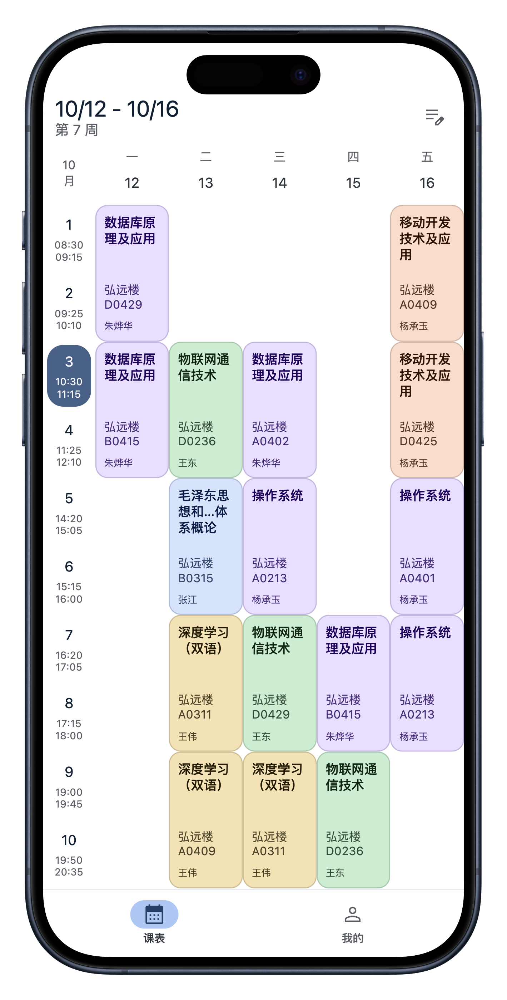
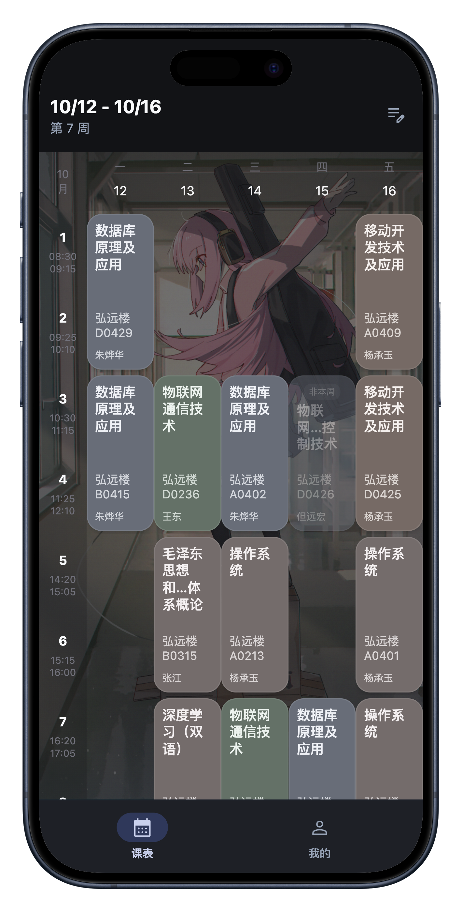

# _Chronos_

基于渐进式 Web 的课程表应用，深度适配本校课表

## 主要功能

仅支持查看与分享课表

## 导入课表

Chronos 支持三种导入方式：知行理工在线导入、分享链接与教务系统导出的HTML文件

#### 知行理工

在应用内选择导入方式为「知行理工」，输入知行理工帐号密码

#### HTML

在应用内选择导入方式为「HTML 文件」，并按照以下步骤操作：

1. 电脑端登录办事大厅
2. 进入【本科生教务管理系统】->【信息查询】->【个人课表查询】
3. 按下键盘的 `Ctrl + S` 或 `Cmd + S` 保存页面为 HTML 文件，将此文件发送到手机上
4. 在 Chronos 中选择导入方式，并选择刚才保存的 HTML 文件即可

> [!NOTE]
> 未验证其它学校的教务是否可解析

## 部署指南

Chronos 提供两种部署方式，共用同一套源码，按构建目标输出不同产物：

| 部署方式         | 知行理工在线导入 |
| ---------------- | ---------------- |
| **Vercel**       | 支持             |
| **GitHub Pages** | 不支持           |

> [!IMPORTANT]
> **Chronos** 深度适配 Vercel，强烈推荐使用 Vercel 部署

### 环境变量配置

Chronos 不需要配置任何环境变量即可正常部署，以下变量仅在本地开发或特定构建场景下使用：

| 变量                    | 作用域 | 说明                                                                                                             |
| ----------------------- | ------ | ---------------------------------------------------------------------------------------------------------------- |
| `CHRONOS_DEPLOY_TARGET` | 构建时 | 设为 `pages` 时构建 GitHub Pages 静态版，默认不设置则构建 Vercel 版                                              |
| `ORIGIN`                | 运行时 | SvelteKit 标准变量，用于 CSRF 校验等场景。本地开发一般无需配置；若部署后出现 origin 相关报错，可设为站点完整 URL |
| `PUBLIC_POSTHOG_KEY`    | 构建时 | PostHog 项目密钥；留空则构建期剔除埋点（GitHub Pages、自行部署默认不启用）                                       |
| `PUBLIC_POSTHOG_HOST`   | 运行时 | PostHog API 地址，默认 `https://eu.i.posthog.com`                                                                |

## 数据收集

官方 Vercel 托管版在生产环境且配置了 `PUBLIC_POSTHOG_KEY` 时，会通过 [PostHog](https://posthog.com/) 收集匿名化的功能使用统计（如导入、主题/配色切换、PWA 安装等），不包含课表内容与账号凭据。未配置密钥的构建不会启用埋点。

详见应用内「关于 → 隐私政策」，或 [`static/legal/privacy-policy.md`](static/legal/privacy-policy.md)。

## 切换到旧版

**Chronos-Android** 位于 `legacy` 分支，目前已停止维护
